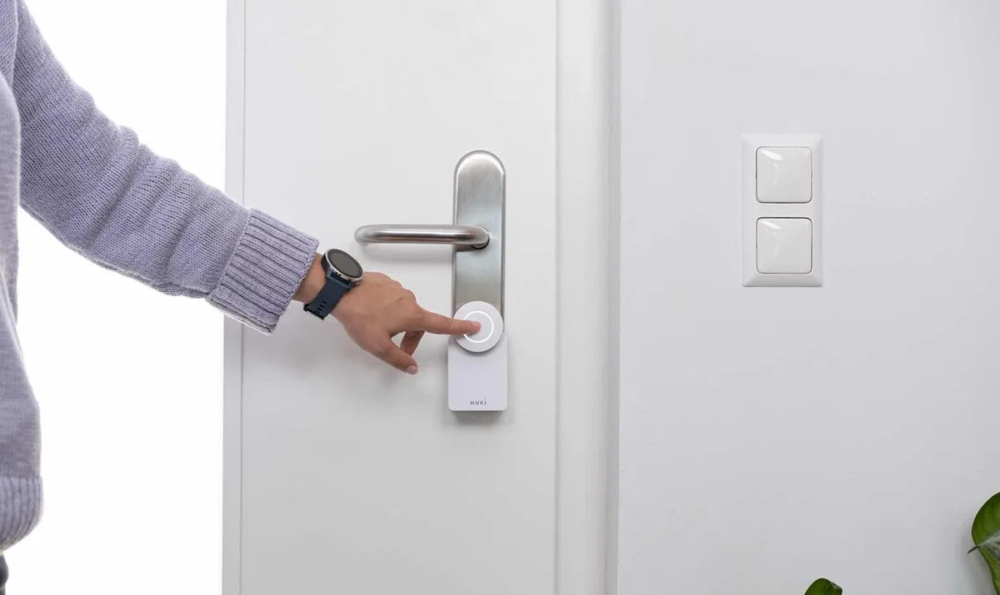

Naast slimme lampen, thermostaten en speakers heb je ook vaker slimme sloten. Het Oostenrijkse Nuki verkoopt er eentje die je vrij simpel op je eigen deur kunt plakken. Waarbij een nieuw model de grootste batterijzorgen bij ons lijkt weg te nemen.

> [!NOTE]
> Deze recensie verscheen eerder op [AD](https://www.ad.nl/tech/het-slimme-slot-van-nuki-is-nog-steeds-doodsimpel-maar-ook-best-luid~aeb99906/).

Nuki onthulde recent twee nieuwe sloten: de Nuki 3.0 en een Pro-variant. Bij die eerste is eigenlijk bar weinig veranderd: het gaat vooral om een nieuwe, witte kleurvariant. Dat kun je prima karig noemen, maar het neemt wel een klein voordeel met zich mee: het slot oogt hierdoor een stuk minder log en groot. Vorige edities waren al vrij fors, omdat veel ruimte nodig is voor de vier benodigde batterijen. En hoewel het formaat hetzelfde is gebleven, oogt zo’n wit model minder massaal op een wit geschilderde deur.

De Nuki 3.0 Pro is op een paar andere fronten verbeterd, waarvan de meest noemenswaardige het bijgeleverde batterijblokje is. Waar gewone Nuki-sloten werken op vier AA-batterijen, heeft het Pro-slot een ingebouwde accu die via USB-C van stroom voorzien wordt. Bij het slot een belangrijke upgrade: de angst om door een lege accu buitengesloten te worden is er altijd, en met USB-C kan je uit voorzorg je slot eens in de paar maanden weer volladen en dat voorkomen.

De nieuwe Nuki's zijn er ook in het wit. © Nuki

## Makkelijk op je deur geklikt

Bij onze tests van de Nuki Pro viel op hoe makkelijk het apparaatje op een deur geklikt kan worden. Het slot wordt geleverd met twee opzetplaatjes. Eén kan je met drie schroeven aan de cilinder vastzetten, mits het sleutelgat ver genoeg uitsteekt. Zit de cilinder te diep in de deur, dan kun je het tweede plaatje op de deur plakken.

Vervolgens steek je jouw sleutel in de deur en klik je de Nuki daar bovenop. In feite is dit namelijk een apparaatje dat jouw ouderwetse sleutels voor je heen en weer draait. Wat ons betreft kun je de Nuki daarom ook beter gebruiken bij een deur met een vrij groot cilinder, waarbij aan beide zijden tegelijkertijd een sleutel gestoken kan worden. Dan kan je de deur immers nog ontgrendelen als het slimme slot het ooit wellicht begeeft - al is dat bij onze tests tot dusver niet gebeurd.

## Liever met wifi verbinden

Beide Nuki-sloten kunnen via bluetooth met je telefoon verbinden om zo draadloos open of dicht te gaan. Handig als je telefoon in de buurt is, maar voor slimme functionaliteit kun je hem beter wel met wifi verbinden. Bij de gewone Nuki 3.0 heb je dan een extra apparaatje nodig dat je in je stopcontact steekt, terwijl dit bij de Pro ingebouwd zit.

Wifi zorgt er bijvoorbeeld voor dat je de deur kunt openen en sluiten als je net even in de winkel staat en er een postbezorger iets wil achterlaten, of laat je makkelijker allerlei functionaliteit automatiseren. Zo kan de Nuki via draadloos internet samenwerken met slimme speakers zodat je de deur met stembediening opent. Of, nog handiger: dat hij op slot gaat als je de Google Assistent welterusten zegt en de lichten tegelijkertijd worden gedoofd.

## Te luid voor naast een babykamer

Eén ding om wel rekening mee te houden: de Nuki-sloten zijn nogal luid. We konden onze deur op slot horen gaan terwijl we in een andere kamer staan, en dat motortje moet flink lang blijven doordraaien bij complexere driepuntssluitingen. Dat is geen probleem in bijvoorbeeld een bijkeuken, maar we zouden hem niet in de buurt van een babykamer monteren. Naar onze beleving zijn zowel de gewone variant als het Pro-model even luid.

Het slot is door zijn benodigde capaciteit gigantisch, maar dat biedt hopelijk ook een lange gebruikstijd. Volgens Nuki kun je op een volle set batterijen een jaar lang teren bij gewoon gebruik. Bij onze review is dat lastig verifiëren omdat we hem nog maar een week hebben.

Wel viel op dat het slot snel alarm slaat bij een leeglopende batterij: onze accu zat nog op 40 procent, wat bijna een half jaar aan gebruikstijd moet bieden, maar toen begon het alarmlampje al rood te knipperen. Dat biedt stiekem wel wat gemoedsrust: als Nuki ons er snel aan herinnert op te laden, is de kans immers ook klein dat je te langzaam bent en buitengesloten wordt.

## Conclusie

De nieuwe sloten van Nuki zijn net als hun voorgangers best makkelijk te installeren. De witte kleur is een wat karige upgrade, al is hij hierdoor wel iets mooier op sommige deuren. We zouden graag willen dat de motor iets stiller de deur dichtdraaide, maar de mogelijkheid om hem zelf op te laden is een welkome toevoeging.
