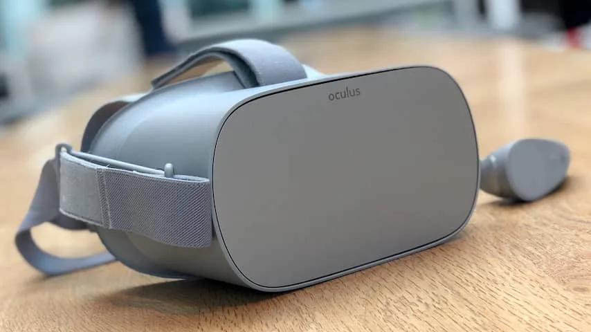
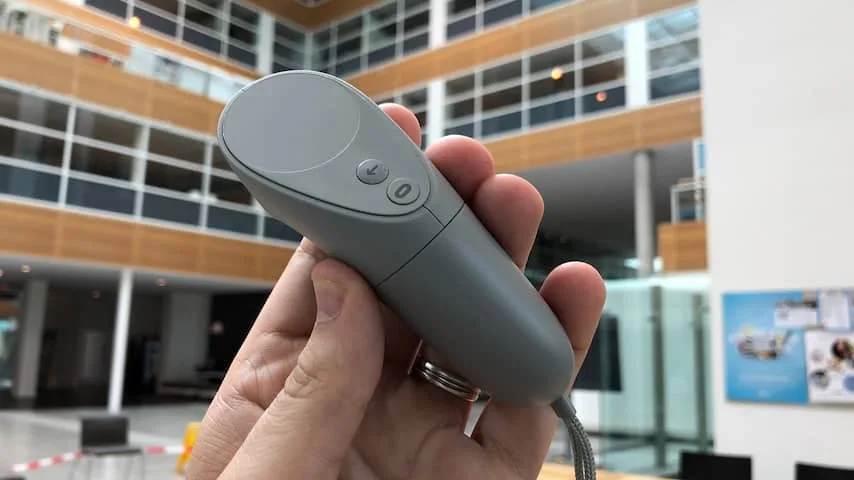
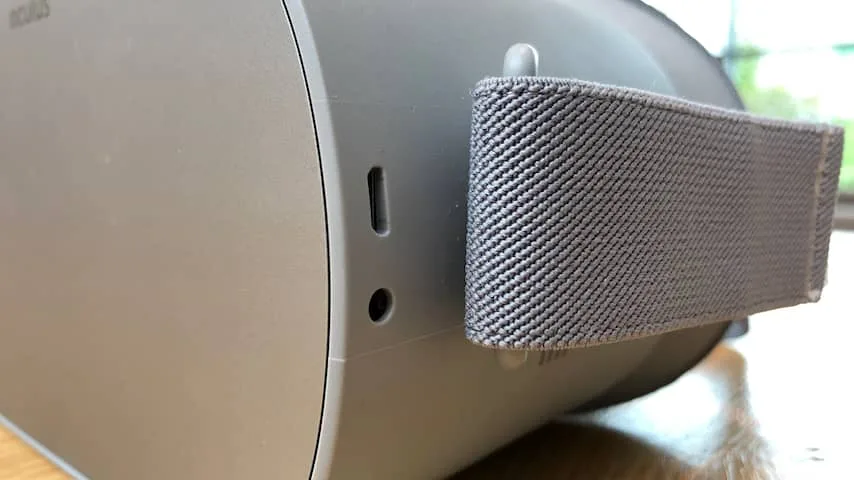
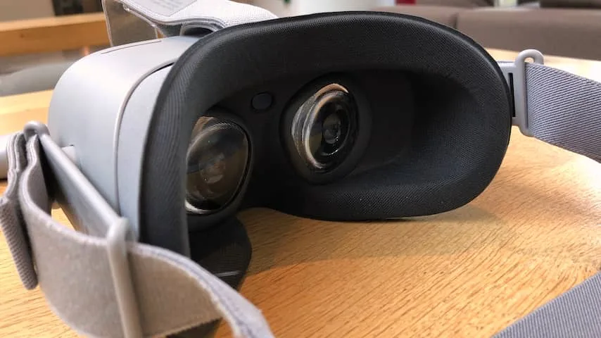
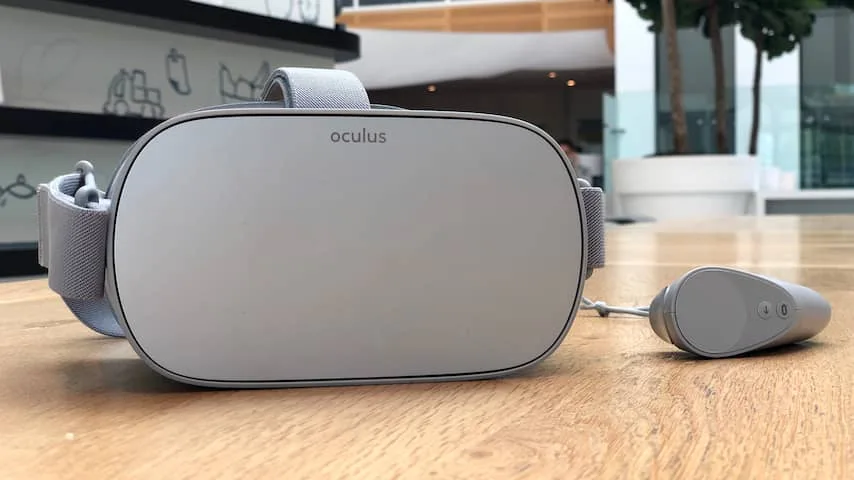

**De nieuwe virtualrealitybril van Oculus belooft een volledige virtualreality-ervaring voor 220 euro. Is dit het moment om eindelijk in VR te stappen?**

> [!NOTE]
> Deze recensie verscheen eerder op [NU.nl](https://www.nu.nl/reviews/5246651/review-oculus-go-maakt-goede-virtual-reality-eindelijk-betaalbaar.html).

Virtual reality was tot op heden een vrij dure aangelegenheid. Wie in een virtuele wereld wil stappen, moet een bril van minstens 300 euro kopen plus een pc of spelcomputer, die nog eens honderden euro's extra kost.

Goedkope alternatieven zijn er al langer in de vorm van smartphonebrillen die vaak voor een tientje te koop zijn, maar deze werken alleen in combinatie met een telefoon. En daarbij geldt ook: hoe beter de telefoon, hoe hoogwaardiger de VR-ervaring. Voor een goede mobiele VR-ervaring ben je daarom ook minstens 600 euro kwijt.

De Oculus Go is daarentegen volledig zelfstandig. In de bril zitten in feite de onderdelen die normaliter in een smartphone zitten, waaronder een beeldscherm, processor, geheugen en antennes voor wifi en bluetooth. Hierdoor kan de bril worden gebruikt zonder dat er een smartphone in wordt geschoven of er een pc mee verbonden moet zijn.

De Go heeft geen ingebouwde koptelefoon. Het geluid wordt vanuit de bril richting je oren verzonden, waardoor je alles hoort zonder je oren af te dekken. Een leuke vondst, maar we merkten daarbij wel dat de bril best veel geluid naar de mensen om je heen lekt. Gelukkig heeft de bril ook een koptelefoonpoort.

Je moet de bril eenmalig met een bijbehorende smartphone-app koppelen. Vanuit die app wordt de bril geactiveerd, waarna je zowel vanuit de Go als op de telefoon nieuwe apps en games kunt downloaden. Alle games en apps die normaal gesproken op de Gear VR, de virtualrealitybril van Samsung, beschikbaar zijn, werken ook op de Oculus Go. Hierdoor is het initiële aanbod al best groot.

_Oculus Go — Beeld: NU.nl/Bastiaan Vroegop_

_Oculus Go — Beeld: NU.nl/Bastiaan Vroegop_

_Oculus Go — Beeld: NU.nl/Bastiaan Vroegop_

_Oculus Go — Beeld: NU.nl/Bastiaan Vroegop_

_Oculus Go — Beeld: NU.nl/Bastiaan Vroegop_

## Hoge resolutie

Het scherm in de bril heeft een resolutie van 2560 bij 1440 pixels. Daarmee is het beeldscherm een stuk scherper dan die in de Oculus Rift, die een resolutie van 2160 bij 1200 pixels biedt.

Door zijn mobiele chip heeft de bril minder rekenkracht dan een game-pc of spelcomputer, maar een truc genaamd 'foveated rendering' zorgt ervoor dat apps en games er alsnog scherp en gedetailleerd uit kunnen zien. Details in je ooghoeken zijn hierdoor minder gedetailleerd, terwijl het midden van het scherm beter in beeld wordt gebracht.

De games en apps die wij probeerden, zagen er hierdoor verrassend goed uit. We konden bij de Netflix-app - waarmee je in een virtuele bioscoop zit - de kleine ondertitels prima lezen. De game _Coaster Combat_ was visueel vergelijkbaar met veel simpele games voor de Rift - de grote broer van de Go, die een pc vereist.

## Rift en Vive

Vergelijk je de VR-ervaringen verder met de Rift of concurrent Vive, dan zijn wel een aantal verschillen merkbaar. Het opvallendst is de tracking van hoofdbewegingen. De Rift en Vive hebben externe sensoren die zien of je een stapje opzij doet, maar de Go heeft enkel interne bewegingssensoren. Hierdoor worden hoofdbewegingen wel gezien, maar wordt je positie in de kamer niet in de gaten gehouden.

We merkten dat we hierdoor wat sneller misselijk werden bij games met intensieve bewegingen, vermoedelijk omdat bewegingen in de echte wereld niet helemaal naar de virtuele wereld werden vertaald. Rustigere games en apps leverden bij onze tests gelukkig geen problemen op, en Oculus laat in de appwinkel zien hoe intensief alle software is.

[Bekijk ingesloten media](https://content.jwplatform.com/players/5ozmnBdp-whqXCOFb.html)

## Gamepad

Daarnaast is er de afstandsbediening die met de gamepad wordt meegeleverd, die op een statische plek naast je lichaam hangt. Het is een soort laserpointer die opties kan selecteren, met een trekker en aanraakpaneel voor extra interacties. Dat zijn te weinig knoppen voor complexere VR-ervaringen.

Het is mogelijk om een gamepad op de Oculus Go aan te sluiten, maar deze wordt niet standaard meegeleverd. Daarnaast lukte het ons tijdens de testperiode bijvoorbeeld niet om een PlayStation 4-controller te verbinden.

_Oculus Go — Beeld: NU.nl/Bastiaan Vroegop_

Er zijn echter genoeg simpele, leuke ervaringen om de afstandsbediening te rechtvaardigen. Oculus Rooms biedt de mogelijkheid om samen met een andere Go-gebruiker in een virtuele kamer te schaken of dammen. Het is een bijzondere manier om het gevoel te krijgen dat je samen met iemand bent, terwijl je in werkelijkheid honderden kilometers van elkaar bent verwijderd.

## Batterij

Door het zelfstandige karakter van de Go kun je hem gebruiken zonder dat je met een pc of spelcomputer verbonden bent. Dat biedt de nodige vrijheid; hij is bijvoorbeeld in de trein te gebruiken om een filmpje te kijken. Je bent hierdoor echter ook afhankelijk van de beperkte batterijduur van de bril.

Op één volle lading konden wij de Oculus Go hooguit drie uur gebruiken. Bij grafisch zware games was dat meestal twee uur. Dat is voor een apparaat normaal gesproken kort, maar voor virtual reality is het enigszins te rechtvaardigen. We kennen weinig mensen die langer dan twee uur achter elkaar in virtual reality blijven.

## Conclusie

De prijs-kwaliteitverhouding van de Oculus Go is fantastisch. Voor 220 euro krijg je een bril met een scherper scherm dan de Oculus Rift, zonder dat je er een losse pc voor nodig hebt. Daar staat wel tegenover dat de ervaringen op de Go een stuk simpeler zijn, omdat je slechts één afstandsbediening met een paar knoppen tot je beschikking hebt.

De Go is niet bedoeld voor complexe games of urenlange ervaringen, maar voor een snel spelletje of een filmpje. Het is daarnaast enorm leuk om een virtuele bioscoop in te duiken terwijl je in het vliegtuig zit. De tracking en controller doen wellicht onder voor de grote broer, maar de mobiliteit en het lage prijskaartje van de Go maken een hoop goed.

**_4 van de 5 sterren._**
