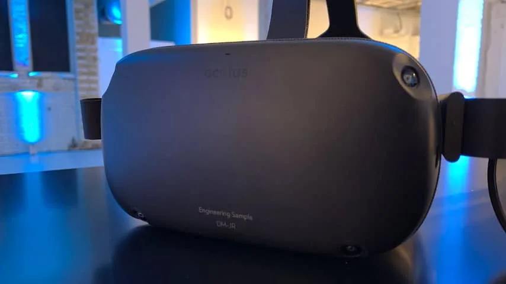
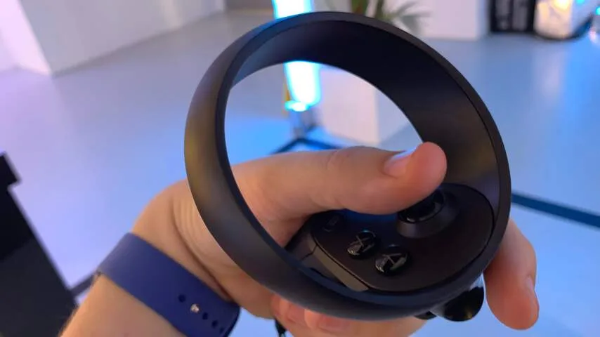
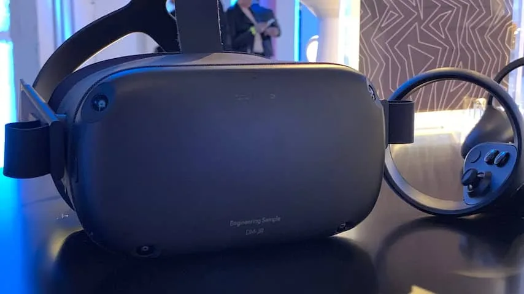

**Wie een virtualrealityspel (VR-spel) wil spelen, moest tot op heden diep in de buidel tasten voor alle benodigde apparatuur. De Oculus Quest belooft dat te veranderen met een zelfstandige headset. En daarmee wordt het ineens veel makkelijk om je in VR te verdiepen.**

> [!NOTE]
> Deze recensie verscheen eerder op [NU.nl](https://www.nu.nl/reviews/5836587/eerste-indruk-oculus-quest-kan-echte-vr-naar-de-massa-brengen.html).

Hoewel het met goedkope brilletjes al langer mogelijk is om filmpjes te kijken in virtual reality, vereisen grootschalige games een duurdere headset met een bijbehorende game-pc of spelcomputer. De prijs daarvan loopt al snel op in de honderden euro's, tot ruim boven de 1.000 euro voor de beste ervaringen.

"Er is een gigantische markt aan mensen die virtualrealitygames willen spelen, die daar niet gigantisch veel voor willen betalen", vertelt Oculus-contentbaas Jason Rubin in gesprek met NU.nl. "We hadden al de Go, een goedkope bril om media mee te kijken, maar deze biedt niet de volledige bewegingsvrijheid die voor games vereist is."

Dat biedt de Quest wel. De nieuwe virtualrealitybril kost 449 euro - waarmee je alles in huis haalt om games te spelen. Een extra pc of spelcomputer is niet meer nodig.

Oculus gebruikte tot voor kort altijd externe sensoren om bewegingen van spelers in de omgeving te volgen. Bij de Quest (en de nieuwe pc-bril Rift S) wordt voor het eerst gekozen voor camera's in de bril zelf. Bij onze tests wist de bril de kamer verrassend goed vast te leggen. Een stap naar links voelt in de virtuele wereld ook als een stap naar links.

_Oculus Quest — Beeld: NU.nl/Bastiaan Vroegop_

## Het maken van een vuist wordt ook getoond in virtuele wereld

De bril ziet ook duidelijk waar de ingestelde grenzen van het speelveld zijn. Je stelt vooraf in waar je in de kamer wil spelen. Bereik je de rand in de virtuele wereld, dan verschijnt er een digitaal dranghek om je tegen te houden. De tracking doet niet onder voor de externe sensoren van een game-pc, maar zonder dat je allemaal apparaten door je kamer hoeft te verspreiden.

De twee bijgeleverde gamecontrollers geven aan diezelfde sensoren de positie van je handen door. Tactisch geplaatste knoppen zorgen ervoor dat bijvoorbeeld het maken van een vuist ook in de virtuele wereld wordt getoond.

De bril kan niet iedere handbeweging van de controllers zien. Bevinden ze zich recht achter je hoofd, dan weet een game niet wat je doet. In de games die wij speelden, was dat echter nooit een probleem. Maak je een zwaai van achter naar voren, dan vangen de sensoren de beweging op tijd op om dit goed in de game te laten zien.

_Oculus Quest — Beeld: NU.nl/Bastiaan Vroegop_

## Voelt hetzelfde als een dure virtualrealitybril

Daarmee is de manier van spelen ongeveer gelijk aan de Rift-bril van hetzelfde bedrijf. De vereiste dure game-pc is hier vervangen door een Qualcomm Snapdragon 835-processor in de bril zelf - een chip die in veel smartphones wordt gebruikt.

Dat maakt de Quest een veel flexibeler apparaat. Je kunt hem makkelijk in iedere kamer in huis gebruiken, zonder de losse sensoren van de Rift mee te slepen.

Daar staat tegenover dat games op de Quest er een stuk minder mooi uitzien dan op de Rift of andere hoogwaardige VR-brillen. Dat was vooral merkbaar bij een demo van het spel _Robo Recall_, een schietspel dat origineel voor de Rift uitkwam. Op de Rift zit deze game vol met fraai ontworpen robots, maar de Quest-versie van het spel laat om ieder personage ruwe kartelrandjes zien.

"Een pc heeft natuurlijk veel betere hardware", vertelt Rubin. "Wil je pc-games in een bril zoals de Quest, dan moet je al deze warmte verzamelende apparaten aan iemands hoofd bevestigen. Dat leek ons geen goed idee."

_Oculus Quest — Beeld: NU.nl/Bastiaan Vroegop_

## Nieuw ontwikkelde games zien er prima uit

Het verschil in grafische prestaties is niet bij iedere game merkbaar. Bij het muziekspel _Beat Saber_, waarin je met lichtzwaarden blokken op maat van de muziek snijdt, is het verschil tussen beide spelversies haast niet te zien. Dat is deels omdat de originele pc-game al een vrij simpele, lege spelwereld heeft.

Games speciaal gemaakt voor de Quest zien er alsnog verrassend goed uit. Dat is bijvoorbeeld merkbaar in cowboyschietspel _Dead & Buried 2_, dat een cartoony stijl en goed lichtgebruik weet te combineren om een gedetailleerde spelomgeving vorm te geven. Puzzelspel _Shadow Point_, waarin je schaduwvormen moet maken voor lampen, heeft een tekenfilmachtige omgeving die zich perfect leent voor de mobiele processor.

Hoewel de chip minder rekenkracht heeft dan een game-pc, zijn de verdere specificaties van de bril wel indrukwekkend. De schermen hebben een resolutie van 1.440 bij 1.600 pixels per oog, en bij het spelen was het scherm bijzonder scherp. Geluid wordt vanuit de bril naar je oren geleid, al kun je ook een koptelefoon aansluiten.

De ingebouwde accu moet het iets meer dan twee uur volhouden tijdens een speelsessie. Dat zal voor sommigen weinig zijn, maar de Quest wordt geleverd met een oplaadkabel van 3 meter. De bijbehorende adapter laadt hem volgens Oculus snel genoeg op om tegelijkertijd te blijven spelen. Dat konden wij nog niet testen bij onze eerste sessie.

## Conclusie

De Quest doet in grote lijnen alles wat de Rift, Vive en PlayStation VR doen, maar dan zonder dat je een dure pc of console nodig hebt. De keerzijde hiervan is dat spellen er iets minder mooi uitzien.

Dat maakt de Quest een zeer interessant apparaat. Het is voor het eerst dat de ervaring van uitgebreide VR-games speelbaar wordt, zonder dat je diep in de buidel moet tasten en je huis vol sensoren hoeft te hangen. Daarmee is de technologie ineens binnen handbereik voor minder technische aangelegde gamers, waardoor virtual reality ineens een veel groter publiek kan bereiken.
