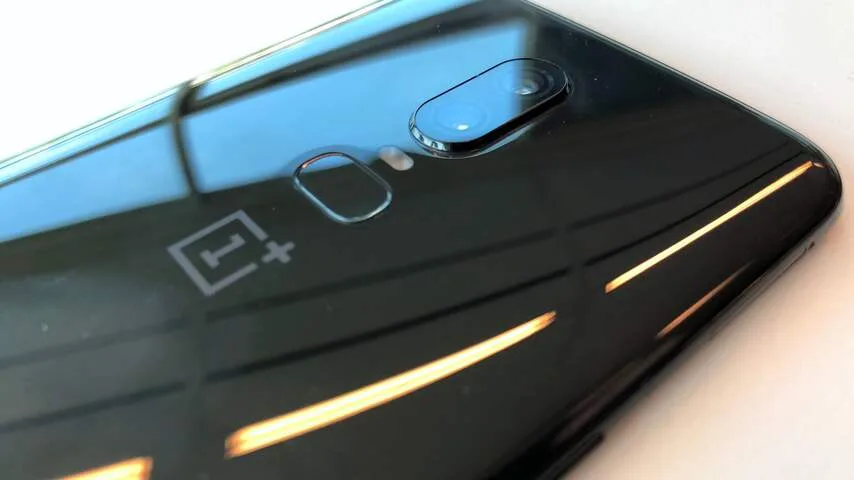
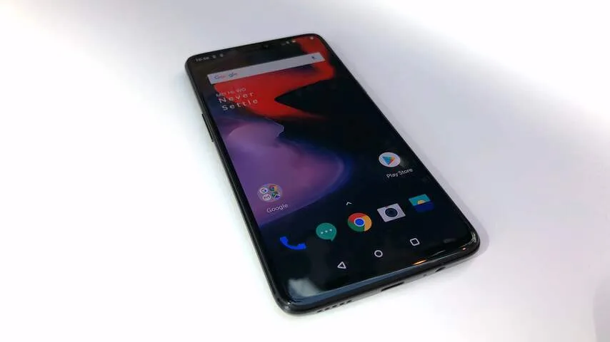
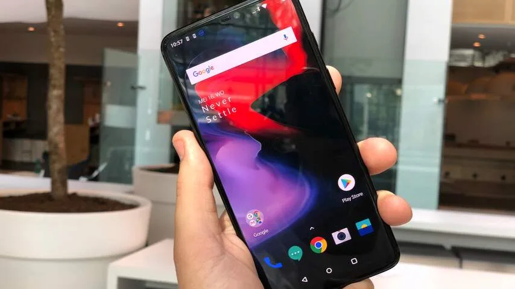
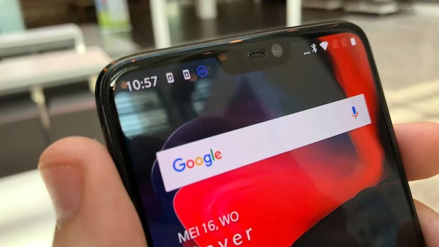

**De nieuwe OnePlus 6 bevat geen grote verrassingen, maar presteert op één punt wel erg goed: de prijs.**

> [!NOTE]
> Deze recensie verscheen eerder op [NU.nl](https://www.nu.nl/reviews/5269109/eerste-indruk-oneplus-6-is-een-uitstekende-prijsvechter.html).

De OnePlus 6 doet verdacht veel denken aan zijn recente concurrenten. De gladde, glazen achterkant lijkt bijvoorbeeld best op de vele recente telefoons die in het afgelopen jaar verschenen, waaronder ook de Galaxy S9.

De voorkant van de telefoon heeft net zo'n bekend voorkomend design. Het scherm is nagenoeg randloos gemaakt, met alleen aan de bovenkant een kleine inkeping voor de camera's. Een compromis die smartphonemakers steeds vaker lijken te maken, sinds Apple deze designtrend populair maakte met de iPhone X.

De vingerafdrukscanner zit achterop de telefoon, op dezelfde plek waar hij ook op de eerdere OnePlus 5T te vinden was. De camera's zijn wel verplaatst, naar vlak boven de scanner. De gehele telefoon lijkt hierdoor op het gros van de huidige vlaggenschepen van grote telefoonmakers.

## Camera's

De camera's achterop hebben resoluties van 16 en 20 megapixel - een upgrade ten opzichte van de 5T, die twee 16 megapixel-sensoren bevat. Nieuw is een optische beeldstabilisator in beide lenzen, waardoor beide camera's goed stabiel blijven bij het maken en foto's en video's. Dat is vooral merkbaar bij het gebruik van de zoomoptie, waarbij trillingen normaal gesproken minder goed zichtbaar zijn.

Bij onze tests maakte de camera's goede, scherpe foto's. Ook bij lage lichtomstandigheden lijkt de camera prima te presteren, al is bij avondfoto's wel een lichte ruis in beeld te zien.

_OnePlus 6 — Beeld: NU.nl/Bastiaan Vroegop_

_OnePlus 6 — Beeld: NU.nl/Bastiaan Vroegop_

_OnePlus 6 — Beeld: NU.nl/Bastiaan Vroegop_

_OnePlus 6 — Beeld: NU.nl/Bastiaan Vroegop_

## Goedkoop vlaggenschip

De software van de OnePlus 6 voelt in gebruik snel en vloeiend. Op de telefoon staat Android 8.1 geïnstalleerd, met daar bovenop de OxygenOS-skin van OnePlus. Dat is nog steeds een relatief lichte skin voor Android, zonder opdringerige extra's of vreemde ontwerpveranderingen ten opzichte van Googles eigen ontwerp.

Kijk je naar de rauwe rekenkracht van de telefoon, dan heeft hij ook een streepje voor op de concurrentie. Bij een reeks benchmarks scoorde de telefoon bij ons stelselmatig iets beter dan de recente Galaxy S9 van Samsung.

Die hoge scores zijn opmerkelijk als je naar de prijs van het toestel kijkt. De OnePlus 6 is met 519 euro immers een stuk goedkoper dan de Galaxy S9, die op het moment voor rond de 680 euro wordt aangeboden.

We moeten daarbij wel zeggen dat we een duurder model hebben getest. Deze telefoon bevat 8GB werkgeheugen in plaats van de 6GB in de 519 euro-modellen. Voor die RAM-upgrade moet een telefoon van minstens 569 euro worden gekocht.

## Kleine compromissen

De veel lagere prijs rechtvaardigt het gebrek aan verrassingen in deze telefoon enigszins. De OnePlus 6 is geen innovatieve wereldverbeteraar, maar een toestel dat recente technologie in een zo goedkoop mogelijk jasje heeft weten te verwerken.

Er zijn wel een paar kleine compromissen in de telefoon te bespeuren. De telefoon is ondanks de glazen achterkant niet draadloos op te laden, waardoor je genoodzaakt bent om altijd de kabel te gebruiken. Wel heeft het toestel ondersteuning voor snelladen, waardoor hij in een half uur helemaal volzit.

Hoewel de OnePlus 6 met gezichtsherkenning ontgrendeld kan worden, is dit nog steeds dezelfde ouderwetse cameratechnologie in eerdere toestellen. De smartphone heeft niet de extra sensoren van de iPhone X, waardoor gezichtsontgrendeling niet in het donker werkt.

De telefoon heeft plek voor twee simkaarten, maar is het niet mogelijk om een microSD-kaart in de telefoon te stoppen. Er is maar één manier om meer opslag te krijgen, en dat is door een duurder model te halen.

## Conclusie

De gemaakte compromissen zijn slechts kleine details in een groter plaatje. Bekijk je de OnePlus 6 in zijn volledigheid, dan heb je een hoogwaardige telefoon die gewoonweg veel minder kost dan concurrenten met vergelijkbare specificaties. Voor wie een degelijke smartphone voor een relatief zacht prijsje wil, is dat goed nieuws.
