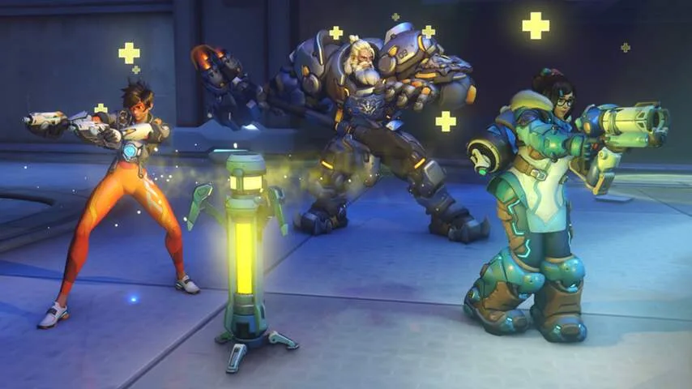
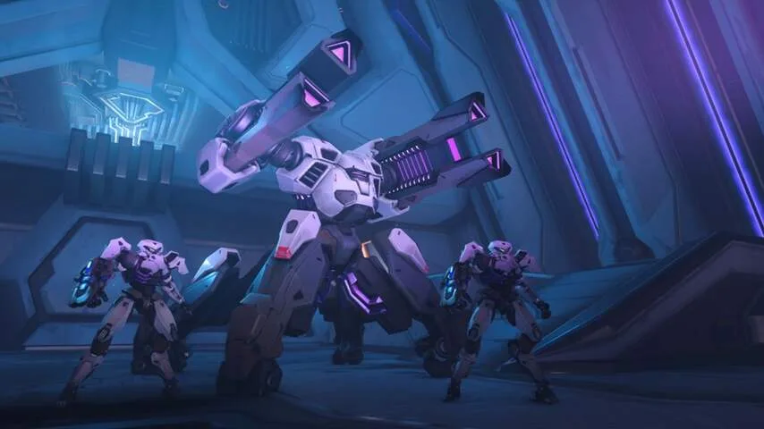

**Het vervolg van competitief schietspel Overwatch introduceert een veel verzochte toevoeging: een verhaal.**

> [!NOTE]
> Deze recensie verscheen eerder op [NU.nl](https://www.nu.nl/reviews/6008846/eerste-indruk-overwatch-2-wordt-ook-leuk-voor-niet-competitieve-spelers.html).

In de afgelopen vijf jaar richtte _Overwatch_ zich vooral op één doelgroep: de competitieve gamer. In de verschillende modi neem je het altijd op tegen een team andere spelers, in een constante strijd om de eerste plek.

Heel af en toe was er een tijdelijk evenement waarbij je het coöperatief tegen de computer opnam, maar die spelopties waren altijd van korte duur. In _Overwatch_ was er geen uitgebreide verhaalcampagne te vinden, zoals je die vindt in bijvoorbeeld de recente _Call of Duty_. Voor veel spelers een pijnpunt, gezien trailers juist wel een grootse wereld met een uitgebreid verhaal lieten zien.

Het pas aangekondigde _Overwatch 2_ lost dit kritiekpunt op. In een reeks Story Missions volg je een groep superhelden, die het opneemt tegen een mysterieus robotleger. Tijdens gamebeurs Blizzcon konden we een van die missies alvast spelen.

_Overwatch 2 — Beeld: Blizzard_

_In een reeks Story Missions volg je een groep superhelden, die het opneemt tegen een mysterieus robotleger. (Beeld: Blizzard)_

## Openingsfilmpje doet denken aan Avengers-films

Het level opent met de Braziliaanse held Lucio, die zijn best doet om Rio de Janeiro te beschermen tegen een robotinvasie. Net als hij zijn grip op de situatie dreigt te verliezen, komt een groep vrienden hem van de ondergang redden. Het openingsfilmpje is gelikt en meeslepend, en doet qua choreografie denken aan fragmenten uit de Avengers-films.

Na een paar snelle verhaalsprongen mochten we kiezen uit de speelbare helden Lucio, Reinhardt, Mei en Tracer. De verhaalmodus van _Overwatch 2_ is coöperatief, wat betekent dat de overige drie personages worden gespeeld door andere mensen. Bij onze demo waren dat drie andere journalisten in dezelfde ruimte, maar in de definitieve game kun je online met vrienden spelen.

## Variatie tijdens gevechten ligt hoog

We rennen door het level, terwijl we naderende groepen robots uitschakelen. De game beweegt snel: robots zijn in no-time uitgeschakeld, maar kunnen jou ook snel neerschieten als je niet blijft bewegen. Strategieën uit de competitieve multiplayer zijn ook hier van groot belang. Reinhardt kan bijvoorbeeld met een schild het team beschermen tegen kogels, terwijl Lucio zijn metgezellen geneest.

Iets later in het level vliegen we naar een groot schip boven de stad, waar we ons een weg richting de motorkamer vechten. Daar volgt een complex baasgevecht, waarbij de reactor moet worden verwoest en een gigantische robot ons probeert tegen te houden. Het bewijst dat de variatie tijdens gevechten hoog ligt - en de stijgende moeilijkheidsgraad zorgt voor een steeds grotere uitdaging.

## Voorwerpen die speelstijl veranderen

_Overwatch 2_ biedt voor het eerst een vorm van progressie voor je personages. Je groeit langzamerhand in level, waarbij je iedere zoveel levels mag kiezen uit twee vaardigheden. Lucio kan bijvoorbeeld ervoor kiezen om twee liedjes tegelijk af te spelen, waarmee hij zowel geneest als de bewegingssnelheid van teamgenoten verhoogt. Maar hij kan ook zijn genezende krachten versterken, om meer nadruk op zijn ondersteunende kwaliteiten te leggen.

Tijdens levels kom je ook af en toe voorwerpen tegen die je speelstijl kunnen veranderen. Wij vonden bijvoorbeeld een granaat om vijanden mee te bekogelen, en iets later een geautomatiseerd machinegeweer om op de grond te plaatsen.

Het zorgt ervoor dat je iets meer kan doen dan in de competitieve game. Dat is ook een must: de beperkte vaardigheden van personages zijn te vergeven in de versus-modi, omdat de spanning van een pot je actief houdt. Maar tegen robots heb je variatie nodig om je interesse te behouden.

## Constante Hero Missions

De campagne van _Overwatch 2_ moet een uitgebreid verhaal vertellen. Wie daarna de game nog wil blijven spelen, kan zich gaan storten op de nieuwe Hero Missions. Hierbij kan je aan de slag met iedere held, ongeacht of die bij de helden of de vijanden hoort.

Die Hero Missions speel je om je personage sterker te maken, terwijl je langzamerhand nieuwe dingen ontgrendelt, zoals vaardigheden. Blizzard hoopt dat je op die manier _Overwatch 2_ maandenlang blijft spelen, zoals ook het geval is bij hun games _World of Warcraft_ en _Diablo_.

_Overwatch 2 — Beeld: Blizzard_

_De beperkte vaardigheden van personages zijn te vergeven in de versus-modi, omdat de spanning van een pot je actief houdt. (Beeld: Blizzard)_

## Overwatch 1 blijft relevant

Tegelijkertijd blijft _Overwatch 1_ ook bestaan. Sterker nog: die eerdere game krijgt alle updates voor de competitieve modus uit _Overwatch 2_, waardoor je het vervolg niet hoeft te kopen. Dat hoef je eigenlijk alleen maar te doen als je de coöperatieve modi tegen computergestuurde vijanden wil spelen, zoals het verhaal en de Hero Missions.

Dat betekent dat bijvoorbeeld de nieuwe competitieve modus Push ook speelbaar zal zijn in _Overwatch 1_. Hierbij moet je samen met teamgenoten een robotje naar voren duwen, dat met een schild de weg verspert voor je tegenstanders. Ieder team heeft een eigen robot en levels zijn symmetrisch, waardoor potjes voor elk team gelijk moeten zijn.

Het betekent ook dat nieuwe personages in _Overwatch 2_ ook meteen in _Overwatch 1_ speelbaar zijn. Spelers van de twee games zien elkaar ook in potjes, waarbij de outfits van personages laten zien of je _Overwatch 1_ of _2_ hebt.

## Voorlopige conclusie

Het is ons nog niet meteen duidelijk waarom je _Overwatch 2_ zou moeten kopen als je de game alleen competitief speelt. Maar voor iedereen die al jarenlang uitkijkt naar een verhalend spel in dit vrolijk ogende game-universum, is dit vervolg een stap in de juiste richting.
