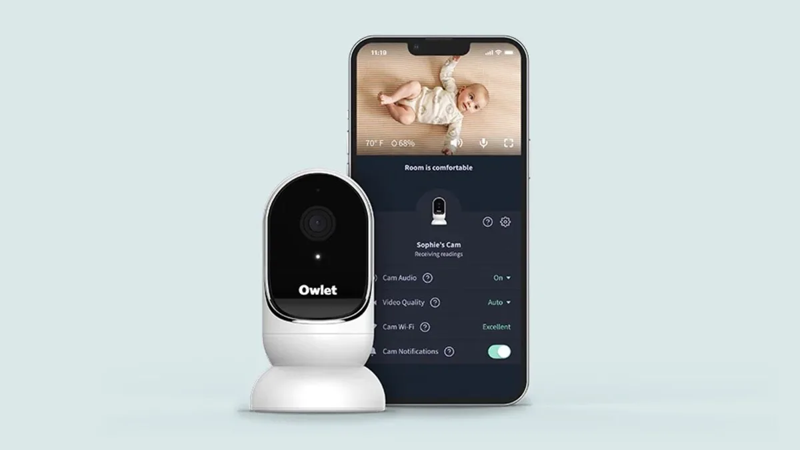

Smarthomebedrijf Owlet heeft een slimme sok voor baby’s gemaakt, die aan de hand van hartslag laat zien wanneer je kindje precies slaapt. Bijkomend voordeel: nerveuze ouders kunnen makkelijk zien of hun kindje nog gewoon ligt te ademen in bed. We hebben hem getest.

> [!NOTE]
> Deze recensie verscheen eerder op [AD](https://www.ad.nl/tech/deze-slimme-sok-en-camera-moeten-je-babyfoon-vervangen-hoe-goed-werken-ze~ab97c08e/).

Owlet verkoopt voor de ouders van kersverse baby’s twee gadgets voor bij het bed: een slimme camera met ingebouwde thermometer en daarnaast de eerder genoemde slimme sok. Gebruik je beide, dan krijg je bij het openen van de bijbehorende app een vrij uitgebreid overzicht: je ziet hoe warm het in de babykamer is, de huidige hartslag van je kindje en een beeld van boven het bed.

## Babyfoon met camera versus de slimme sok

Wie een camera boven het babybed wil hangen, kan in feite ook een ‘gewoon’ alternatief halen, maar deze babyvariant heeft een paar handigheidjes die kersverse ouders moeten helpen. De instructies leggen bijvoorbeeld precies uit hoe hoog de camera boven het babybedje moet hangen. In de doos vind je bovendien speciale kabelgootjes die lastig los te pielen zijn, zodat je baby niet een kabel door de spijlen van het bed kan vastgrijpen.

Heb je hem eenmaal geïnstalleerd, dan is de camera zelf grotendeels identiek aan andere internetcamera’s. Je kunt instellen om een pushmelding op je telefoon te ontvangen zodra er geluid of beweging wordt gedetecteerd, net als bij veel alternatieven. Handig als je bericht wilt ontvangen zodra de baby wakker is, al is er één inherent risico: heb je wifi-problemen, dan ontvang je ook geen bericht bij babygeluiden.

Smart Cam. © Owlet

## Sok ziet wanneer de baby slaapt en de hartslag

De sok wordt geleverd met een oplaadstation waar je hem met een magneet op klikt. Die kun je op bijvoorbeeld de commode zetten, zodat je de sok snel weglegt en oplaadt zodra je de baby weer uit bed haalt.

De sok is bedoeld om te gebruiken als je baby slaapt, wat meteen blijkt uit de app: alle draagmomenten worden daar in een grafiekje verzameld, waar de hartslag gebruikt wordt om een soort slaappatroon te doorgronden. Bij onze tests sluit dat grotendeels aan op het slaappatroon van de baby: als de app zegt dat de baby sliep, dan sliep hij ook. Bij flesjesmomenten midden in de nacht heeft de sensor alleen niet altijd door dat de baby wakker is, omdat hij stilligt tijdens het drinken - maar zelfs dan detecteert de sensor dat er even wat anders aan de hand is.

De app laat ook de huidige live-hartslag zien. De app slaat alarm als de hartslag ver buiten de verwachte metingen springt, zodat je weet of er wellicht iets aan de hand is. Het kan een extra stukje geruststelling zijn voor bezorgde ouders, al zouden we het niet als alternatief aanraden bij kinderen met serieuze hartkwalen. In de Verenigde Staten werd de sok van de markt gehaald omdat hij niet de juiste medische keuring heeft, dus we zouden dan toch sneller grijpen naar een alternatief van de arts.

## Owlet app crasht continu (op iPhone)

De Owlet-gadgets zitten gelikt en leuk in elkaar, maar er is één grote reden waarom we ze niet zomaar zouden aanraden: de app kan een telefoon ineens compleet laten crashen. Op iPhones hadden we meerdere malen last van een gekke bug waardoor de hele telefoon bevroor, en pas werkte na een volledige reset.

Bij korte tests op Android gebeurde dit niet zomaar, al kunnen we niet uitsluiten of diezelfde crashes daar gebeuren. De app is simpelweg niet betrouwbaar, waardoor we hem op termijn liever niet gebruikten.

Voor wie alleen de camera wil gebruiken, is een alternatief dan immers net zo’n goede optie. Het stikt van de slimme camera’s die je boven een babybed kunt hangen. Het is dan wel te adviseren om er een te halen met goede beveiliging - wil je hem online gebruiken, zorg dat dit versleuteld bij een betrouwbare provider kan. Maar ook daarvan zijn er genoeg.

## Conclusie

De hartslagsensor van Owlet is een leuk hebbedingetje dat een aardig idee geeft van hoe lang je baby ‘s nachts slaapt. Essentieel zouden we hem echter niet noemen: bij medische problemen zouden we sneller verwijzen naar een arts met wellicht betere alternatieven die zijn goedgekeurd door de juiste instanties.

De camera heeft een paar leuke extraatjes die helpen om hem goed boven een babybed te installeren, maar is in de regel gelijk aan veel niet-baby-concurrenten. En die zijn vaak goedkoper - en hebben geen apps die je telefoon helemaal laten vastlopen.
