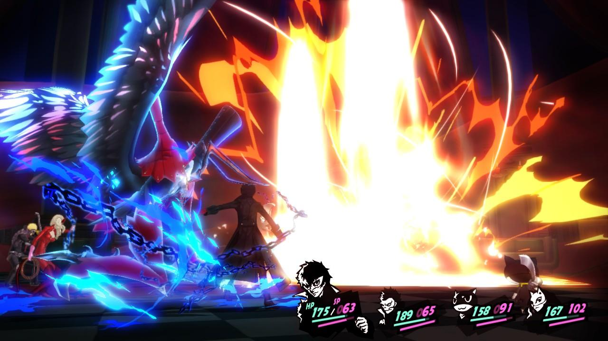
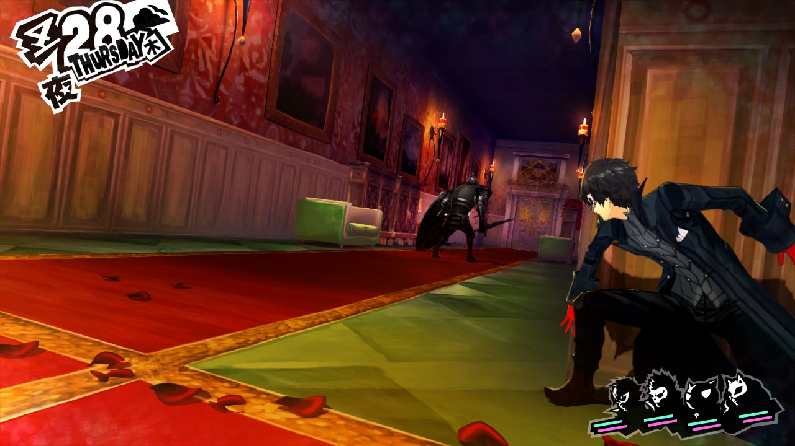
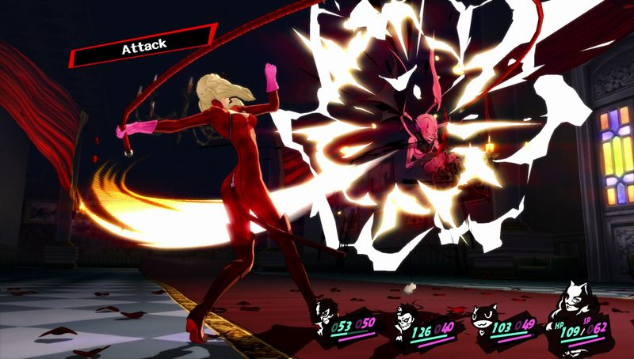
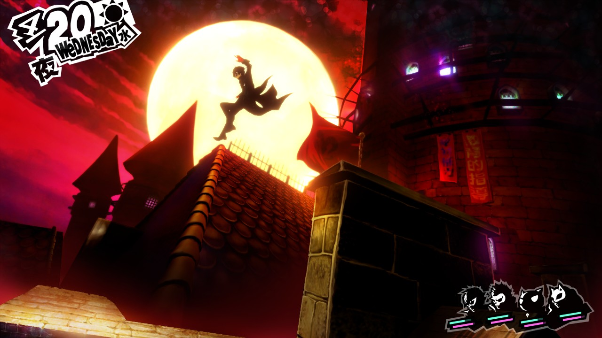
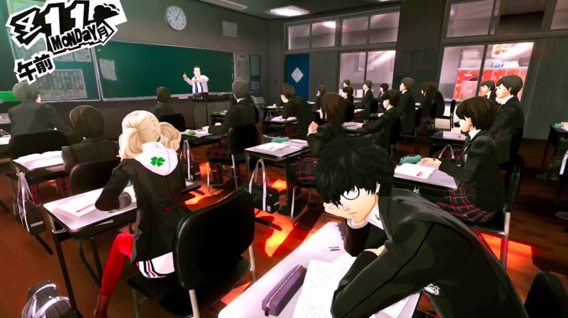

**Daten voor betere stats.**

Persona 5 is inmiddels zo vaak uitgesteld, dat de game zelfs een consolegeneratie is opgeschoven. De jrpg is immers uitgekomen voor zowel PlayStation 3 als PlayStation 4. Dat maakt het één van de laatste PS3-games die zal verschijnen – waarmee de spelcomputer met een hoogtepunt eindigt.

> [!NOTE]
>
> Deze review verscheen eerder op [Insidegamer](https://inside.gamer.nl/127254-persona-5-review-daten-voor-betere-stats/).

Persona 5 combineert net als voorgaande delen een levenssimulator met een Japans rollenspel. In de ochtend moet je naar school om te studeren, waarna je ’s middags de kerkers in kunt trekken. Dat doe je in de zogeheten Metaverse – een wereld die bestaat uit de vormgegeven emoties van verdorven personen. Door in zo’n kerker de schat op het einde te stelen, kun je dit slechte stukje van een persoon vernietigen. Het resultaat: mogelijk betert die persoon in de echte wereld zijn of haar leven.

Het intrekken van de kerker is slechts één van de opties die je hebt. Je kunt er net zo goed voor kiezen om tijdens een middag op te trekken met een klasgenoot, of de bibliotheek in te duiken om te studeren. Alles dat je doet helpt om bepaalde statistieken of relaties met personages te verbeteren – wat vervolgens een positief effect heeft op je personage in de Metaverse. Heb je een goede band met je teamgenoot Ryuji? Dan leert hij bijvoorbeeld om een extra klap te geven, als jij een vijand net niet dood krijgt.

Het zal spelers van voorgaande Persona-games allemaal bekend in de oren klinken. De basis van deze game is identiek gebleven aan de vorige delen, maar is op een aantal fronten significant verbeterd. Dat zie je het beste terug in de kerkers. Die worden niet langer willekeurig gegenereerd zoals bij de vorige twee delen, maar zijn vooraf ontworpen gebieden. Het zorgt ervoor dat de ontwikkelaar beter een verhaal in de kerkers kan vertellen. De Metaverse representeert de emoties van je doelwit, wat op interessante wijzen gedaan kan worden. Zo zul je bijvoorbeeld in het level van een wrede gymleraar zijn overwerkte studenten aantreffen.

## Sluipen

Loop je tegen monsters in kerkers aan, dan begint er een traditioneel, beurtelingsjrpg-gevecht. In dat geval loopt er ook een meter vol met 15 procent bij ieder gestart gevecht. Tikt hij de 100 procent aan? Dan word je het level uitgekieperd. Iets dat je kan voorkomen door te sluipen.

Sla je een monster namelijk van achter, dan begint het gevecht zonder dat de meter volloopt. Het geeft je ook de gelegenheid om de eerste klap te doen, waardoor je met wat tactisch denken het gevecht soms meteen kunt beëindigen.

Dat sluipen sluit leuk aan op de thematiek van Persona 5 – je speelt nu eenmaal een dief. Heel erg diepgravend is het echter niet. Je kunt wel achter muurtjes zitten en snel van obstakel naar obstakel sluipen, maar dat is eerder een gimmick dan een gameplay-element. De meeste monsters zijn namelijk stekeblind, waardoor je in de praktijk zéér makkelijk een sluipaanval uitvoert.

## Pokémon

De beurtelingse gevechten voelen wellicht wat traditioneel aan, maar wat gebruikelijke Persona-elementen maken ze een stuk inventiever. Raak je bijvoorbeeld een vijand op zijn zwakke plek? Dan mag je personage nog een mep geven. Dat kun je herhalen totdat iedere vijand op de grond ligt, waarna je een speciale superaanval uitvoert. Nog een optie: praat op dat moment met de neergetikte vijand, om hem te overtuigen om zich bij je aan te sluiten. Dan kun je hem koppelen aan de hoofdpersoon, die vervolgens hogere statistieken en nieuwe spreuken krijgt.

Daar zit een aardig verzamelsysteem achter. Door nieuwe monsters te rekruteren en met elkaar te fuseren, creëer je een steeds sterker team. Tijdens gevechten kun je wisselen tussen je verzameling, waardoor je dat ene monster kunt selecteren die het zwakke punt van je tegenstander kan misbruiken.

Daardoor ontstaat een soort puzzel. In andere jrpg’s is het raken van een zwakke plek ook belangrijk, maar in Persona is het een essentieel onderdeel. Maak je geen gebruik van oneerlijke voordelen? Dan zijn baasgevechten al snel onmogelijk.

Ook dat is voor Persona een bekende basis, maar de praktische verbeteringen in deel vijf weten aanzienlijke vernieuwing te bieden. Zo kun je bijvoorbeeld op de R1-knop drukken om meteen een spreuk te selecteren die sterk is tegen een vijand, mits je die al eens eerder hebt ontdekt. Ideaal tijdens het grinden, als je al precies weet hoe je vijanden te lijf moet gaan. Met het indrukken van R1 en de bevestigingsknop ram je dan een stuk sneller door vijanden heen.

Persona 5 zit vol met dat soort kleine vernieuwingen, die de game véél speelbaarder maken. Neem bijvoorbeeld het genezen van je team: in de meeste jrpg’s moet je door menu’s heen springen om iedereen levenspunten te geven, maar in Persona 5 kun je buiten gevechten om net zo makkelijk op vierkantje drukken. Dan wordt iedereen automatisch genezen, waarbij wel de magiepunten van je genezers worden verlaagd.

## Misbruik

Persona 5 weet door zijn schoolelement een heel ander soort verhaal te vertellen dan de gebruikelijke games in dit genre. Je gaat hier niet van stad naar stad, maar bouwt een leven op bij één locatie. Daar wisten Persona 3 en 4 al goed gebruik van te maken, maar met deel 5 lijken de schrijvers iets nieuws te proberen.

Het nieuwe deel staat namelijk in het teken van een thema: misbruik. Je probeert de harten te veranderen van kwaadwillende mensen in de echte wereld, die bijna altijd wel slachtoffers maken. Het is makkelijk om daar een kortzichtig plot over goed versus kwaad omheen te bouwen, maar Persona is in veel gevallen genuanceerder dan dat. Zo laat de game zien hoe slachtoffers van misbruik hiermee omgaan, of waarom sommigen dit niet aan de politie rapporteren.

## Gevoelig

Daarbij schuwt de ontwikkelaar geen gevoelige onderwerpen. Seksueel misbruik en zelfmoord spelen centrale rollen – wat in de Metaverse zowel subtiel als expliciet in beeld wordt gebracht. Hoe deze game een PEGI-waardering van 12+ heeft ontvangen is ons een raadsel, vooral nadat we een bepaalde baas in de eerste kerker hadden bevochten.

[Bekijk ingesloten media](https://www.youtube.com/embed/1lV-eaEKxjQ)

Helaas is niet ieder onderdeel van het verhaal een succes. Hoewel de schrijvers er in slagen om interessante, gelaagde personages in bijzondere situaties neer te zetten, worden homoseksuele spelfiguren voornamelijk gebruikt als punchlines voor grapjes. Dat is in iedere game jammer, maar van Persona hadden we al helemaal meer verwacht. Als er namelijk één spel is dat de worsteling met seksualiteit op school perfect kan vormgeven, dan is het Persona 5 wel.

Dat verandert niets aan het feit dat andere onderwerpen wel met respect en diepgang worden behandeld. Persona 5 is één van de weinige games die een lager tempo in zijn verhaal durft te nemen dan andere rollenspellen, waardoor er ruimte ontstaat voor zeer goede karakterontwikkelingen. Aan het einde van Persona 5 houd je van je team emotiedieven. Gelukkig duurt het maar liefst 80 uur totdat het echt voorbij is.
