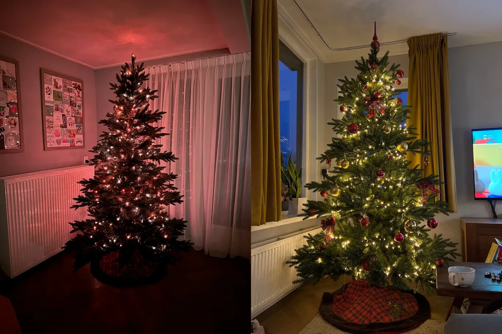
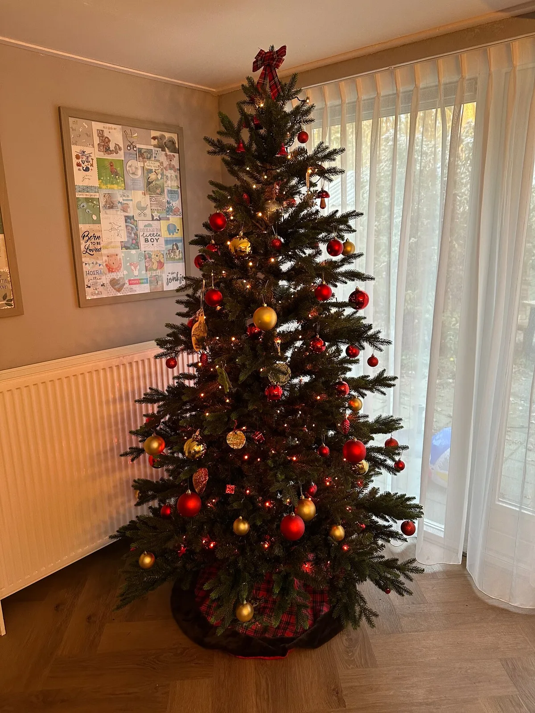
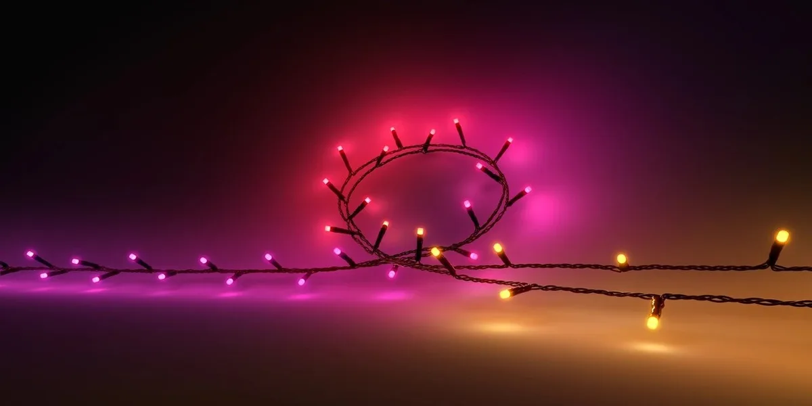

Het heeft even geduurd, maar Philips verkoopt eindelijk slimme Hue-lampen voor in de kerstboom. Wij hebben ze getest.

> [!NOTE]
> Deze recensie verscheen eerder op [AD](https://www.ad.nl/tech/de-slimme-hue-kerstlampen-zijn-duur-maar-hebben-wat-unieke-extra-s~a28150fc/).

Het aanbod aan Hue-lampen is inmiddels groot, maar kerstlampen ontbraken gek genoeg al jaren. Smarthome-enthousiastelingen konden wel wat RGB-strips (meerkleurig) van het bedrijf in de boom hangen, maar echt kerstachtig was dat niet.

Dat verandert met de komst van de nieuwe Festavia. Dat is een traditionele slinger aan kerstlampjes, maar dan met de mogelijkheid ze te bedienen vanaf je smartphone of slimme assistent. Ook kun je ze automatiseren en aan andere lampen koppelen, zodat de kerstboom automatisch uitgaat als je het licht uitzet om naar bed te gaan.

## Hoeveel kosten de slimme kerstlampen?

Goedkoop zijn ze niet: je moet bereid zijn maar liefst 160 euro neer te leggen voor je kerstboomverlichting. Voor dat geld krijg je maar 250 lampjes, in plaats van de 750 die je bij grotere, ook goedkope slingers ziet.

Die hoeveelheid lampjes lijkt een slechte deal, al zit het wat genuanceerder. Ondanks de hoeveelheid lampjes is de slinger net zo lang, waardoor het licht meer verspreid zit. Het zorgt ervoor dat de lampjes mooi verdeeld in de boom zitten en je niet een soort streep aan fel licht door de boom hebt hangen.

Ja, het zijn minder lampjes, maar bij onze boom vonden we dit zowaar mooier. Dat was bij ons in een boom van 2,20 meter hoog - bij een veel grotere is de hoeveelheid lampjes wellicht alsnog te weinig.

Tekst loopt door onder de afbeelding

Links de Festavia-slinger met 250 lampjes, rechts een 'ouderwetse' met 750. Rechts heeft meer licht, maar links zitten de lampjes mooier verspreid. © Bastiaan Vroegop

## Kaarslicht simuleren met een app

De Festavia werkt net als de meeste Hue-lampen: je koppelt de slinger in de app en kunt hem vervolgens aan- en uitzetten. Ook kun je de kleuren van de lampen aanpassen. Daarbij heb je de keuze uit drie kleuren tegelijk, waardoor het licht in de boom gradueel van onder naar boven verandert. Je kunt die kleuren ook bij willekeur door de boom verspreiden voor een soort regenboogeffect.

Uniek zijn de opties om ‘echte’ kerstverlichting te simuleren. De knoppen ‘Kaars’, ‘Open haard’ en ‘Schitterend’ zorgen ervoor dat de lampjes licht pulseren of knipperen, alsof je naar echt kaarslicht of een haardvuur kijkt. Het effect is subtiel genoeg om mooi te zijn, al mist de optie om dan tegelijkertijd je eigen kleuren te gebruiken: de drie opties werken alleen met kleuren die Philips vooraf heeft uitgekozen.

Tekst loopt door onder de afbeelding

Onderin zijn de lampjes rood, waarna ze geler worden naarmate de slinger hoger komt. Dit is in te stellen met iedere kleur. © Bastiaan Vroegop

## Wat zijn de nadelen van de Hue-kerstlampen?

Het zijn mooi ogende lampjes, maar daar betaal je dus voor: lang niet iedereen zal bereid zijn om 160 euro aan kerstverlichting te betalen. Dit is net als bij andere Hue-lampen een premiumproduct, voor wie zo min mogelijk gedoe wil met zijn of haar lampen.

Nog één klein nadeel: Philips benadrukt dat deze lampjes voor binnengebruik bedoeld zijn. Wie in de tuin een kerstboom wil optuigen, heeft dus niks aan de Festavia.

Tekst loopt door onder de afbeelding

De lampjes zitten wat breder verspreid over de slinger. © Philips

## Alternatieven voor slimme kerstlampen

Hiernaast zijn er veel alternatieven om je kerstlampen met een app te bedienen. Je kunt bijvoorbeeld een slimme schakelaar aan je ‘ouderwetse’ lampen hangen, die dan de stroomtoevoer aan- en uitzet wanneer jij dat wil. Zo’n schakelaar kun je soms al voor een tientje kopen - Philips verkoopt er zelf ook eentje voor 35 euro.

Maar dan mis je wel de extra’s die de Festavia-lampen bieden, zoals de meerdere kleuren en de mogelijkheid om kaarslicht te simuleren. Beide functies zien er buitengewoon gaaf uit - mits je bereid bent daarvoor te betalen.
