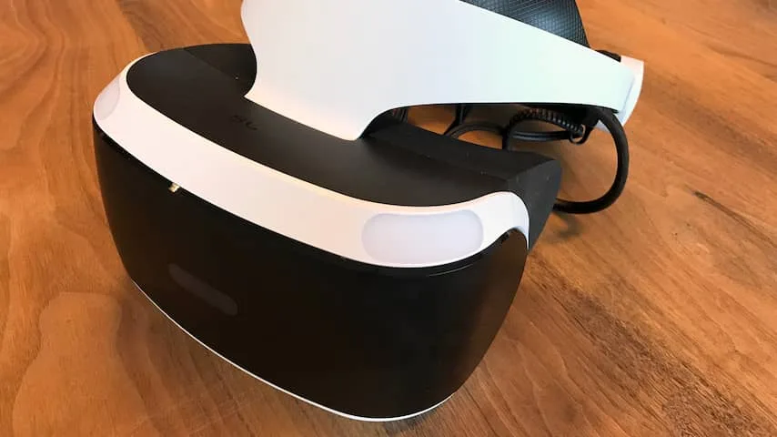
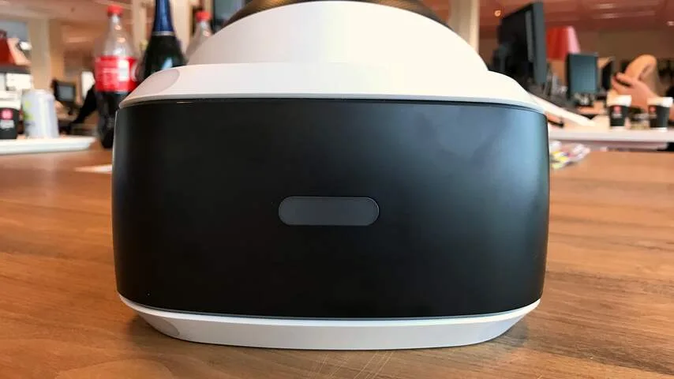
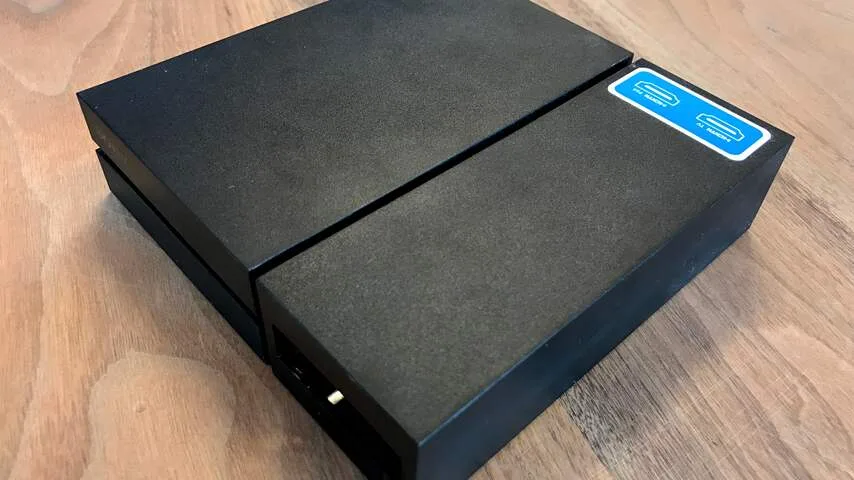
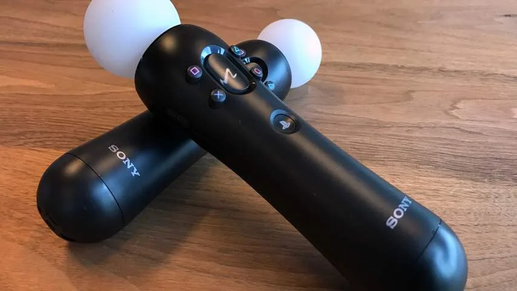
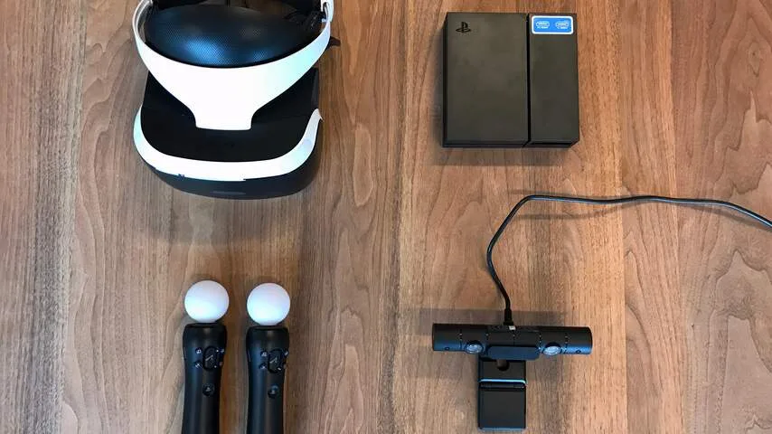

**De PlayStation VR is de minste van de drie grote VR-brillen, maar is wel de eerste die virtual reality naar spelcomputers brengt.**

> [!NOTE]
> Deze recensie verscheen eerder op [NU.nl](https://www.nu.nl/reviews/4334697/review-playstation-vr-is-de-minste-van-de-drie-grote-vr-brillen.html).

Na onder meer Oculus en HTC brengt ook Sony een virtualrealitybril uit. De PlayStation VR (PSVR) is speciaal gemaakt voor de PlayStation 4-spelcomputer, en met een prijskaartje van 400 euro is hij goedkoper dan de concurrentie. Wel is er nog een bijbehorende camera van 60 euro nodig.

Het gebruik van een gameconsole maakt de PlayStation VR een stuk toegankelijker. De benodigde apparatuur is in de gemiddelde Nederlandse speelgoedwinkel te vinden en vereist niet heel veel technische kennis. Daarnaast worden games voor de bril in de winkel of Sony's online winkel verkocht, waardoor er geen software uit vreemde bronnen gedownload hoeft te worden. Het maakt de PSVR één van de meest toegankelijke brillen voor premium-VR.

De headset ondersteunt een resolutie van 960 bij 1080 pixels per oog, iets lager dan bij de Oculus Rift en HTC Vive. Wie er op let, kan hierdoor de pixels soms van elkaar onderscheiden. Er zit een soort 'hordeur' op het scherm, waardoor de wereld nooit helemaal scherp is.

## Vloeiend

Bij het spelen van games valt dit hordeur-effect minder op. De resolutie is niet zo storend dat die afleidt van de spelwereld, die altijd vloeiend lijkt mee te bewegen.

De bril ondersteunt een ververssnelheid van tussen de 90 en 120 hertz, waardoor games nooit stotterend overkomen. Ontwikkelaars moeten met hun games de hoge beeldsnelheid ook ondersteunen als ze op het PSVR-platform willen worden toegelaten.

De wat mindere grafische kwaliteit van de PlayStation VR valt pas op zodra personages of objecten in games ver weg zijn. Auto’s in _Driveclub_ lijken bijvoorbeeld op vage klodders verf naarmate ze verder weg rijden. De bril lijkt de nadruk te leggen op objecten in de voorgrond, die er als enige indrukwekkend uitzien.

_PlayStation VR — Beeld: NU.nl_

_PlayStation VR — Beeld: NU.nl_

_PlayStation VR — Beeld: NU.nl_

_PlayStation VR — Beeld: NU.nl_

_PlayStation VR — Beeld: NU.nl_

## Matige beeldtracking

De PlayStation VR gebruikt een bijbehorende camera om de positie in de kamer in de gaten te houden. Hiermee wordt bijvoorbeeld een beweging naar voren vastgelegd, waardoor de drager iets van dichterbij kan bekijken.

De camera houdt lampen aan de voorkant, zijkanten en achterzijde van de VR-bril in de gaten om dit voor elkaar te krijgen. Dat gaat alleen niet altijd even goed. Ik kreeg vaak de melding dat ik mij buiten het blikveld van de camera bevond, zonder dat ik had bewogen.

Daarnaast verloor de bril af en toe het juiste middelpunt, waardoor ik ineens een paar graden moest bijdraaien om naar 'voren' te kijken. Of dat aan de camera of de bril ligt, is onduidelijk.

Het zorgt er tijdens lange speelsessies voor dat je soms wel een kwartslag bent gedraaid ten opzichte van je beginpositie. Dat kan desoriënterend aanvoelen, maar was gelukkig nooit misselijkmakend.

## PlayStation Move

Nagenoeg alle PlayStation VR-games werken met de standaard gamepad van de spelcomputer. Bij sommige games is het ook mogelijk PlayStation Move-bewegingscontrollers te gebruiken. Deze apparaten houden iedere beweging bij, zodat directe handbewegingen naar een spel overgezet kunnen worden.

De game _Job Simulator_ maakt hier goed gebruik van. De Move-controllers veranderen bij dit spel in handen, die ook aanvoelen als een extensie van je 'echte' lichaam. Hiermee is het mogelijk om bijvoorbeeld knoppen in te drukken en kasten open te trekken, om zo simpele baantjes uit te voeren.

De Move-controllers zijn indrukwekkend als ze goed werken, maar hebben geregeld last van kleine problemen. Je ziet in spellen bijvoorbeeld vaak de virtuele handen of voorwerpen kort trillen, omdat de exacte positie dan niet goed in de gaten wordt gehouden.

De trillingen maken het soms lastig om handelingen uit te voeren. Wellicht is de PlayStation Move inmiddels net wat te ouderwets geworden; de gamecontroller verscheen immers al voor de PlayStation 3.

[Bekijk ingesloten media](https://content.jwplatform.com/players/AG3JlDQy-whqXCOFb.html)

## Blokkendoos

Het in elkaar zetten van de PlayStation VR is enigszins verwarrend. De bril wordt geleverd met een extra kastje, zodat het videosignaal naar zowel de TV als de headset gestuurd kan worden.

Daardoor zijn er maar liefst vier kabels en een extra stroomadapter nodig om de PSVR op een PlayStation 4 en televisie aan te sluiten. Daar komt ook een PlayStation Camera bij, mits die nog niet eerder is aangesloten, en de optionele bewegingscontrollers. Het verbinden en aansluiten van de bril is daarmee een wat onhandig proces.

De bril zelf is wel gemakkelijker in gebruik dan die van concurrenten. Met een knop kan de headset worden uitgeschoven, waarna de band om het hoofd gebogen kan worden. Hierdoor kan hij makkelijker worden afgesteld, zelfs als je al een brildrager bent.

## Gebalanceerde line-up

Hoewel er het één en ander op de PlayStation VR valt aan te merken, weet de bril te imponeren met zijn software. In totaal komen er tachtig games beschikbaar voor de headset, waarvan de helft al voor het einde van 2016 zal uitkomen.

Sommige van de games voelen vooral aan als voorbeelddemo’s. Na een uur heb je het grootste gedeelte van _Job Simulator_ bijvoorbeeld al gezien. De ruimtevlieggame _EVE: Valkyrie_ valt ook snel in herhaling en begint dan te vervelen.

Toch zijn er veel games die meer diepgang bieden. _Driveclub_ is bijvoorbeeld een volwaardig racespel, waarin het gebruik van virtual reality ook echt iets toevoegt. _RIGS_, een competitieve shooter van Guerrilla Games, is speciaal gemaakt voor VR en is na veel potjes nog steeds leuk om te spelen.

Overigens is niet ieder spel voor iedereen weggelegd. Sommige mensen worden bijvoorbeeld snel misselijk bij een potje _RIGS_, terwijl anderen daar niet zo snel last van hebben. Wie gevoelig is voor bewegingsziekte, kan beter games spelen waarin je stil blijft zitten, zoals puzzelgame_Tumble VR_.

## Prijs

De PlayStation VR is met een prijs van 400 euro goedkoper dan de Oculus Rift (700 euro) en HTC Vive (900 euro), maar voor dat bedrag zijn nog niet alle benodigdheden in huis. De bijbehorende camera gooit er 60 euro bovenop, terwijl een pakket met twee Move-controllers 80 euro kost. Het totaalbedrag van 540 euro is alsnog goedkoper dan de concurrentie.

Voor wie nog geen krachtige computers in huis heeft, is de PlayStation VR aanzienlijk goedkoper dan de concurrentie. De benodigde PlayStation 4 kost namelijk 300 euro, terwijl een pc die overweg kan met de Rift en de Vive al snel 1000 euro kost.

## Conclusie

De PlayStation VR toont aan dat de vr-bril nog niet is uitgegroeid. Hoewel spelervaringen consistent en indrukwekkend aanvoelen, halen kinderziektes spelers nog geregeld uit de illusie van een virtuele omgeving.

De headset van Sony voelt als een beginproduct, dat een voorproefje geeft van de toekomst van virtual reality. Door de benodigde hardware en het lastige aansluitproces, voelt het vaak niet als een consumentenproduct.

Sony toont de potentie van virtual reality, maar zal daarmee nog niet iedereen overtuigen om de overstap te maken. Dit is een gadget voor de grootste fanatiekelingen, die willen voorlopen op de rest.
