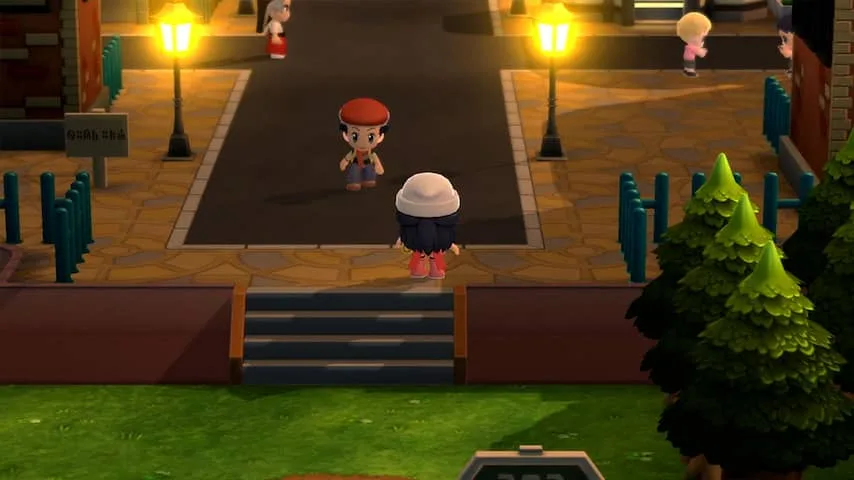

**De nieuwste Pokémon-games zijn remakes van twee oude klassiekers. Maar die herziene versies zijn zó trouw aan het origineel, dat het eindresultaat gedateerd aanvoelt.**

> [!NOTE]
> Deze recensie verscheen eerder op [NU.nl](https://www.nu.nl/reviews/6168321/review-pokemon-brilliant-diamond-en-shining-pearl-zijn-vooral-heel-ouderwets.html).

In ruim twintig jaar tijd is _Pokémon_ uitgegroeid tot een van de grootste gamereeksen op aarde. De serie heeft inmiddels honderden miljoenen euro's opgebracht en jaarlijks worden nog steeds nieuwe games uitgebracht, waarin weer nieuwe monstertjes gevangen moeten worden.

Die games werden afgelopen jaren vaker kritisch ontvangen. Fans balen van een gebrek aan vernieuwing, terwijl tegelijkertijd oude functies worden weggehaald. Bij het voorgaande _Pokémon Sword_ en _Shield_ werden zelfs klassieke monsters uit de eerste generaties weggehaald.

## Remake van ouderwetse games

Met _Pokémon Brilliant Diamond_ en _Shining Pearl_ wordt weinig gedaan om die kritiek weg te nemen. Dit is wederom een klassieke _Pokémon_, waarin je acht Gym Leaders moet verslaan om aan een toernooi mee te doen waar je tot _Pokémon_\-kampioen uitgeroepen kan worden.

Het is geen wonder dat deze spellen zo dicht bij de ouderwetse kern blijven, want beide zijn remakes van titels die in 2006 werden uitgebracht voor de Nintendo DS. En bij deze herziene versies is de basis van die klassiekers grotendeels gelijk gebleven.

[Bekijk ingesloten media](https://content.jwplatform.com/players/u2bEDsiE-whqXCOFb.html)

## Furby-personages

Dat is duidelijk te zien aan de spelwereld. De natuurlijk ogende personages uit _Sword_ en _Shield_ zijn ingeruild voor een soort Furby's met gigantische hoofden. Dat oogt gek, maar die spelfiguren zijn precies even groot als de pixelachtige personen uit het origineel. De gestileerde stijl laat de makers de originele spelwereld een-op-een nabouwen.

Je merkt dat de spellen vaak worstelen tussen hun klassieke oorsprong en andere, modernere _Pokémon_\-games. Dat valt bijvoorbeeld op tijdens gevechten, waarbij de gekke speelgoedpersonages ineens worden omgeruild voor de langere, realistischere helden die we van recente games kennen. De makers durven niet te kiezen tussen twee stijlen, waardoor het geheel nooit echt samenkomt.

## Besturing onwennig

Dat merk je ook bij het verkennen van de wereld. Waar het origineel met een D-pad bestuurd werd, kun je in de Nintendo Switch-versie ook rondlopen met het analoge pookje. Dat voelt vloeiender en logischer, maar tegelijk val je snel in gaten of spring je onbedoeld over hekjes in smalle ruimtes. Die zijn immers gemaakt voor de oude bediening. Wisselen naar de D-pad is mogelijk, maar dan kun je maar vier kanten op lopen.

Het origineel verscheen voor een spelcomputer met twee schermen, waarbij het onderste beeld extra's toont, zoals de levensbalken van je team of de huidige tijd. Die functie zit ook in de Switch-editie, maar neemt een flink deel van het beeld in beslag. Een wat lompe manier om deze functies over te hevelen, al kun je dit extra schermpje gelukkig uitschakelen.

_Review: Pokémon Brilliant Diamond en Shining Pearl zijn vooral heel ouderwets — Beeld: Game Freak_

## Ouderwetse Pokémon op zijn sterkst

_Brilliant Diamond_ en _Shining Pearl_ zijn de oude _Pokémon_\-formule op zijn sterkst, met een wereld die iets vrijer te verkennen is dan wat we in voorgaande titels zagen. Het is een game die je urenlang zoet kan houden. En zelfs nadat je het spel hebt uitgespeeld kan het nog veel uitdaging bieden, omdat je het gros van de tegenstanders opnieuw kunt bevechten met nieuwe, sterkere monsters.

Dat is goed nieuws voor fans van het eerste uur, maar nieuwkomers stuiten hier op een game die wat gedateerd aanvoelt. _Diamond_ en _Pearl_ zijn buitengewoon trage games, waarbij het uren duurt tot ze een beetje op gang komen. Het vechtsysteem voelt ook zeer langzaam door de vele animaties die worden getoond. Sommige daarvan kun je uitzetten, maar dan oogt de game weer saai.

De games zijn alleen de moeite waard voor fans die met de originele titels uit 2006 zijn opgegroeid. Prima voor die toch wel grote groep gamers, maar bij een remake van games in zo'n waardevolle serie hoop je op meer. Deze nieuwe versies voegen in de basis weinig toe aan zijn voorgangers en dat is jammer.

## Conclusie

_Pokémon Brilliant Diamond_ en _Shining Pearl_ zijn twee oerconservatieve remakes van twee wat ouderwets aanvoelende _Pokémon_\-games. Een leuke nostalgietrip voor iedereen die met de originele versies is opgegroeid, maar nieuwkomers zullen snel afhaken.

_Review: Pokémon Brilliant Diamond en Shining Pearl zijn vooral heel ouderwets_
