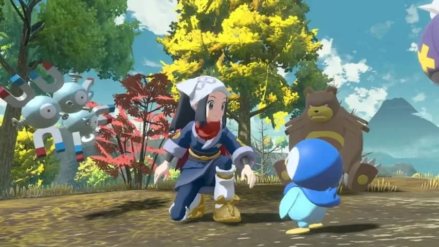

**Met Pokémon Legends: Arceus probeert de maker van de populaire gamereeks voor het eerst in tijdens écht iets nieuws. Het resultaat is een ontzettend leuke game die er tegelijkertijd nogal lelijk uitziet.**

> [!NOTE]
> Deze recensie verscheen eerder op [NU.nl](https://www.nu.nl/reviews/6180395/review-pokemon-legends-arceus-is-leukste-en-lelijkste-pokemon-game-in-jaren.html).

Sinds het verschijnen van de eerste Pokémon-games heeft ontwikkelaar Game Freak weinig gedaan om de formule echt op te schudden. Ieder volgend deel bouwde vooral voort op wat al bestond: wel nieuwe monsters en extra spelsystemen, maar de kern bleef hetzelfde.

Met _Pokémon Legends: Arceus_ probeert Game Freak daar nu echt verandering in te brengen. Dit nieuwe deel speelt zich af in het verre verleden, in een tijd waarin de titulaire monsters nog worden gezien als wilde beesten waar mensen vooral bang voor moeten zijn.

Jij bent een aspirant-verkenner die probeert alle monsters in de regio in kaart te brengen, waarbij je met de nieuwe uitvinding Pokéball ze ook probeert te vangen. Je wordt op missie gestuurd in specifieke gebieden, waar je vrij rondloopt om de juiste monsters te zoeken.

## 'Echt' vangen in de spelwereld

Waar je in oude games tijdens gevechten voorwerpen moest aanklikken om een monster te vangen, doe je dat in _Legends_ door in de spelwereld een bal te gooien. Je houdt de rechtertrekker ingedrukt om te mikken en kunt bijvoorbeeld door gras sluipen om ongezien te blijven. Soms moet je aan de kant rollen voor agressieve monsters die jou aanvallen.

Het zorgt ervoor dat de game wat meer aanvoelt als een 'echte' wereld. Je ziet wezentjes rondlopen en reageren op jouw aanwezigheid, alsof je een hert op de Veluwe hebt gespot. Iets dat in oude titels enkel werd gevat in kille menu's vol met statistieken.

De wereld voelt bovendien levendiger aan door de toevoeging van zogeheten Alpha Pokémon: veel sterkere varianten die moeilijk zijn te vangen. Het maakt de omgeving gevaarlijker, wat bijdraagt aan het gevoel dat je een wilde omgeving aan het verkennen bent.

[Bekijk ingesloten media](https://content.jwplatform.com/players/sm6RhL3S-whqXCOFb.html)

## Gevechten zijn sneller en gestroomlijnder

Je kunt in _Pokémon Legends_ ook vechten, wat meestal tegen wilde monsters gebeurt. Gevechten zijn nog steeds beurtelings, maar nu vele malen gestroomlijnder. Weg zijn de eindeloze tekstvelden met informatie over level-ups en geleerde aanvallen: dat wordt nu op veel slimmere wijze getoond in de interface.

Je mag bijvoorbeeld zelf kiezen wanneer je een monster laat transformeren, waardoor het tempo een stuk hoger blijft liggen.

## Leuk, maar ook erg lelijk

Al deze factoren maken _Pokémon Legends_ een van de baanbrekendste Pokémon-games van de afgelopen jaren. Daar staat wel één wapenfeit tegenover: het is ook één van de lelijkste Nintendo Switch-spellen die we in jaren hebben gezien.

De omgeving en personages zijn omhuld in wollige texturen, je ziet kartelrandjes tussen verschillende 3D-modellen en soms kun je de pixels op het scherm zelfs tellen. _Pokémon Legends_ oogt als een vroeg prototype van een game die eigenlijk in 2006 moest verschijnen. Bizar, vooral als je bedenkt dat _The Legend of Zelda: Breath of the Wild_ met zijn open wereld in 2017 al vele malen mooier was op de Nintendo Switch.

Dat valt nog eens extra op in het dorpje waar de game start. Dat dorp is niet alleen lelijk, maar bestaat ook uit huizen die inspiratieloos zijn gekopieerd en naast elkaar zijn gezet. Zodra je op pad mag, wordt het allemaal iets minder stuitend, maar echt mooi wordt dit spel nooit.

_Review: Pokémon Legends: Arceus is leukste én lelijkste Pokémon-game in jaren — Beeld: Game Freak_

## Conclusie

Die domper kunnen we de ontwikkelaar kwalijk nemen, al zouden we toch adviseren om te proberen erdoorheen te kijken. Doe je dat, dan heb je het leukste Pokémon-spel in jaren te pakken. Het voelt bij _Legends_ alsof je door de echte natuur struint op zoek naar beestjes, waarmee wordt teruggegrepen op dat oergevoel waarmee Pokémon eind jaren negentig zo groot is geworden.

Laten we hopen dat Game Freak hier in een vervolg op voortborduurt en dat die game er wél goed uitziet. Dan heeft de studio pas echt goud in handen.

_Rating 3,5_
