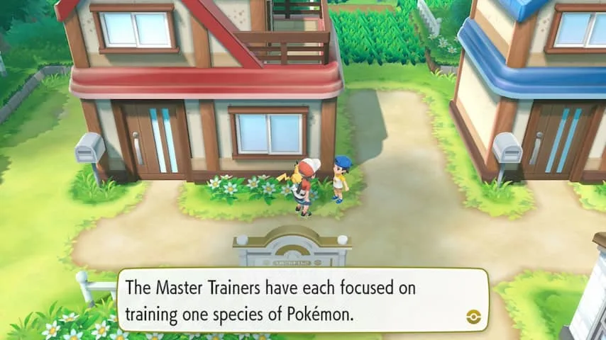
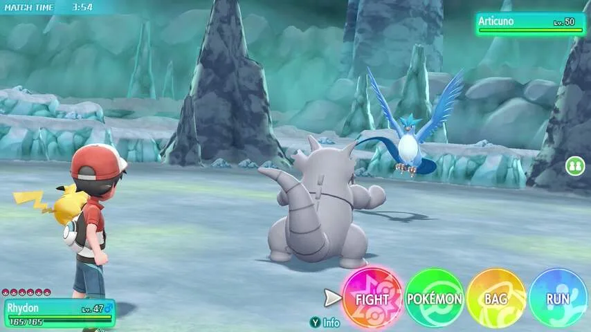
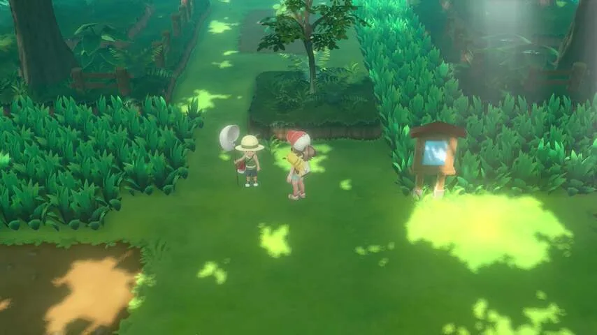
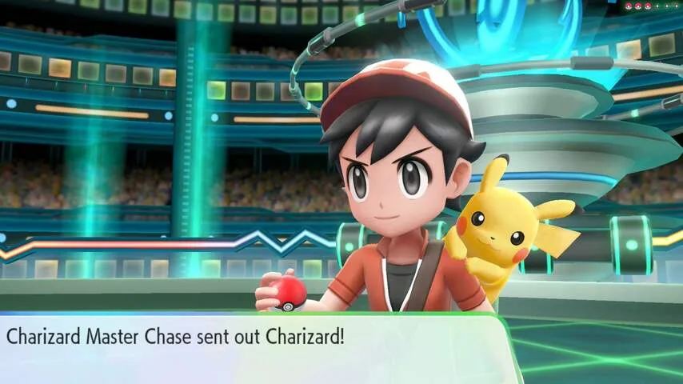
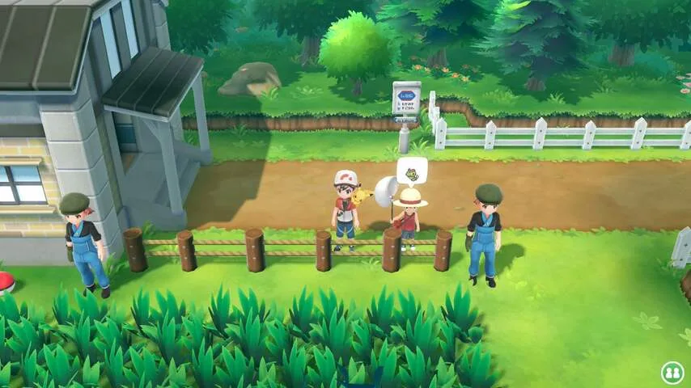
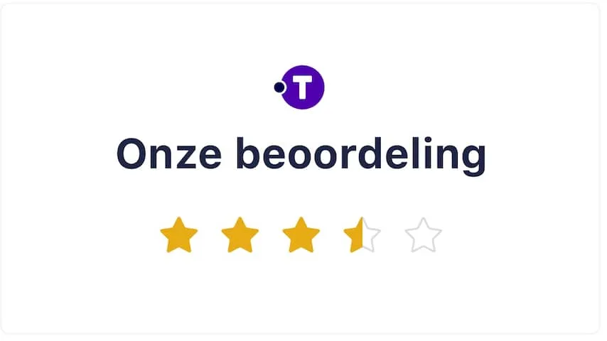

**Met de games Pokémon Let's Go Pikachu en Let's Go Eevee verschijnt een compleet vernieuwde versie van de allereerste game in de reeks, maar dan met elementen van Pokémon Go. Is dat genoeg om nieuwe fans te strikken?**

> [!NOTE]
> Deze recensie verscheen eerder op [NU.nl](https://www.nu.nl/reviews/5570402/review-pokemon-lets-go-is-een-instapgame-voor-pokemon-go-fans.html).

Inmiddels is het meer dan negentien jaar geleden sinds de eerste Pokémon-games in Nederland verschenen. Spelers konden met knoppen op de Game Boy het land door reizen, op zoek naar nieuwe monsters om te verzamelen en te trainen.

Jaren later verscheen _Pokémon Go_ voor smartphones, waarmee spelers ineens de echte wereld moesten afreizen. De gps-ontvanger van de telefoon houdt bij waar je bent, zodat je echt naar de supermarkt moet lopen om een wild monster tegen te komen.

_Pokémon Go_ wist de game naar de echte wereld te trekken, maar versimpelde de game wel volgens veel fans van het eerste uur. Ineens werd er niet meer gevochten tegen wilde Pokémon, maar hoefde je alleen maar over het scherm te vegen om ballen te gooien en ze te vangen. Functies zoals ruilen werden ook pas later toegevoegd.

[Bekijk ingesloten media](https://content.jwplatform.com/players/Cw185KWA-whqXCOFb.html)

## Pokémon Let's Go smelt de oude en nieuwe games samen

Voor die traditionele fans waren er lange tijd nog de Nintendo 3DS-spellen, die grotendeels de formule van de oude spellen volgden. Nu de Nintendo Switch op de markt is, probeert Nintendo voor het eerst om die klassieke games en _Pokémon Go_ samen te smelten.

De _Pokémon Let's Go_\-games zijn in grote lijnen identiek aan _Pokémon Red_, _Blue_ en _Yellow_. Je reist in dezelfde wereld tussen dezelfde steden, vecht tegen andere Pokémon-trainers en komt wilde monsters tegen om te vangen.

De originele Game Boy-games bestonden uit ruwe zwart-witpixels, die bij deze remakes zijn omgeruild voor gedetailleerde 3D-omgevingen. Personages hebben gezichtsuitdrukkingen en monumenten in de spelwereld zijn vrij precies vormgegeven, waardoor de game meer tot leven lijkt te komen. _Pokémon Let’s Go_ op grafisch vlak de mooiste uit de serie, mede omdat voorgaande spellen altijd alleen op de minder krachtige handheld-spelcomputeres van Nintendo verschenen.

Er zijn twee versies van de game, die worden verkocht als _Let's Go Eevee_ en _Let's Go Pikachu_. Ze verschillen op kleine manieren van elkaar - met als voornaamste verschil de Pokémon waar je het spel mee start. Een grote kopzorg is dat echter niet, omdat je de niet-gekozen Pokémon in de andere games later ook tegenkomt.

Het vangen van Pokémon werkt nu hetzelfde als in _Pokémon Go_, door met speciale monsterballen op je prooi te mikken. Speel je _Pokémon Let's Go_ op een televisie, dan moet je met je controller een gooibeweging maken om de bal te werpen. De bewegingssensor in de gamepad houdt bij of je hard genoeg en in een rechte lijn gooit.

De Nintendo Switch kan ook als draagbare spelcomputer gebruikt worden. In die gevallen hoef je geen gooibewegingen te maken, maar richt je de Switch op een doelwit en druk je op de A-knop.

## Een stuk simpeler dan de oude games

Het vangsysteem is een stuk simpeler dan in de traditionele games. Daarin moest je een monster verzwakken voordat je met ballen kon werpen, waarbij in de tussentijd een kans bestond dat je team werd uitgeschakeld. In _Let's Go_ is dat niet het geval, waardoor de algehele moeilijkheidsgraad van het spel een stuk lager ligt.

Dat geldt ook voor andere onderdelen van het spel. Pokémon-trainers waar je tegen vecht, hebben kleine teams met zwakkere monsters, waardoor de kans een stuk kleiner is dat je wordt uitgeschakeld tijdens een schermutseling. Wij speelden _Pokémon Let's Go_ toch zeker zo'n tien uur voordat een van onze teamgenoten werd uitgeschakeld.

Wil je het spel nóg makkelijker maken, dan kan een vriend op ieder willekeurig ogenblik met een tweede controller schudden om ook in de wereld te verschijnen. Tijdens zo'n coöperatief potje vecht je met zijn tweeën tegelijk tegen één monster, waardoor je praktisch onverslaanbaar wordt.

Iets later wordt het spel wel wat uitdagender, waardoor je goed moet nadenken over welke monsters je inzet tijdens bepaalde gevechten. Iedere Pokémon is namelijk sterk en zwak tegen andere types.

_Pokémon Let's Go — Beeld: Nintendo_

_Pokémon Let's Go — Beeld: Nintendo_

_Pokémon Let's Go — Beeld: Nintendo_

_Pokémon Let's Go — Beeld: Nintendo_

_Pokémon Let's Go — Beeld: Nintendo_

## Een lokkertje voor Pokémon Go-fans

Feit blijft wel dat de game een stuk makkelijker is dan de originelen waar hij op gebaseerd is. Wellicht omdat Nintendo minder fanatieke gamers wil aantrekken, die tot nu toe alleen _Pokémon Go_ hebben gespeeld.

Voor die _Pokémon Go_\-spelers is dit wel de meest toegankelijke titel tot nu toe. _Pokémon Let's Go_ geeft ze iets bekends, waarna ze langzaamaan kennis maken met de 'gewone' Pokémon-spellen. En dat de wereld de allereerste Game Boy-game, die veel mensen aan het begin van de eerste Pokémon-hype van de jaren negentig misschien nog wel herinneren.

De _Pokémon Go_\-spelers kunnen hun voortgang in het mobiele spel ook koppelen aan de Switch-game, zodat ze op de smartphone gevangen monsters kunnen gebruiken. Een veelbelovende functie die we helaas niet konden testen, omdat hij tijdens de reviewperiode nog niet toegankelijk was.

Ook verkoopt Nintendo een Switch-controller in de vorm van een Poké Ball. Deze kan worden gebruikt tijdens het spelen van _Let's Go_, waarbij hij dezelfde licht- en geluidseffecten heeft als de bal in het spel. Maar de bal kan ook aan _Pokémon Go_ worden gekoppeld om het spel te spelen zonder dat de app openstaat.

## Conclusie

Pokémon-fans van het allereerste uur zullen misschien niet héél diep onder de indruk zijn van _Pokémon Let's Go_. Het spel is makkelijker, vooral door een versimpeling van de manier waarop je monsters vangt. Wie een uitdaging wil kan beter tot volgend jaar wachten. Ontwikkelaar Game Freak belooft namelijk dan dat er een 'gewone' Pokémon-game voor de Switch verschijnt.

_Pokémon Go_\-spelers hebben hier echter een prima 'instapper', waarmee ze die traditionele games eens voor het eerst kunnen proberen. En daarna misschien wel verleid zijn om die ouderwetse spellen te blijven spelen.

_Pokémon Let's Go Eevee en Let's Go Pikachu verschijnen op 16 november voor Nintendo Switch._

_Rating 3,5_
