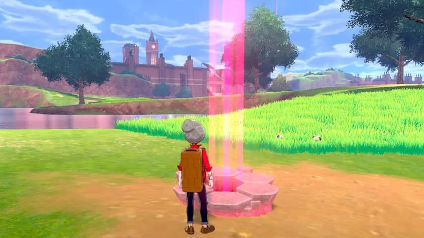

**De nieuwste Pokémon-games lijken op hun voorgangers. De vernieuwingen zitten vooral in de kleinste details.**

> [!NOTE]
> Deze recensie verscheen eerder op [NU.nl](https://www.nu.nl/reviews/6013246/review-pokemon-sword-en-pokemon-shield-zijn-vooral-ouderwets.html).

_Pokémon Sword_ en _*Pokémon* Shield_ zijn mogelijk de controversieelste games in de ruim twintig jaar oude reeks. Fans leveren al weken kritiek. Deels omdat ruim de helft van de inmiddels negenhonderd zakmonsters niet in het spel te vangen zijn.

Het is zelfs niet mogelijk om die missende wezens uit oudere games te importeren, iets wat decennialang wel mogelijk was. Boze internetters riepen op tot een boycot. Die bleek onlangs niet succesvol: na drie dagen hebben de games al een verkooprecord gevestigd.

Minder radicale fans zullen zich minder bekommeren om de verdwenen beestjes. _Pokémon Sword_ en **Pokémon** _Shield_ zijn in de kern wat we van voorgaande games konden verwachten: je krijgt aan het begin een Pokémon, reist van stad naar stad om medailles te verzamelen en komt in een groot toernooi uiteindelijk voor de landelijke kampioen te staan.

De games spelen zich ditmaal af in Galar, een regio die is geïnspireerd op het Verenigd Koninkrijk. Het is duidelijk dat de ontwikkelaar vooral heeft gekeken naar de voetbalgekte in het land: medailles worden ditmaal verdiend in grote stadions, die lijken op voetbalarena's.

_Pokémon Sword & Shield — Beeld: The Pokémon Company_

_De gevechten in Sword en Shield vinden plaats in grote stadions._

## Nieuw gevoel van schaal

Die nieuwe locaties zorgen voor een nieuw gevoel van schaal. Tijdens je belangrijkste gevechten kijken er duizenden (virtuele) mensen toe, waardoor je het idee hebt echt mee te doen aan een nationaal toernooi.

Tijdens dat toernooi wordt ook een nieuw spelsysteem toegevoegd. Je kunt voortaan één monster voor een beperkte periode gigantisch groot maken, waardoor ze krachtige aanvallen tot hun beschikking hebben. Daarmee combineert Game Freak de supersterke aanvallen uit _Sun_ en _Moon_ en de megaevoluties uit _X_ en _Y_.

## Het verhaal is versimpeld

Daar staat tegenover dat het verhaal van de games significant is versimpeld. Je bent enkel en alleen bezig jezelf omhoog te knokken in het klassement, zonder dat er significante zijpaden zijn. Sterker nog: op sommige punten lijkt het verhaal een andere wending te nemen, maar sturen personages je weg om "maar weer wat te gaan vechten".

_Sword_ en _Shield_ zijn de eerste games voor de Nintendo Switch, maar visueel is er verrassend weinig veranderd ten opzichte van de Nintendo 3DS-games. De game is scherper en heeft een indrukwekkender schaduwspel, maar de algehele visuele stijl doet nog sterk denken aan de mobiele game. Zo is het op de meeste locaties bijvoorbeeld nog niet mogelijk om de camera te draaien.

_Pokémon Sword & Shield — Beeld: The Pokémon Company_

_De regio Galar is geïnspireerd op het Verenigd Koninkrijk. Eerder gebruikte Pokémon-regio's leken geografisch gezien met name op gebieden in Japan._

## Wild Area verandert op basis van het weer

De grote uitzondering is de Wild Area, een groot spelgebied dat verandert op basis van het weer. Dit gebied is vrij te verkennen en bevat ook monsters die veel te sterk zijn om meteen al mee te vechten.

In de Wild Area krijg je ook te maken met raids, waarbij je een gigantische Pokémon bevecht met drie andere spelers. Daarmee biedt de game een makkelijke manier om coöperatief met je vrienden aan de slag te gaan. Heb je niemand om samen mee te spelen, dan wordt je team aangevuld met computergestuurde vechters.

Een raid-Pokémon is buitengewoon sterk en mag soms zelfs meerdere aanvallen tegelijk uitvoeren, waardoor je nauwlettend moet samenwerken om ze te verslaan. Het loont echter om deze gevechten te winnen: achteraf mag je het monster in kwestie proberen te vangen.

## Missers

Het ontbreken van bepaalde Pokémon vormt eigenlijk geen groot bezwaar bij het spelen van de game. Je komt er alsnog rond de vierhonderd tegen. Dat zijn er veel meer dan in de vroegste games te vinden waren. Nooit hadden we het gevoel dat er een tekort aan te vangen beesten was.

Wel misten we oude klassiekers die juist perfect leken voor Galar. De Pokémon Stoutland is bijvoorbeeld gebaseerd op een yorkshireterriër, een hondenras dat oorspronkelijk uit het Verenigd Koninkrijk komt. In Galar is hij alleen nergens terug te vinden.

Het gebrek is vooral een probleem voor professionele spelers, die graag een gevarieerd team samenstellen om mee te doen aan e-sporttoernooien. Game Freak legt zo te zien liever de nadruk op de gemiddelde speler die eens de game doorspeelt, dan de fanatieke professionele speler.

## Conclusie

_Pokémon Sword_ en _Pokémon_ _Shield_ zijn prima games, maar worden eigenlijk nooit meer dan dat. Dit is ouderwets _Pokémon_: heb je vroeger de oude games gespeeld, dan zullen deze spellen nostalgische gevoelens opwekken. Voor sommigen is dat genoeg; anderen hadden gehoopt op meer.

_Rating 3,5_
