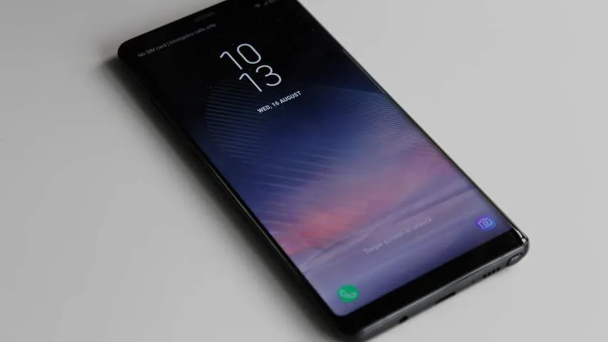
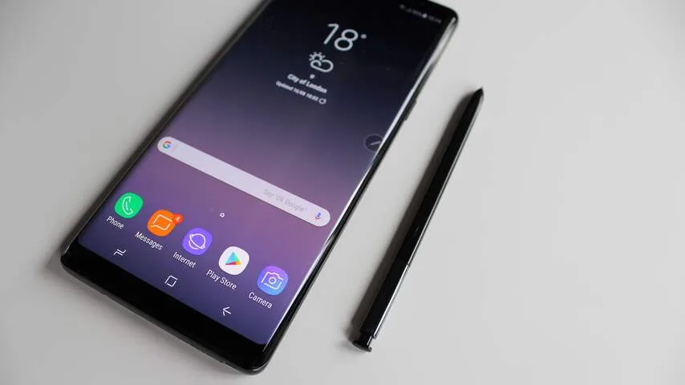
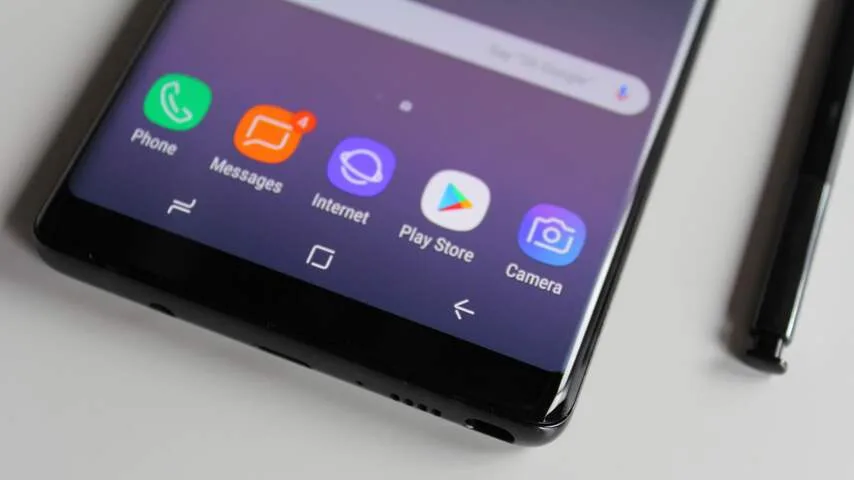
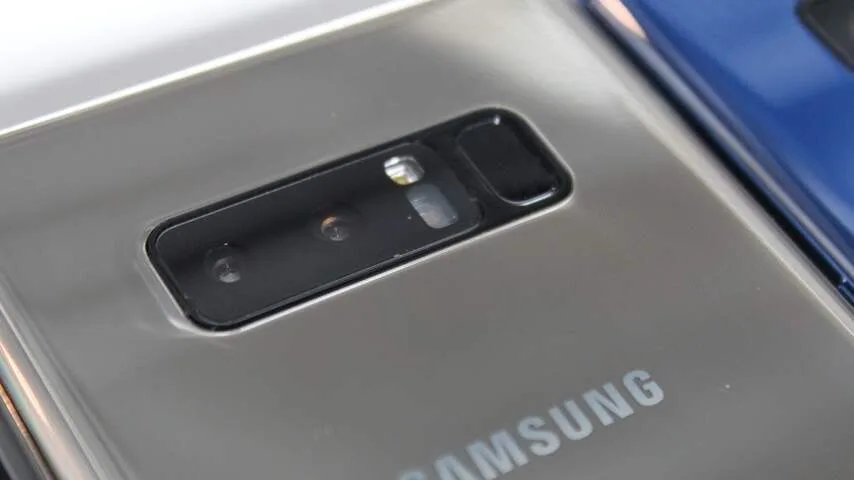

**Na drie jaar komt er eindelijk weer een Galaxy Note-telefoon naar Nederland. Een stylus, dubbele camera en betere specificaties moeten de Galaxy Note 8 onderscheiden van de S8 die eerder dit jaar op de markt kwam.**

> [!NOTE]
> Deze recensie verscheen eerder op [NU.nl](https://www.nu.nl/reviews/4891457/eerste-indruk-galaxy-note-8-is-een-s8-met-stylus-en-extra-camera.html).

De Note 8 is met een 6,3 inch-scherm nét iets groter dan de Galaxy S8+ van eerder dit jaar, die 6,2 inch groot is. Het verschil in grootte tussen de telefoons voelt verwaarloosbaar; de Note 8 voelt in de hand ongeveer even fors als de S8+. Daarmee lijkt de tijd voorbij waarin de Note-serie zich als echte phablets wist te onderscheiden.

Niet alleen de grootte voelt vergelijkbaar met de S8+, want ook het ontwerp van de Note 8 lijkt voor een groot deel identiek. De nieuwe Note heeft dezelfde dunnere schermranden die eerder in de S8-lijn werden geïntroduceerd. De glanzende achterkant is grotendeels gelijk aan die van de S8.

[Bekijk ingesloten media](https://content.jwplatform.com/players/6lZkYGQc-whqXCOFb.html)

## Stylus

De nieuwe Note onderscheidt zich op drie manieren van zijn concurrenten. Het meest noemenswaardige verschil is de stylus, die met een drukbeweging uit de onderkant van de telefoon gehaald kan worden.

Het pennetje kan worden gebruikt om bijvoorbeeld notities op te schrijven, zelfs als het scherm is uitgeschakeld. Deze notities kunnen ook worden vastgepind op het _always-on-display_, waardoor boodschappen bijvoorbeeld op het standbybeeld worden getoond.

Met de stylus lijkt Samsung zich op een specifieke doelgroep te richten. Niet iedereen gebruikt immers graag een pen om handgeschreven teksten in te voeren, terwijl een smartphone ook gewoon een toetsenbord heeft. Voor creatieve gebruikers die bijvoorbeeld ook graag tekenen, is het echter een welkome functie.

## Camera

Het tweede verschil: achterop de Note 8 zitten twee cameralenzen, een groothoeklens en een telefotolens. Bij het maken van foto’s wordt beeld met beide lenzen vastgelegd, zodat de gebruiker achteraf kan kiezen welke van de twee bewaard moet worden.

Met de telelens worden beelden meer ingezoomd vastgelegd, zonder dat er kwaliteitsverlies is door het gebruik van en digitale zoom. Beide camera’s gebruiken een 12 megapixel-sensor.

De camera’s kunnen ook worden gebruikt om virtuele scherptediepte te creëren bij portretfoto’s. Het onderwerp wordt daarbij herkend en de achtergrond onscherp gemaakt. Omdat het gaat om een digitaal effect, kan de intensiteit van het scherpte-effect worden aangepast.

De nieuwe camerafuncties zijn een prima toevoeging, maar niet héél origineel. We zagen meerdere smartphonefabrikanten eerder al dubbele camera’s achterop hun telefoons plaatsen. Bij de iPhone 7 Plus van concurrent Apple wordt hetzelfde scherpte-trucje voor portretfoto’s toegepast.

_Galaxy Note 8 — Beeld: NU.nl/Bastiaan Vroegop_

_Galaxy Note 8 — Beeld: NU.nl/Bastiaan Vroegop_

_Galaxy Note 8 — Beeld: NU.nl/Bastiaan Vroegop_

_Galaxy Note 8 — Beeld: NU.nl/Bastiaan Vroegop_

## Een grote S8

Zoals eerder aangegeven, lijkt de Note 8 in zijn ontwerp erg op de S8. Deels is dat logisch, gezien dat toestel eerder dit jaar verscheen en de toon heeft gezet voor komende Samsung-ontwerpen.

Het is alleen jammer dat kleine kritiekpunten op het ontwerp niet zijn aangepakt. Dat is vooral merkbaar bij de vingerafdrukscanner. Die zit achterop de telefoon, omdat voorop door de kleine schermranden geen ruimte is. Omdat hij net naast de camera is geplaatst, is het makkelijk om per ongeluk een vinger op de lens te leggen.

De Bixby-knop op de zijkant van de telefoon voelt nog steeds onhandig, omdat de virtuele assistent nog niet een héél grote toevoeging is. Een recente update voegde Engelse stembediening toe, maar dit was bij onze tests nog niet te gebruiken.

We kunnen echter wel zeggen dat de dagen van goedkoop ogende Samsung-telefoons ver achter ons zijn. Ook bij de Note 8 is gebruikgemaakt van gebogen schermranden en een glazen behuizing. Voorop staat niet langer het bedrijfslogo, wat de telefoon een minimalistische en professionele uitstraling geeft.

## Specs

Het derde verschil met de S8 vind je aan de binnenkant. Qua specificaties onderscheidt de Note 8 zich namelijk wel, al zijn de verschillen niet bijster groot. De telefoon heeft 6GB RAM, in plaats van de 4GB in de S8 eerder dit jaar.

De iets grotere 3.300mAh-accu zal een tikkeltje minder stroom bieden dan de 3.500mAh van de S8+. Al is dat afhankelijk van de nieuwe onderdelen en hoeveel meer deze verbruiken.

## Voorlopige conclusie

De Note 8 is simpel gezegd een S8+ met een dubbele camera en een stylus. Daar wint Samsung geen originaliteitsprijs mee, maar dat hoeft eigenlijk ook niet. Zo lang geleden is het niet sinds de S8 uitkwam, en die telefoon wist in de afgelopen lente een goede indruk achter te laten.

De Note 8 lijkt gemaakt te zijn om één grote concurrent te bestrijden: de iPhone 8. Samsung’s nieuwe telefoon heeft namelijk een prijskaartje van 999 euro, terwijl geruchten spreken over een nieuwe Apple-telefoon rond diezelfde prijsklasse. De Note 8 verschijnt op 15 september, terwijl de iPhone ook in september wordt verwacht. Het wordt dus een spannende maand voor de smartphonemarkt.
