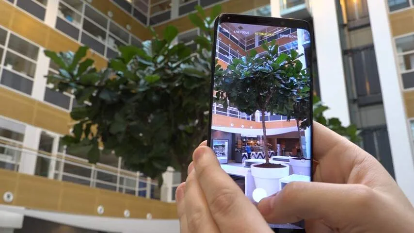
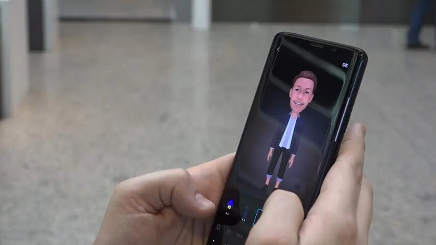
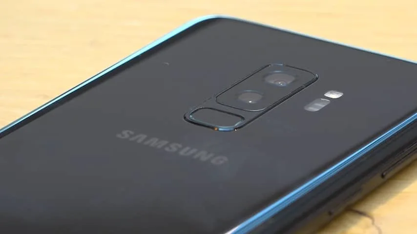
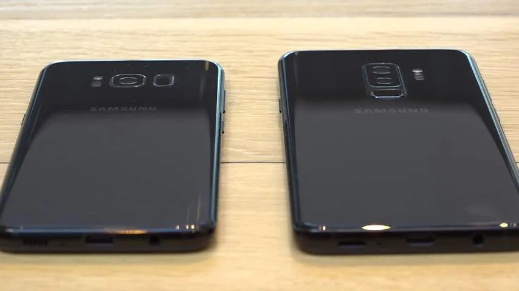
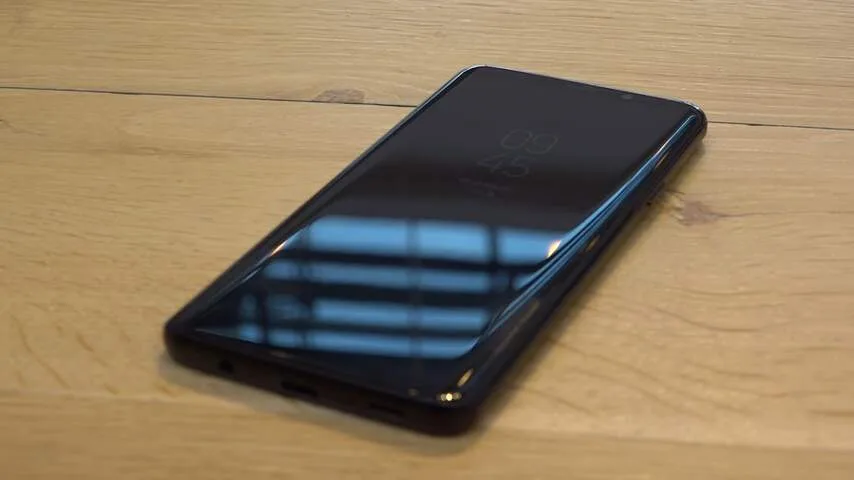

**Van buiten ziet de Galaxy S9 er verdacht veel uit als zijn voorganger. Bieden de cameravernieuwingen genoeg reden om de nieuwste Samsung-telefoon toch te kopen?**

> [!NOTE]
> Deze recensie verscheen eerder op [NU.nl](https://www.nu.nl/reviews/5200895/review-samsung-galaxy-s9-voelt-als-een-herhaaloefening.html).

De designveranderingen in de Galaxy S9 zijn minimaal. De schermranden zijn ietsje dunner, maar het verschil is alleen merkbaar als je er een Galaxy S8 naast legt. Je zult een S9 vooral in het wild herkennen aan de kleur paars, die Samsung voor het eerst bij dit model aanbiedt.

Het is lastig om Samsung de minimale designupdate te verwijten: met de S8 maakte het bedrijf een grote sprong, door als één van de eerste bedrijven te kiezen voor dunne schermranden. En hoewel het ontwerp weinig is veranderd, oogt de telefoon alsnog vrij gelikt en modern.

De randen van het scherm zijn aan de linker- en rechterkant nog steeds afgerond. De wat gladde achterkant zorgt ervoor dat de gehele telefoon aanvoelt als een minimalistisch stuk glas, waarbij geen enkel onderdeel van het design afleidt van het beeldscherm.

De vingerafdrukscanner achterop de telefoon zit niet langer naast de cameralens, maar eronder. Hierdoor is hij vooral op het grotere plusmodel van de telefoon makkelijker om met een vinger aan te raken. Ook is de kans kleiner dat je hem per ongeluk met de camera verwart en je vinger op de lens legt.

[Bekijk ingesloten media](https://content.jwplatform.com/players/P2s844Y5-whqXCOFb.html)

## Slowmotion

De grootste vernieuwing zit in de camera van de S9. Hoewel die nog steeds dezelfde twaalf megapixels als de S8 gebruikt, is hij op een aantal bijzondere manieren verbeterd.

Zo heeft de telefoonmaker bijvoorbeeld werkgeheugen rechtstreeks aan de sensor verbonden, dat weer wordt gebruikt voor een nieuwe slowmotionfunctie. Een video wordt opgenomen met een snelheid van 960 beelden per seconde. Speel je die af, dan wordt een fragment van 0,2 seconde opgerekt naar zes seconden.

Omdat de camera ook maar echt maximaal 0,2 seconde kan filmen, gebruikt de S9 een bewegingssensor om op het juiste moment beelden vast te leggen. Je ziet in de camera-app een vierkantje op het scherm waarbinnen naar beweging wordt gezocht. Zodra hier bijvoorbeeld een hond doorheen rent, zal de slowmotioncamera automatisch activeren.

## Resoluties

De slowmotionbeelden zien er indrukwekkend uit, maar er is een keerzijde. De beelden worden slechts in een resolutie van 1280 bij 720 pixels opgenomen, waardoor ze er wat wazig uit kunnen zien als je ze op bijvoorbeeld een 4K-scherm terugkijkt.

Het is mogelijk om 'gewone' slowmotion op te nemen in full HD, maar dan filmt de telefoon met 'slechts' 240 beelden per seconde, net als de slowmotionfunctie in veel bestaande telefoons. De telefoon kan ook 4K-video's vastleggen, maar doet dit alleen in 30 of 60 beelden per seconde.

De camera heeft voor het eerst een mechanisch diafragma. Hiermee kan de camera-opening door de telefoon worden aangepast, om te bepalen hoeveel licht er wordt doorgelaten en de scherptediepte een klein beetje aan te passen.

Dat diafragma is voor professionals en hobbyfotografen een stap in de goede richting. De gemiddelde telefoongebruiker zal het verschil vooral merken bij lage lichtomstandigheden, waarin de camera aanzienlijk mooiere beelden schiet.

_Galaxy S9 — Beeld: NU.nl/Robbert Jacobs_

_Galaxy S9 — Beeld: NU.nl/Robbert Jacobs_

_Galaxy S9 — Beeld: NU.nl/Robbert Jacobs_

_Samsung Galaxy S9 — Beeld: NU.nl/Robbert Jacobs_

_Samsung Galaxy S9 — Beeld: NU.nl/Robbert Jacobs_

## AR Emoji

De selfiecamera kan nu worden gebruikt om zogeheten 'AR Emoji' te maken. Daarbij wordt het gezicht van de telefoongebruiker gescand om een 3D-poppetje te maken, die als geanimeerde emoji in filmpjes kan opduiken. Daarbij worden gezichtsuitdrukkingen en mondbewegingen vastgelegd, net als bij de Animoji op de concurrerende iPhone X.

Waar de iPhone X meerdere sensoren gebruikt voor de emoji, moet de S9 het alleen doen met een enkele camera. Het zorgt ervoor dat bewegingen en uitdrukkingen vaak langzaam of foutief worden geregistreerd, waardoor de emoji er vooral wat onwenning uitzien.

Ze zijn wel makkelijker deelbaar dan bij de Apple-concurrent. De S9 maakt van je zelfgemaakte emoji een reeks simpele plaatjes, die vanuit een Android-toetsenbord snel geplaatst kunnen worden in apps zoals WhatsApp.

## Even snel?

En dan is er nog het dilemma van de processor. Nieuwe smartphones zijn doorgaans sneller dan hun voorgangers, maar bij de Galaxy S9 is daar in de praktijk niet heel veel van te merken. De smartphone is 'gewoon' snel, maar dat was de S8 afgelopen jaar ook al.

Bij strikte tests ontstaat een verwarrender verhaal. Bij het uitvoeren van een benchmark - waarbij de processorsnelheid wordt teruggebracht naar een meetbaar cijfer - lijkt de S9 ongeveer gelijk of zelfs iets slechter dan de S8 te presteren.

De verschillen zijn zodanig klein dat je er bij dagelijks gebruik niks van merkt. En laten we duidelijk zijn: zelfs de S8 is in 2018 nog een best snelle telefoon. Het is desalniettemin opmerkelijk dat er geen aanzienlijke prestatiesprong te zien is - en dat daarmee de groei in snelheid bij Samsung iets is vertraagd.

## Conclusie

Moet je nou een Galaxy S8 of een S9 kopen? Beide telefoons lijken verdacht veel op elkaar, vooral als je kijkt naar het ontwerp en de snelheid. Alleen de camera biedt een duidelijk verschil. Wat dat betreft is de keuze wellicht makkelijk. Ben je een fervent Instagrammer, of maak je dagelijks meerdere leuke video's? Dan is de S9 wellicht de telefoon voor jou. Zit je vooral op Twitter en Facebook, en speelt de camera helemaal niet zo'n grote rol? Dan is het eigenlijk geen slecht idee om voor nu nog een goedkopere S8 in huis te halen.

**Beoordeling: 3,5 uit 5 sterren**
