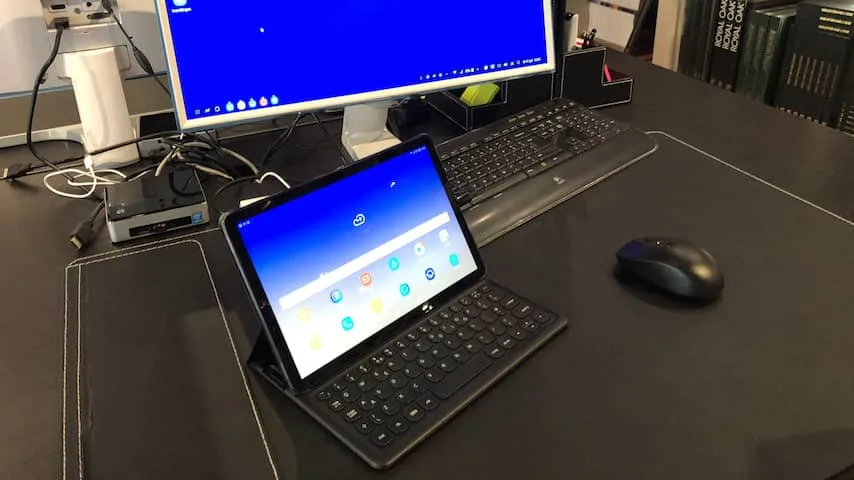
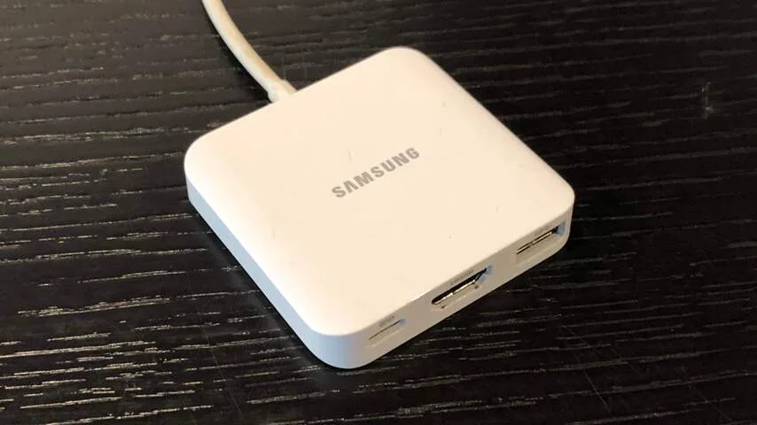
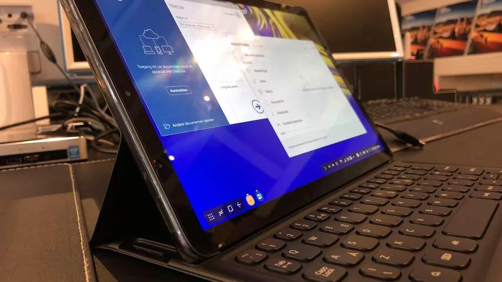
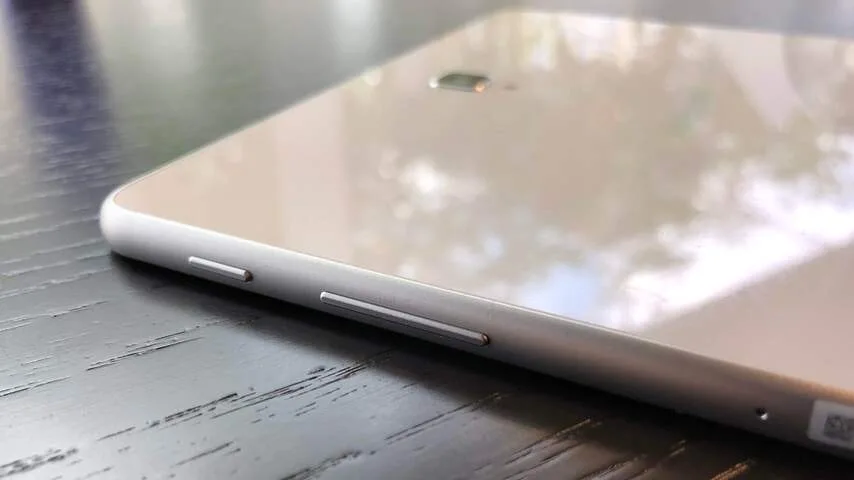
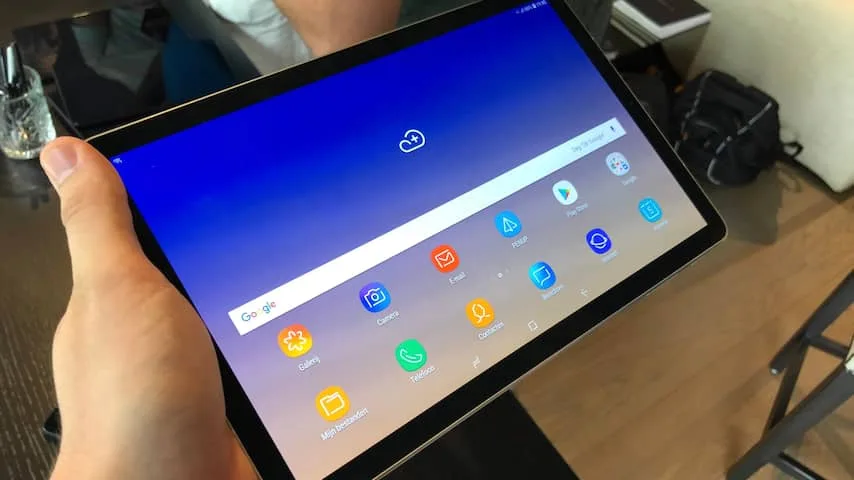
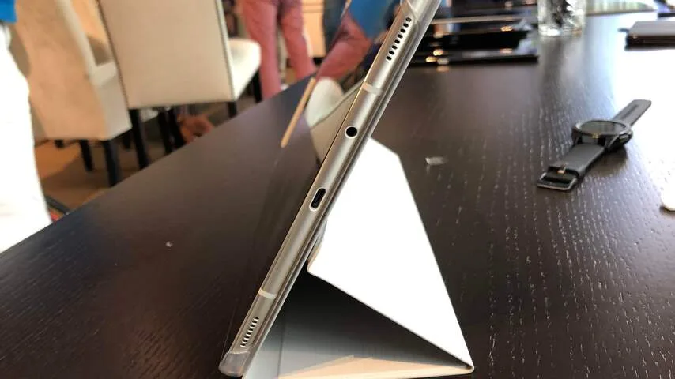

**Samsung doet met zijn nieuwste tablet nog een gooi naar de professionele markt. Daarmee heeft het bedrijf een interessante concurrent voor je laptop in handen.**

> [!NOTE]
> Deze recensie verscheen eerder op [NU.nl](https://www.nu.nl/reviews/5393507/eerste-indruk-concurreert-de-samsung-galaxy-tab-s4-met-laptops.html).

De Galaxy Tab S4 lijkt op het eerste gezicht een vrij standaard upgrade voor een tablet als je hem vergelijkt met de eerdere S3. Het scherm is met 10,5 iets groter, de resolutie van 2560 bij 1600 pixels ligt hoger dan bij de voorganger en de processor heeft ook een upgrade gekregen. Alleen de hoeveelheid werkgeheugen is met 4GB gelijk gebleven.

De schermranden zijn ook dunner geworden, wat vooral merkbaar is aan de boven- en onderkant. Dat leek inmiddels ook wel een noodzaak. Naarmate smartphones vaker randloze ontwerpen gebruiken, begon de oude Tab S3 er steeds meer uit te zien als een gigantische, ouderwetse smartphone.

De Tab S4 moet wel op één front inleveren om die dunnere randen mogelijk te maken. De tablet heeft ditmaal namelijk geen vingerafdrukscanner, terwijl die op de Tab S3 wel aanwezig is.

Gebruikers die geen codes willen invoeren, zijn daarom genoodzaakt om de irisscanner te gebruiken. Die werkte prima bij Samsung in een goed verlichte testruimte, waar we de tablet een uur konden uitproberen. Er was geen donkere kamer, dus we weten nog niet hoe de scanner functioneert bij minder licht.

_Galaxy Tab S4 — Beeld: NU.nl/Bastiaan Vroegop_

_Galaxy Tab S4 — Beeld: NU.nl/Bastiaan Vroegop_

_Galaxy Tab S4 — Beeld: NU.nl/Bastiaan Vroegop_

_Galaxy Tab S4 — Beeld: NU.nl/Bastiaan Vroegop_

_Galaxy Tab S4 — Beeld: NU.nl/Bastiaan Vroegop_

_Galaxy Tab S4 — Beeld: NU.nl/Bastiaan Vroegop_

Het herontwerp geeft de tablet wel een wat hoogwaardiger gevoel. Door de dunnere randen is er op de voorkant niet langer plek voor het Samsung-logo, dat er op de vorige tablets vaak wat opzichtig uitzag. De achterkant is net als bij de S3 gemaakt van glas. Er is geen plastic op de tablet te bekennen, maar ondanks het 'zwaar' ogende materiaal voelt de tablet licht bij gewoon gebruik.

Bij onze tests was het niet mogelijk om de tablet aan benchmarktests te onderwerpen. We kunnen wel zeggen dat het apparaat snel en soepel aanvoelt in gebruik, al is dat ook nog steeds het geval bij de oudere S3.

## DeX

De Tab S4 kenmerkt zich misschien wel het meeste door de ondersteuning voor DeX, een apparaat waarmee de tablet aan een toetsenbord, muis en monitor bevestigd kan worden. Samsung introduceerde dit apparaatje eerder al voor Galaxy-telefoons, die hierdoor in feite als werkcomputers gebruikt konden worden.

Er wordt binnen DeX een aangepaste versie van het Android-besturingssysteem getoond, waarbij apps in losse vensters getoond kunnen worden alsof het Windows-programma's zijn. Met toetsenbordcommando's kan snel worden geknipt en geplakt, of worden geschakeld tussen meerdere openstaande applicaties.

## Hybride tablet

Op de smartphones van Samsung voelde DeX als een leuke toevoeging, maar op de S4 lijkt de optie pas echt goed tot zijn recht te komen. Het zorgt er namelijk voor dat de tablet een hybride apparaat is, dat makkelijk kan schakelen tussen werk- en thuissituaties.

De Tab S4 wordt samen met een toetsenbordhoes verkocht waarin het ook mogelijk is om DeX te gebruiken. Je hebt dan alleen nog een bluetoothmuis nodig om de tablet als laptopvervanger te gebruiken.

Een alternatieve optie is om de tablet als grote trackpad te gebruiken terwijl hij met een beeldscherm is verbonden, waardoor bijvoorbeeld een illustrator met de stylus kan tekenen zoals op een traditionele tekentablet.

Samsung probeerde al eens iets vergelijkbaars met Windows-tablets en apparaten met alleen het mobiele Android, maar met DeX lijkt het bedrijf pas echt iets interessants in handen te hebben. De tablet heeft in 'gewone' thuismodus alle opties van het Android-besturingssysteem, terwijl bestanden en voortgang tussen apps in DeX hetzelfde blijft.

Verwacht echter niet dat DeX net zo uitgebreid is als Windows of macOS. Apps zoals Word, Excel, PowerPoint en Skype zijn aangepast om hierbinnen te worden gebruikt, maar andere apps kun je vooralsnog beter met je vingers bedienen. Professionals die gespecialiseerde software nodig hebben, kunnen wellicht niet hun ei kwijt bij de Tab S4, maar voor gewoon alledaags gebruik van e-mail-apps, Office en een tekstverwerker werkt DeX prima.

## Voorlopige conclusie

Gaat DeX van de Tab S4 een hybride tablet maken die kan concurreren met bijvoorbeeld de Microsoft Surface? Dat zal waarschijnlijk blijken naarmate de tablet langer beschikbaar is en serieus kan worden gebruikt.

Ben je van plan om de S4 alleen als 'gewone' tablet op de bank te gebruiken? Dan doet Samsung niet heel veel denderende dingen. Het scherm is iets beter en de randen zijn wat dunner, maar van de snelheidsverhoging zul je niet heel veel merken. De S4 is 'gewoon' snel genoeg, maar dat was de S3 ook al.
