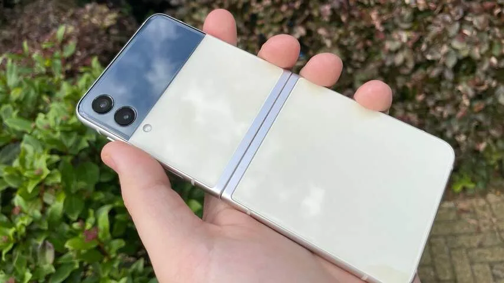
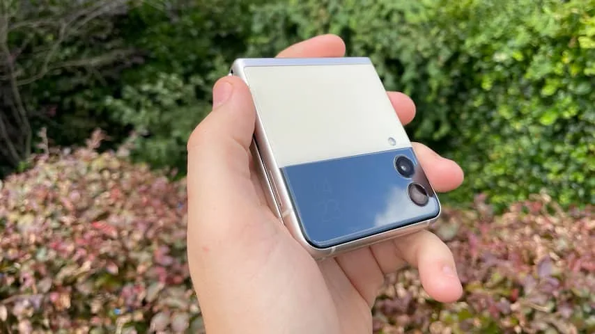
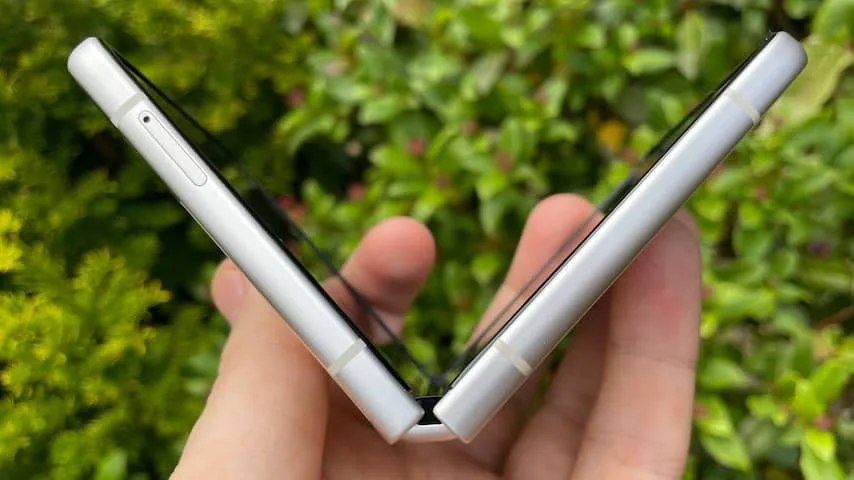
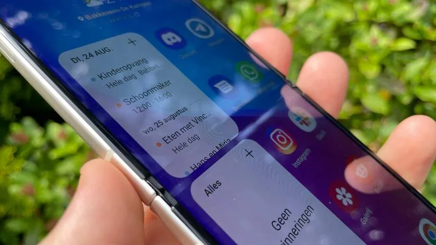

**Met de Galaxy Z Flip 3 heeft Samsung een betaalbare opvouwtelefoon geïntroduceerd. Maar je voelt nog wel een bobbel in het midden van het display.**

> [!NOTE]
> Deze recensie verscheen eerder op [NU.nl](https://www.nu.nl/reviews/6152968/review-samsung-galaxy-z-flip-3-maakt-opvouwtelefoons-iets-betaalbaarder.html).

De Zuid-Koreaanse telefoonmaker probeert nu al jaren van opvouwtelefoons de norm te maken. Dat begon met de Galaxy Fold in 2019, gevolgd door de Galaxy Z Flip in 2020. Met een ontwerp dat doet denken aan oude fliptelefoons zoals de originele Motorola Razr.

Nu maakt Samsung de sprong naar de Galaxy Z Flip 3 - de 2 is overgeslagen zodat de naam aansluit op de tevens nieuwe Fold 3. Hij lijkt in grote lijnen op zijn voorganger, hoewel de buitenkant nu een tweekleurig ontwerp heeft. Hierdoor doet de telefoon een beetje denken aan de Pixel-telefoons die Google zelf maakt.

De grootste vernieuwing zit in de prijs van de telefoon: een Galaxy Z Flip 3 kost 1.049 euro en wordt nu al soms voor minder verkocht. Dat blijft veel geld, maar het is meer in lijn met bijvoorbeeld de iPhone 12 en Galaxy S21 Ultra. En het is veel minder dan de 1.500 euro van de Flip 1.

_Review: Samsung Galaxy Z Flip 3 maakt opvouwtelefoons iets betaalbaarder — Beeld: Bastiaan Vroegop_

## Schermpje aan de buitenkant

De Flip 3 heeft wederom een schermpje aan de buitenzijde waarop notificaties getoond worden. Die is ditmaal een slag groter, waardoor hij bijna de breedte van de telefoon inneemt.

Dat buitenscherm heeft een paar leuke extraatjes. Zo is het mogelijk om het always-on-display te activeren, zodat de buitenzijde van de telefoon altijd de huidige tijd laat zien. Als je twee keer achter elkaar op de ontgrendelknop drukt, toont het schermpje een viewfinder voor de camera's. Zo kun je selfies maken met de betere lenzen en sensor van de telefoon.

Achterop de telefoon zitten twee camera's van ieder 12 megapixel. De tweede lens is bij deze telefoon een ultragroothoekcamera. Daar is verder weinig aan te merken: beide lenzen maken mooie, scherpe foto's met ruim kleurgebruik.

_Review: Samsung Galaxy Z Flip 3 maakt opvouwtelefoons iets betaalbaarder — Beeld: Bastiaan Vroegop_

## Nog niet stofdicht

De Flip 3 gebruikt net als zijn voorganger een speciaal, flexibel scherm dat opgevouwen kan worden. Een vrij prille technologie, die er ook voor zorgt dat het scharnier in het midden het meest kwetsbare gedeelte is. Dat zie je ook aan de specificaties: hoewel de telefoon geclassificeerd is als waterdicht tot 1,5 meter, is hij niet stofdicht.

Het open- en dichtvouwen van ons testtoestel voelde afgelopen week soms spannend. Af en toe hoor je een licht gekraak, alsof er een stofje of zandkorrel uit de broekzak in het scharnier terecht is gekomen. Die hebben tot dusver nog niet voor merkbare schade gezorgd, maar bij zulke mechanische systemen blijven we er voor vrezen.

_Review: Samsung Galaxy Z Flip 3 maakt opvouwtelefoons iets betaalbaarder — Beeld: Bastiaan Vroegop_

## Bobbel in je telefoon

Veeg over het midden van het scherm en je voelt vrij duidelijk een bobbel, die je ook snel ziet vanuit bepaalde kijkhoeken. Alles in deze telefoonbult is prima te zien of lezen, maar het is jammer als een recht bedoelde lijn in een app of game ineens een bocht maakt.

Het lijkt een noodzakelijk offer voor wie een opvouwtelefoon wil. Het is nog de vraag of het scherm op termijn bobbeliger zal worden: wij hebben hem nog maar een week getest.

_Review: Samsung Galaxy Z Flip 3 maakt opvouwtelefoons iets betaalbaarder — Beeld: Bastiaan Vroegop_

## Conclusie

De Galaxy Z Flip 3 is vooral een goedkopere variant van de peperdure telefoon van vorig jaar, met betere specificaties en een iets groter scherm aan de buitenzijde.

Daarmee pakt Samsung de meest gehoorde kritiekpunten aan, behalve het lastigste: het opvouwscherm. Hopelijk wordt dat in latere edities ook nog stofafstotend.
