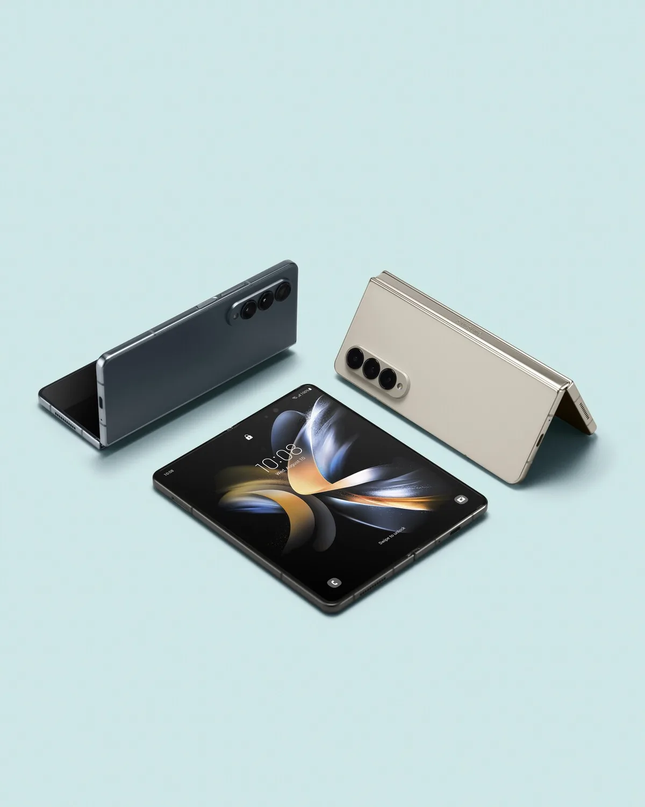
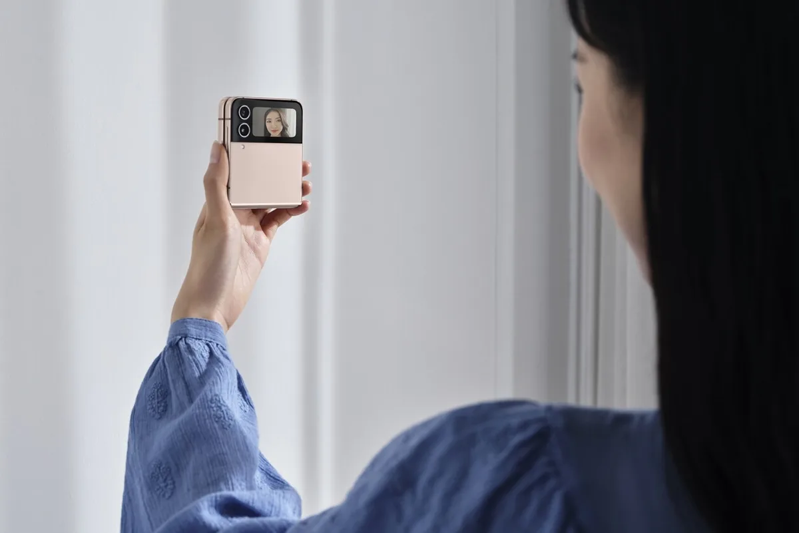

Eerder deze week presenteerde Samsung de opvolgers van zijn opvouwtelefoons: de Galaxy Z Fold 4 en Galaxy Z Flip 4. Beide lijken verdacht veel op hun voorgangers. Weinig vernieuwend, maar met deze twee toestellen is dat goed te begrijpen.

> [!NOTE]
> Deze recensie verscheen eerder op [AD](https://www.ad.nl/tech/samsungs-nieuwe-opvouwtelefoons-zijn-amper-veranderd-en-dat-is-oke~ac453abf/).

Samsung is op het moment koning van de opvouwbare telefoonmarkt. De Galaxy Z Flip, een toestel dat je als een ouderwetse klaptelefoon kunt vouwen, is de onbetwiste marktleider op dit moment. Hij is door zijn scharnier een stuk compacter dan ‘gewone’ smartphones, waardoor hij makkelijk in een ondiepe broekzak past. Een verademing in een wereld met steeds grotere toestellen.

De Z Fold is Samsungs productiviteitsmachine. Hij is met zijn 1800 euro duurder dan de 1100 euro kostende Flip, maar kan worden uitgevouwen tot een kleine tablet. Hierop kun je meerdere apps naast elkaar open hebben staan. Het maakt dit één van de weinige tablets die je net zo makkelijk als een smartphone met je meeneemt.

## Vierde generatie haast onveranderd

Bij de nieuwe Z Flip 4 en Z Fold 4 zitten de verschillen in de details. Beide smartphones hebben snellere processoren, betere camera’s en een kleiner scharnier om ze mee dicht te vouwen. In het gebruik zijn het simpel gezegd hartstikke snelle telefoons die mooie foto’s schieten. Op beide fronten is niks aan te merken.

De Fold heeft een iets breder en lager scherm. Een stap in de goede richting, al is het ingeklapt nog steeds een vrij smal beeldscherm om naar te kijken. Maar het is een aanpassing in grootte die pas opvalt als je de oude Fold ernaast houdt: van significante veranderingen is hier geen sprake.

Samsung probeert beide telefoons vooral te verfijnen en actualiseren. De snellere chip kan zich prima meten met andere recente smartphones, waardoor je niet bang hoeft te zijn een verouderd apparaat te kopen. Daarnaast zijn er op softwaregebied kleine aanpassingen gedaan. Bij de Z Flip 4 kun je bijvoorbeeld het buitenste minischermpje meer naar eigen smaak aanpassen en snelle reacties op berichten sturen. En bij de Z Fold 4 staat nu een dock met app-iconen onderaan, zodat je sneller tussen meerdere applicaties wisselt.

De Z Fold 4 kan worden uitgevouwen tot een soort tablet. © Samsung

## Verfijning is precies wat de vouwtelefoon nu nodig heeft

Je kunt Samsung verwijten dat beide smartphones zo weinig veranderd zijn, maar het is bij producten als deze eigenlijk wel logisch. De opvouwtelefoon is nog steeds vrij experimenteel en onontgonnen terrein. Ze gebruiken speciale, flexibele schermen en scharnieren, die schadegevoeliger zijn dan platte telefoons die altijd ongebogen blijven. Dat bleek ook bij de eerste generatie vouwtoestellen, die snel kapotgingen als vuil in het scharnier terechtkwam. Sindsdien is de achterliggende technologie verbeterd, maar die eerste problemen hebben de telefoons een slecht imago gegeven.

Dat maakt het logisch om dit jaar de telefoons vooral praktisch te verbeteren, en niet bijvoorbeeld een nieuw ontwerp te introduceren. Bij een ander soort vouwsysteem zou Samsung immers nieuwe mogelijke problemen introduceren. Al heeft het bedrijf weinig gedaan om de toestellen weerbaarder te maken dan hun meest recente voorgangers: de Fold en Flip 4 zijn net zo vuilafstotend als het derde model. Daarnaast kunnen ze volgens Samsung nog net zo vaak vouwen: tot 200.000 keer.

Het schermpje achterop de Z Flip 4 kan voor selfies worden gebruikt, zodat je foto's maakt met de beste camera's in het toestel. © Samsung

## Niet voor Fold 3- en Flip 3-bezitters

Het gebrek aan noemenswaardige nieuwe functies maakt beide toestellen oninteressant voor bezitters van de Fold 3 en Flip 3 - maar ze zijn daar ook helemaal niet voor bedoeld. Dit zijn smartphones die voor meer dan duizend euro over de toonbank gaan, en daarmee bedoeld zijn om langere tijd te blijven gebruiken. Als jouw 1800 euro kostende Fold 3 uit 2021 nu al aan vervanging toe is, dan is er iets raars aan de hand.

De nieuwste modellen zijn voor wie al jarenlang een andere smartphone heeft, zoals bijvoorbeeld de eerste Flip en Fold of heel wat anders. Dan vind je hier een vouwontwerp dat anno 2022 nog steeds hartstikke modern is, met aan de binnenzijde de nieuwste hardware. De Fold 4 is met zijn torenhoge prijs waarschijnlijk alleen voor een heel specifieke groep mensen interessant, maar de Flip 4 is een smartphone die voor velen aanlokkelijk kan zijn.
