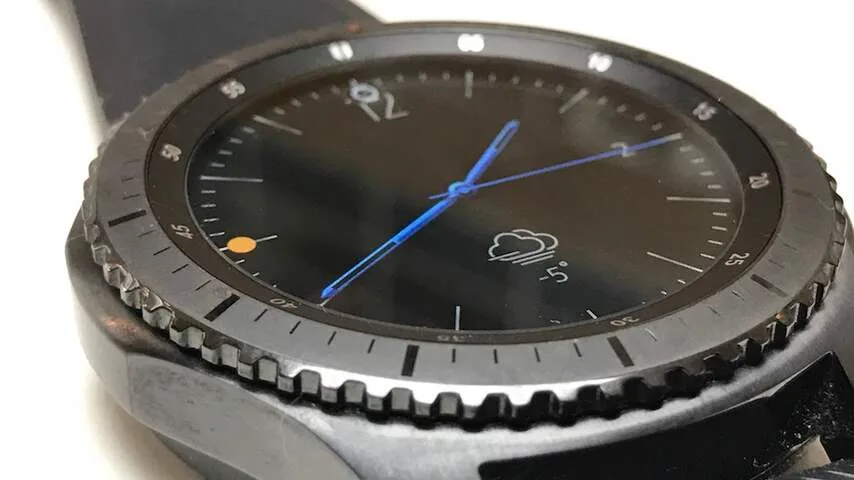
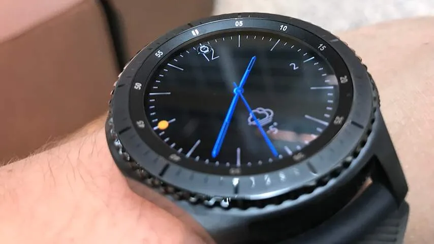
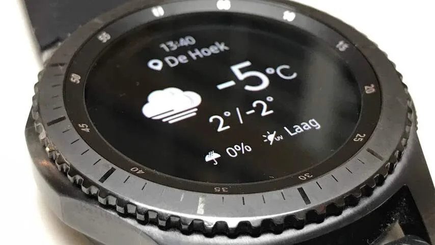

**De Samsung Gear S3 is nog steeds één van de intuïtievere smartwatches - maar zijn de kleine vernieuwingen genoeg om een aanschaf te rechtvaardigen?**

> [!NOTE]
> Deze recensie verscheen eerder op [NU.nl](https://www.nu.nl/reviews/4359621/review-gear-s3-biedt-kleine-verbeteringen-voor-al-prima-smartwatch.html).

Toen Samsung in 2015 de Gear S2-smartwatch op de markt bracht, waren we blij verrast. Het horloge had een draaibare ring, waarmee de interface op intuïtieve wijze bediend kan worden. Het zorgt ervoor dat het kleine horlogescherm bediend kan worden zonder dat hij door vingers wordt bedekt.

Zo kan de draairing vanaf de wijzerplaat nog steeds naar links worden gedraaid voor notificaties van de telefoon, of rechts voor een overzicht met widgets. Het horloge komt nu in twee versies - waaronder een stevigere Frontier-editie.

De nieuwe Gear S3 borduurt voort op het principe achter zijn voorganger. De draairing om het scherm is nog steeds aanwezig en de interface steekt grotendeels nog hetzelfde in elkaar.

Dat gebrek aan verandering hoeft niet per se erg te zijn. Het draairingsysteem werd afgelopen jaar bejubeld, dus het is alleen maar logisch dat een nieuwe variant hier nog gebruik van blijft maken. Daar staat echter tegenover dat dit nieuwe model alleen weinig écht grote vernieuwingen bevat.

## Zelfstandiger

De veranderingen in de Gear S3 zijn te vinden in kleine functies. Zo heeft Samsung bijvoorbeeld een GPS-antenne toegevoegd, zodat het horloge zonder smartphone werkt tijdens het sporten. Er wordt dan een kaart bijgehouden van bijvoorbeeld de gelopen route.

Draadloze Bluetooth-koptelefoons kunnen rechtstreeks met het horloge worden gekoppeld, om muziek gedownload op het horloge mee af te spelen. Een handige functie in het algemeen, die in de praktijk eigenlijk alleen handig is bij het sporten.

Door de smartwatch op meerdere manieren zelfstandiger te maken, wordt hij beter bruikbaar als een serieus sporthorloge. Op het scherm kan bijvoorbeeld afgelegde afstand worden getoond terwijl de ingebouwde stappenteller en hartslagmeter lichaamsactiviteit meten.

Het horloge stuurt een paar keer per dag ook notificaties om je aan te sporen te bewegen, maar de functie voelt willekeurig. Zo maakt de Gear S3 geen onderscheid tussen locaties, waardoor het horloge je ook tijdens een dag op kantoor wil aansporen om te gaan lopen.

De Gear S3 probeert te ontdekken wanneer iemand gaat sporten door te kijken naar bijvoorbeeld hartslag of bewegingen. Het zorgde er bij ons echter voor dat iedere korte wandeling naar de supermarkt ook als een sportactiviteit werd bestempeld, waardoor het sportoverzicht in de horloge-app wat onoverzichtelijk wordt.

_Gear S3 — Beeld: NU.nl/Bastiaan Vroegop_

_Gear S3 — Beeld: NU.nl/Bastiaan Vroegop_

_Gear S3 — Beeld: NU.nl/Bastiaan Vroegop_

## Waterdicht

Volgens Samsung is de Gear S3 water- en stofwerend. Hij is IP68-gecertificeerd. Het betekent in feite dat het horloge prima gedragen kan worden in hevige regenbuien.

Het horloge houdt het een half uur lang anderhalve meter onder water vol, maar daarmee is het apparaat officieel niet geschikt om mee het zwembad in te duiken. Samsung raadt daarom het dragen van de S3 tijdens zwemmen of duiken af.

## Twee dagen

De Gear S2 blonk uit met een bovengemiddeld lange batterijduur, die bij de S3 nog steeds aanwezig is. Volgens de fabrikant kan het apparaat drie dagen lang op een volle accu worden gebruikt. Die lange gebruiksperiode wisten wij niet te halen, maar het horloge was met gemak twee dagen achter elkaar te benutten.

Hoewel een e-ink-smartwatch zoals de Pebble langer overleeft op een volle batterij, weet de Gear S3 hiermee andere slimme horloges te verslaan. Ter illustratie: een Apple Watch houdt het doorgaans een dag vol.

## Weinig apps

De smartwatches van Samsung draaien niet op Android Wear, maar op het eigen besturingssysteem Tizen. Bij de S2 en S3 is dat ook wel logisch, het stelt Samsung in staat om de draairing goed te integreren.

Het eigen OS heeft echter een effect op het appaanbod voor het horloge. Heel veel applicaties zijn er in het afgelopen jaar namelijk niet voor het besturingssysteem ontwikkeld. Waarschijnlijk zien ontwikkelaars er weinig in, omdat een app voor Tizen ook alleen op Samsung-horloges werkt. Een app voor Android Wear draait op meer platformen.

Het betekent dat je grotendeels afhankelijk zult zijn van de apps die Samsung zelf heeft gemaakt. Op zich niet erg, aangezien deze apps genoeg van de basisfuncties bieden. Je kunt hierdoor alleen niet rekenen op veel verrassende, toekomstige toepassingen.

## Conclusie

De vernieuwingen in de Gear S3 zijn niet heel groot. De toevoeging van GPS is vooral interessant voor sporters, waardoor niet-sportieve gebruikers niet héél veel reden hebben om van een S2 te upgraden.

De vraag is of dat erg is. De Gear S2 is anno 2016 nog steeds een prima smartwatch - een productcategorie waarbinnen upgrades nooit heel erg groot zijn. Wie nog geen slim horloge heeft, kan prima terecht bij het nieuwe Samsung-horloge. Het is vanaf een S2 echter niet snel de moeite waard om te upgraden.
