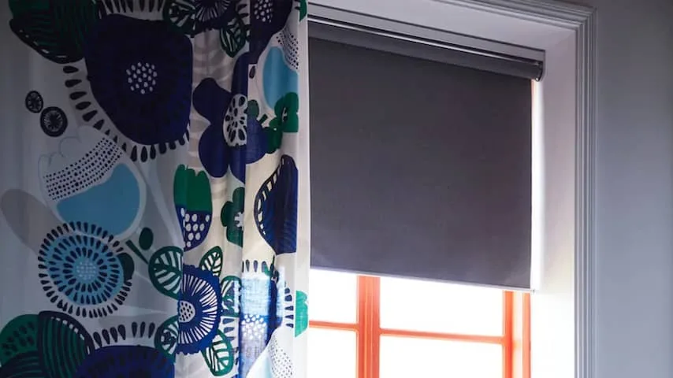

**Woonwinkelgigant IKEA heeft na maanden uitstel eindelijk zijn slimme gordijnen in de winkels liggen. De zelfrollers zijn een stuk goedkoper dan andere slimme alternatieven, maar op softwaregebied moet er nog het een en ander gebeuren.**

> [!NOTE]
> Deze recensie verscheen eerder op [NU.nl](https://www.nu.nl/tech/5993542/review-slimme-gordijnen-van-ikea-zijn-betaalbaar-maar-nog-wel-beperkt.html).

De slimme gordijnen bevatten een batterij en een draadloze antenne. Hierdoor kun je ze met één druk op de knop van een afstandsbediening open of dicht doen. Koop je er een speciale Hub bij, dan zijn ze zelfs te verbinden met een slimme speaker of smartphone, zodat je de gordijnen met apps en stemcommando's bedient.

IKEA verkoopt zijn slimme gordijnen in twee varianten: de verduisterende FYRTUR, die vanaf 139 euro wordt verkocht, en de lichtdoorlatende KADRILJ, die vanaf 119 euro wordt aangeboden. Beide gordijntypes zijn in breedtes tussen de 60 en 140 centimeter beschikbaar.

Ze kunnen allemaal maximaal 195 centimeter naar beneden rollen. Hiermee zijn de gordijnen geschikt voor de meeste gangbare ramen. Met knoppen aan de zijkant van de rail stel je in hoe ver het gordijn maximaal mag uitrollen, zodat hij precies je raam bedekt. Wil je echter een schuifpui of een muurvullend raam bedekken, dan is de lengte iets te kort.

Daarnaast kun je de breedte niet zomaar inkorten. Bij een gewoon rolgordijn kun je soms een ijzerzaag en een mes gebruiken om het precies groot genoeg voor je raam te maken, maar bij de IKEA-variant riskeer je dan dat de ingebouwde hardware stuk gaat.

_IKEA — Beeld: IKEA_

## Met een afstandsbediening

De gordijnen worden standaard geleverd met een signaalversterker en een afstandsbediening. Die laatste heeft een magnetische plaat die je op de muur kunt schroeven of plakken, zodat je hem makkelijk los kunt trekken om op andere plekken te bedienen. De meegeleverde materialen zijn net voldoende om de gordijnen alleen met de afstandsbediening te kunnen bedienen.

Dat werkt zoals je zou verwachten. Een druk op de onderste knop verduistert je kamer, terwijl de bovenste knop het licht binnenlaat. Het gordijn doet er bij ons raam van 1,20 meter hoog ongeveer twintig seconden over om volledig dicht te gaan. Dat klinkt lang, maar je kunt na het indrukken van de knop gewoon weglopen om iets anders te doen.

Het is nog de vraag hoelang de meegeleverde batterij het precies volhoudt. Na een paar weken testen hebben we de batterij nog niet hoeven vervangen. Mocht ze ooit leeg zijn, dan is het gelukkig makkelijk om de batterij weer van stroom te voorzien. In de accu zit namelijk een micro-USB-lader, waar iedere gangbare smartphonelader op kan worden aangesloten.

## Met wifi verbinden

De vereiste verbindingshub om de gordijnen met je wifinetwerk te verbinden, kost 33 euro. Het koppelen van deze twee gadgets vereist soms echter wat geduld. Je moet de afstandsbediening vlak bij de hub en de gordijnen houden terwijl je een knop ingedrukt houdt om ze met elkaar te verbinden - dat lukte bij onze tests maar zelden. Pas na meerdere resets en uren proberen, werkten de apparaten goed met elkaar samen.

Met behulp van de hub kun je de gordijnen koppelen aan de IKEA Home smart-app. Hierin kun je ze bedienen zoals met de afstandsbediening, maar ook bepaalde routines instellen. Zo doe je de gordijnen automatisch iedere dag om een bepaalde tijd open of dicht. Dat is eigenlijk de enige slimmigheid die je in de app kunt vinden. Wil je de IKEA-gordijnen echt slim maken, dan moet je er externe apps en diensten aan koppelen.

## Slimme webkoppelingen

Vanuit de IKEA-app kun je de gordijnen koppelen aan de stemassistenten van Google en Amazon. Met een simpel stemcommando kun je de gordijnen dan open- of dichtdoen. Op de website IFTTT kan je de Google-koppeling vervolgens gebruiken om de gordijnen op meer manieren te automatiseren, zodat ze bijvoorbeeld dichtgaan zodra de zon ondergaat, een functie die niet in de app zelf zit.

De IFTTT-koppeling laat je de gordijnen in feite koppelen aan honderden andere apps, diensten en gadgets. Je kunt de gordijnen bijvoorbeeld open laten gaan als je de lampen aanzet terwijl je thuis bent en het buiten licht is, zodat alles in één keer gebeurt. Koppel je de gordijnen aan je slimme afstandsbediening, dan kunnen ze bijvoorbeeld automatisch dichtgaan als je de filmmodus inschakelt.

_IKEA — Beeld: IKEA_

## Nog niet met Siri

Je kunt de app ook koppelen aan Apples HomeKit, voor bediening vanuit de Woning-app of met Siri, maar deze functie beperkt zich momenteel tot de slimme lampen van IKEA. De gordijnen zijn op het moment van schrijven daarom nog niet op die manier te besturen. Hobbyisten hebben het [via een omweg](https://homebridge.io/) wel werkend gekregen, maar dat vereist de nodige technische kennis en geduld.

Bovenstaande vraagt wel één ding van je: dat je jouw slimme gadget toevertrouwt aan een andere softwaremaker dan IKEA. Daarnaast is het vaak een gepuzzel om het goed werkend te krijgen. En omdat websites als IFTTT via het internet werken, duurt het even voordat de actie wordt uitgevoerd. Eigenlijk zouden we willen dat al die externe functies ook gewoon vanuit de app van IKEA werken.

## Prijs

De gordijnen van IKEA winnen op één front in elk geval: de prijs. Al jarenlang betaal je honderden euro's als je een slim gordijn wilt aanschaffen. De woonwinkelketen verkoopt ze vanaf een prijs van 120 euro, waardoor ze ineens interessant worden voor de gemiddelde huisbezitter.

Die prijs begint overigens al invloed te hebben op de algehele markt. In de afgelopen weken zijn de prijzen van slimme rolgordijnen en gordijnrails flink gezakt, vermoedelijk uit angst om door IKEA weggeconcurreerd te worden.

## Conclusie

IKEA heeft van het slimme gordijn ineens een massaproduct gemaakt. Er is nog het een en ander aan te merken op het huidige model - zoals de missende ondersteuning voor HomeKit en de wat beperkte app - maar het geheel is indrukwekkend. Het koppelen met je wifinetwerk kan in het begin wat gedoe zijn, maar daarna is er weinig op aan te merken.

_4 sterren — Beeld: NU.nl_
