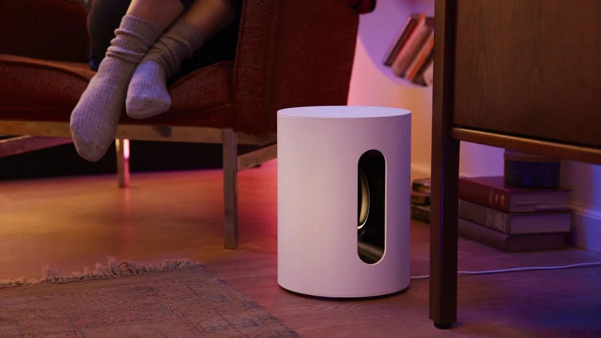

Sonos heeft een nieuwe, goedkopere subwoofer uitgebracht. We konden hem alvast even testen en hebben vijf dingen die daarbij opvielen op een rij gezet.

> [!NOTE]
> Deze recensie verscheen eerder op [AD](https://www.ad.nl/tech/we-hebben-de-goedkopere-sonos-subwoofer-getest-vijf-dingen-die-opvielen~ac4b09fe/).

Sonos had al een tijdje een subwoofer, maar dat was een best duur apparaatje: wie diepe bastonen wilde voelen bij de audiofabrikant, legde daar 850 euro voor neer. De nieuwe Sub Mini is met 500 euro een stuk goedkoper, maar zoals de naam verklapt is hij ook een stukje kleiner. Maar dat is niet per se erg, merkten we.

## 1\. Geluidskwaliteit is prima, mits je kamer niet te groot is

De geluidskwaliteit was bij onze tests namelijk prima. De bas is diep en op de hoogste instellingen zelfs goed voelbaar. We hadden eigenlijk nooit wat te klagen tijdens deze tests.

Maar: we hadden de Sub Mini bij onze tests primair is een kamer van 30 vierkante meter staan. Dat is volgens Sonos de maximale grootte waarop de subwoofer goed presteert - bij grotere ruimtes adviseert het bedrijf de duurdere Sub. Dat kunnen we ons goed voorstellen: het geluid is hard en punchy, maar we vermoeden dat het inderdaad niet de andere kant van een grote, open benedenverdieping zou halen.

## 2\. Sonos wordt steeds goedkoper

De afgelopen jaren introduceert Sonos steeds meer goedkope luidsprekers. Het begon met de boekenkastspeakers die ze samen met IKEA maken, die half zo duur zijn als de Sonos Ones van het bedrijf zelf. De soundbars van het bedrijf kregen een budget-alternatief in de Sonos Ray. En nu is er de Sub Mini, waarmee alles voor een homecinemaset bij het bedrijf nu betaalbaarder is geworden.

Ter illustratie: wie vroeger een volledige Sonos-set om de tv wilde, met soundbar, achterspeakers en een subwoofer, betaalde daar 1.800 euro voor. Met de Sub Mini en andere goedkope speakers heb je de kamer voor minder dan 1.000 euro gevuld. Het zijn nog steeds geen budgetprijzen, maar Sonos maakt zijn speakers duidelijk steeds betaalbaarder.

De Sonos Sub Mini. © Sonos

## 3\. Hij is draadloos, dus je zet hem makkelijk ergens neer

Steeds meer fabrikanten bieden een draadloze verbindingsoptie voor hun luidsprekers, en Sonos loopt op dat vlak al een tijdje voor. Dat is ook het geval bij de Sub Mini: je verbindt hem via 5GHz-wifi met de andere luidsprekers, waarna het geluid synchroon wordt afgespeeld. Je kunt zo een soundbar, twee achterspeakers en de Sub Mini verbinden voor een volwaardige homecinemaset.

Het betekent dat je niet overal audiokabeltjes naartoe hoeft te trekken. Zolang je Sonos-speaker een nabijgelegen stopcontact heeft, kun je hem daar goed neerzetten. Die vrijheid zorgt ervoor dat je makkelijker je Sub Mini en andere speakers ruim door een kamer kunt verspreiden.

**Liever iets compacts?** De redactie van BestGetest zette [de beste draadloze oordoppen](https://bestgetest.nl/de-beste-draadloze-oortjes-van-2021?utm_source=ad&utm_medium=tekstlink&utm_term=byo&utm_campaign=redactioneel&utm_content=c4b09fe) op een rij.

## 4\. De Sub Mini kan alles dat zijn grote broer kan

De Sub Mini is goedkoper, maar het verschil zit echt puur in de speaker zelf. Qua randfuncties is het apparaat verder gelijk aan zijn grote broer, tot het ontwerp met een gat middenin aan toe.

Zo kun je ook bij de Sub Mini de Sonos-app als een soort waterroede gebruiken om het geluid op je kamer af te stemmen. De luidsprekers spelen dan een gek geluid af, terwijl je de telefoon langzaam heen en weer door je kamer beweegt om alles goed af te stemmen. Een beetje gek, maar het werkt wel goed.

## 5\. Wacht nog even, Black Friday komt er aan

De Sub Mini is al goedkoper dan de grote Sub, maar koopjesjagers adviseren we om nog iets langer te wachten. Eerder stelde Sonos de introductie van ‘een nieuw product’ uit tot later in het jaar om beter aan te sluiten op het komende aanbiedingenfeest Black Friday, en het lijkt te gaan om deze Sub Mini.

Het betekent dat er waarschijnlijk rond november tijdelijk een hap van de prijs gaat, en je tegen die tijd er nog minder voor betaalt.
