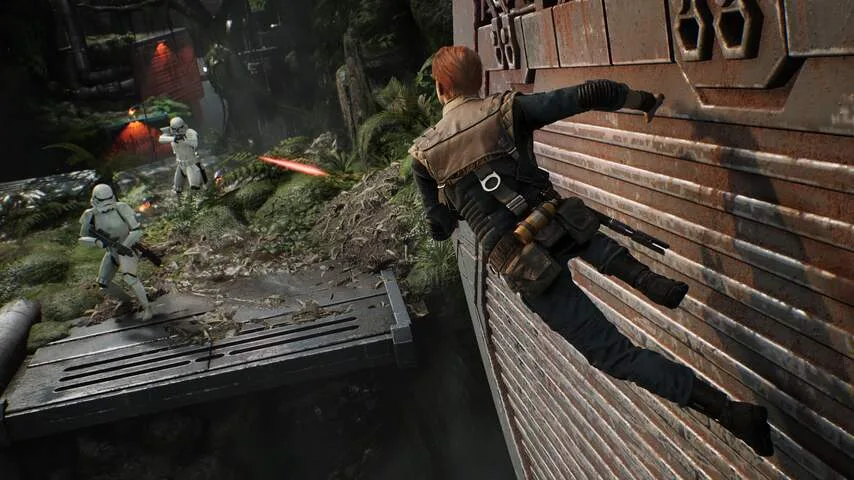
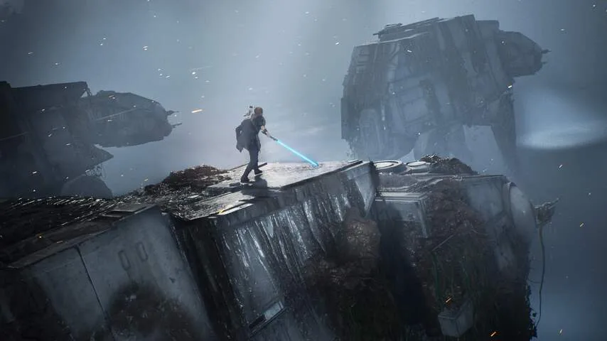

**Voor het eerst in jaren is er weer een verhalende sologame in het Star Wars-universum verschenen. Het spel zal fans van de serie kunnen boeien, maar meer dan een fijn tussendoortje is het niet.**

> [!NOTE]
> Deze recensie verscheen eerder op [NU.nl](https://www.nu.nl/reviews/6011097/review-star-wars-fallen-order-vermaakt-wel-maar-verbaast-nooit.html).

In _Star Wars Jedi: Fallen Order_ speel je een ondergedoken Jedi-ridder, op het moment vlak nadat het Keizerrijk de opdracht gaf om al je lotgenoten uit te moorden. De inquisitie komt je op het spoor nadat je met je krachten een vriend redt, waarna je ontsnapt en in een verzetsoperatie wordt gezogen.

Het verhaal is net interessant genoeg om de game goed lopende te houden, al voelt het tempo soms wat vreemd. Personages naast de held worden eigenlijk amper uitgebouwd, vermoedelijk omdat dit het tempo uit de game zelf haalt.

_Star Wars Fallen Order — Beeld: Respawn_

_Als Jedi-ridder ren en spring je door de wereld heen. (Beeld: Respawn)_

## Open wereld met puzzels en schatkisten

Wat volgt, is een avontuur dat in eerste instantie wat standaard aanvoelt: je springt, vecht en klautert door de eerste gebieden heen. Maar zodra je door het eerste deel heen bent, blijkt de gehele game best open te zijn. Levels zijn opgedeeld in planeten, maar die zijn vrij om te verkennen.

De spelwereld voelt nooit als een levende plek, simpelweg omdat je alleen gevaarlijke gebieden bezoekt die als traditionele levels zijn gestructureerd. Maar het open karakter maakt de game gevarieerder dan aanvankelijk gedacht. Fijn detail: je stuit bij het spelen zelden op laadschermen. Je vliegt met je schip van planeet naar planeet en tijdens die vluchten wordt de game in de achtergrond geladen.

Sommige gebieden kun je pas bereiken zodra je nieuwe krachten hebt ontgrendeld, waarmee de game je probeert aan te sporen om af en toe terug te gaan naar oude plekken. Dat loont vaak: in verborgen grotten en geheime kamers staan regelmatig schatkistjes, met daarin nieuwe kleding of lichtzwaardonderdelen. Hiermee kun je jouw personage uitbouwen.

Iets later stuit je af en toe ook op oude tempels. Deze zitten vaak vol met puzzels. In de eerste moet je bijvoorbeeld windmachines activeren om grote ijzeren bollen rond te laten rollen - wat je daarna zelf kan doen zodra je daar een speciale Jedi-kracht voor krijgt. Deze puzzels zijn een welkome afwisseling van het constante vechten en rondspringen.

_Star Wars Fallen Order — Beeld: Respawn_

_In Fallen Order moet je overal op je hoede zijn. (Beeld: Respawn)_

## Het gevaar schuilt om elke hoek

Veel 'filmgames' proberen je tocht zo makkelijk mogelijk te maken, maar dat is in _Fallen Order_ niet het geval. Gevechten zijn al vanaf het tweede level een uitdaging en vereisen je volledige aandacht. Je moet naar een opening in de verdediging van je vijanden zoeken, terwijl je hun aanvallen met perfecte timing pareert. Vijanden verstoppen zich vaak op onverwachte plekken, waardoor je altijd op je hoede moet zijn als je een nieuwe kamer binnenloopt.

Bovenstaande maakt _Fallen Order_ een onderhoudende game, maar op geen punt weet het spel écht te verbazen. Veel van de spelelementen die hier aanwezig zijn, zijn in veel oudere games al meerdere malen toegepast. De game voelt als een samenraapsel van concepten die eerder succesvol bleken, zonder dat een van deze elementen die van de concurrerende voorgangers ontstijgt.

[Bekijk ingesloten media](https://content.jwplatform.com/players/zzmh2esg-whqXCOFb.html)

## Enkele verstoringen in The Force

_Star Wars_\-fans zullen allang blij zijn dat ze een coherent verhaal binnen het universum kunnen doorspelen. Want hoewel _Fallen Order_ zijn concurrenten op geen enkel punt voorbijschiet, is het over het algemeen wel een prima ervaring. Maar dit is op geen enkel punt een bovengemiddeld fantastische game, laat staan een meesterwerk.

Dat is deels ook te wijten aan de vele bugs die we tijdens het spelen tegenkwamen. Geen van deze foutjes verhinderde onze voortgang, maar ze zorgden er wel voor dat het spel onafgewerkt aanvoelt. Op veel momenten stottert bijvoorbeeld de spelwereld, waarna we een paar seconden moesten wachten tot alles weer stabiel liep.

Bij dialogen liep de audio vaak niet synchroon met de beelden en soms leken personages midden in de lucht te zweven. Het is te hopen dat ontwikkelaar Respawn deze foutjes gladstrijkt met een snelle update. Bij het verschijnen van de game is een patch uitgegeven die veel van de fouten moet herstellen, al was dat voor deze review niet te testen.

## Conclusie

Op wat storende bugs na is er weinig op _Fallen Order_ aan te merken, maar tegelijkertijd steekt de game nooit boven zijn concurrenten uit. Daarom is het een prima spel voor iedereen die het warm krijgt van alles wat met _Star Wars_ te maken heeft en is het een geinig tussendoortje. Maar een kanshebber voor de titel 'game van het jaar' is het niet.

_Rating 3,5_

_Star Wars: Fallen Order is vanaf vandaag verkrijgbaar op PlayStation 4, Xbox One, en Microsoft Windows._
