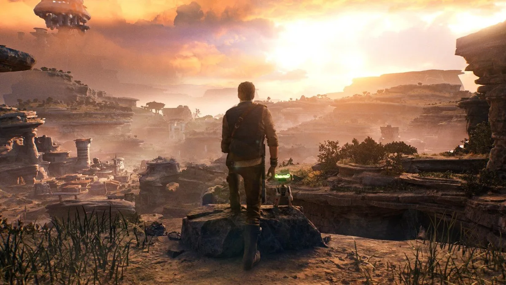

**Bright Review**

Fallen Order was in 2019 de eerste Star Wars-game in jaren die echt een goede indruk wist te maken. Het voelde als een interactieve film: je speelde als de jonge Jedi Cal Kestis, die op de vlucht voor het keizerrijk op zoek gaat naar andere overlevenden.

> [!NOTE]
> Deze recensie verscheen eerder op [Bright](https://www.bright.nl/nieuws/1134205/review-star-wars-jedi-survivor-grootser-leuker-en-met-meer-foutjes.html).

Het nieuwe Jedi Survivor speelt vijf jaar na de gebeurtenissen van die game af. Cal heeft zich inmiddels aangesloten bij het verzet en reist van schuilplaats naar schuilplaats. Als hij ontdekt hoe groot het keizerrijk is geworden, is hij de wanhoop nabij en gaat hij op zoek naar een manier om te overleven.

## Klauteren als Uncharted

De game speelt grotendeels gelijk aan zijn voorganger. Cal kan vechten met zijn lichtzwaard en met de Force tegen objecten aanduwen. Hij beweegt door de wereld door langs richels te klauteren en puzzels op te lossen. Tijdens het verkennen voelt Survivor als een cinematisch avonturenspel als Uncharted. Tijdens gevechten wordt de game snel spannend, vooral bij sterke vijanden, die je met goede reflexen en timing moet pareren om te verslaan.

Naarmate de game vordert wordt Cal vaardiger en kan hij ook beter voortbewegen. Extra sprongen, 'dashes' door de lucht en bewegingen door groene portalen zorgen dat je soms aan het rondspringen bent alsof het een Mario-game is. Latere levels worden ook best wat moeilijker, waardoor de game geduld en goed reflexwerk vraagt. Het voelt als een gedurfde actie voor een game van dit budget - de meeste andere titels spelen het safe, uit angst spelers af te schrikken met een hogere moeilijkheidsgraad.

De handgemaakte wereld voelt lineair aan, maar je kunt steeds meer kanten op naarmate je de game langer speelt. Je komt verspreid door de wereld schatkisten met vooral cosmetische upgrades tegen - zoals nieuwe outfits of kleding voor Cal. Maar soms loop je ook een verborgen grot of tempel tegen het lijf, waar je na een puzzel of moeilijk gevecht een upgrade vindt.

## Grootser

Jedi Survivor probeert alles net iets grootser aan te pakken dan zijn voorganger. Waar je in Fallen Order tussen twee vechtstijlen kon wisselen - met één lichtzwaard of met een dubbel lichtzwaard - heb je er in Survivor vijf. Naast de bestaande opties kun je nu twee lichtzwaarden tegelijk gebruiken, in je linkerhand een laserpistool vasthouden of met een 'crossguard' vechten, het lichtzwaard van filmschurk Kylo Ren dat voelt als een groot, lomper wapen.

Waar je in Fallen Order slechts een handjevol outfits kon aantrekken, waarvan het gros een poncho was, is de variatie in Survivor iets groter. Daarnaast kun je nu kapsels aanpassen en bijvoorbeeld een baard laten staan, en je kunt je meereizende robotje BD-1 allerlei nieuwe onderdelen aanmeten.

Daarnaast is de spelwereld simpelweg groter. De tweede planeet die je bezoekt lijkt gevoelsmatig even groot als het gros van heel Fallen Order - al zijn veel van de te bezoeken gebieden optioneel. Omdat planeten nu dorpjes en andere sociale gebieden hebben om met personages te praten, voelen ze ook meer aan als werelden dan als levels. Een grote verbetering ten opzichte van Fallen Order, waar de wereld soms wat leeg kon voelen door het ontbreken van andere vriendelijke personages.

[Bekijk ingesloten media](https://www.youtube.com/embed/_F6YBwIPzmk?autoplay=1&modestbranding=1)

## Beter geschreven

Een team aan schrijvers heeft er ook voor gezorgd dat het verhaal van de game zelf levendiger aanvoelt. Op dat gebied was Fallen Order vrij terughoudend: je speelde als de vluchtende Cal, maar daarbij putte het verhaal vooral uit bestaande ideeën uit eerdere films en series. Survivor zet op zijn planeten een uniek verhaal neer dat voelt alsof het een galactische impact heeft, zonder dat het zich bemoeit met wat er in het filmuniversum gebeurt. Daarbij grijpt de game zelfs terug naar de 'High Republic', het tijdperk honderden jaren voor de eerste Star Wars-film.

Het universum komt verder tot leven door een grotere hoeveelheid zijpersonages. Cal maakt tijdens zijn reizen steeds weer nieuwe vrienden, die gaandeweg afreizen naar een saloon op de planeet Koboh. Daar kun je met ze praten en zo meer over ze te weten komen. Ze geven je extra missies en diepen zo het game-universum nog verder uit. Hierdoor voelt Jedi Survivor soms als de klassieke Star Wars-rpg Knights of the Old Republic.

## Technische problemen

Naast al dat goeds is er wel één belangrijk kritiekpunt: de technische kant van Jedi Survivor lijkt nog niet heel goed afgewerkt. Wij speelden in de Quality-modus, waarbij de game een framerate van 30 fps probeert aan te houden op een 4K-resolutie, en zagen soms gekke lichtflitsen. Daarnaast lieten personages in tussenfilmpjes soms een gek soort 'aura' achter. Het verpestte de game nooit, maar was wel opvallend. Een collegajournalist die op 'Performance Mode' speelde voor een framerate van 60 frames per seconde zag het spel soms dippen, waardoor alles wat stotterde.

Het kan zijn dat veel van die problemen zijn opgelost als de game is uitgekomen. Ontwikkelaar Respawn zegt te werken aan een patch die nog voor de verkoopstart op vrijdag 28 april verschijnt, die belooft meerdere technische problemen aan te pakken. Het kan echter ook dat slechts een deel van de problemen wordt aangepakt en de game bij de release nog kan stotteren en haperen. Dat is op dit moment lastig zeggen.

## Conclusie

Gelukkig zijn die technische mankementen nooit storend genoeg om van een verder zeer leuke game af te leiden. Jedi Survivor is grootser en meeslepender dan zijn voorganger.

De game voelt soms als een grote, open wereld, maar zit juist vol met allerlei leuke, handgemaakte gebieden om te verkennen. Er is ontzettend veel te doen, en bijna alles dat je tegenkomt voelt interessant. Het maakt Jedi Survivor een onwijs leuke game - en hopelijk het tweede deel in een trilogie.
