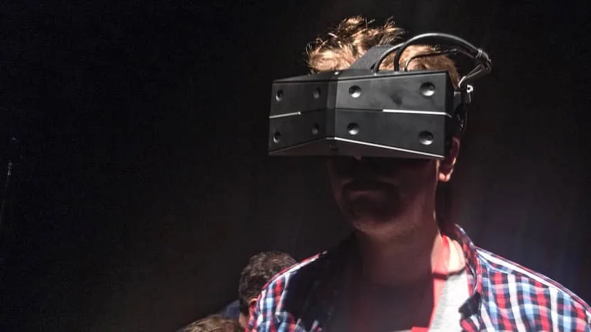

**Techbedrijven hebben de afgelopen jaren grote stappen gemaakt op het gebied van virtual reality, maar bijna alle headsets hebben nog last van het 'duikbrileffect'. Gaat de StarVR dat oplossen?**

> [!NOTE]
> Deze recensie verscheen eerder op [NU.nl](https://www.nu.nl/reviews/5440613/eerste-indruk-starvr-one-is-een-virtualrealitybril-met-gigantische-kijkhoek.html).

Alle virtualrealitybrillen (VR-brillen) hebben een kijkhoek. Die bepaalt hoe breed je blikveld precies is en wat je in één oogopslag tegelijkertijd kunt zien. De Oculus Rift en HTC, twee van de voornaamste VR-brillen van dit moment, hebben een kijkhoek van 110 graden.

Dat is voldoende om recht voor je uit te kijken, maar aan de zijkanten van je ogen zie je zwarte randen. Het is alsof je vanuit een duikbril naar de virtuele wereld kijkt. Wil je zien wat er in je ooghoek gebeurt? Dan moet je vaak je hele hoofd bewegen om de juiste kant op te kijken.

## Kijkhoek van 130 graden minder revolutionair

De StarVR heeft een veel grotere kijkhoek van 210 graden, waardoor je veel meer aan de zijkanten van je blikveld kunt zien. Bij onze tests was deze hoek voldoende om ons volledige beeld te vullen. Voor het eerst was het mogelijk om met alleen je ogen naar links of rechts te bewegen, om te zien wat daar precies gebeurt.

De verticale kijkhoek van 130 graden is iets minder revolutionair. Hoewel je aan de linker- en rechterzijde alles kunt zien, hangen boven en onder je nog kleine zwarte balken die je beeld inkaderen. Daarnaast is het beeld even scherp als bij veel huidige brillen, waardoor je alsnog de pixels van elkaar kunt onderscheiden.

## Slimme truc bij scherpstellen

Het grotere beeldscherm zorgt er wel voor dat de bril een veel hogere resolutie heeft - waardoor games en apps meer rekenkracht zouden vereisen. De maker probeert dit deels op te lossen met een truc genaamd 'foveated rendering'. De bril houdt in de gaten waar je naar kijkt en zal alleen dat onderwerp scherp in beeld brengen, terwijl de rest er minder mooi uitziet.

_StarVR One — Beeld: NU.nl/Rutger Otto_

Bij onze tests was dat effect haast niet op te merken. Tijdens het rondkijken leek alles gewoon even scherp. We kregen nooit het idee dat de scherpte van een onderwerp stiekem werd aangepast. Het is een slimme manier om de vereiste computerspecificaties in te dammen - en iets dat concurrent Oculus recent ook deed om zijn mobiele Go-bril goedkoop te houden. Volgens de maker wordt de StarVR echter alsnog een bril die een relatief krachtige pc zal nodig hebben.

Het testmodel dat wij konden proberen had een klein mankement als we naar het midden van het beeld keken. Dan is ineens heel duidelijk dat je naar een tweedimensionaal scherm kijkt, waardoor je uit de virtuele wereld wordt gehaald.

## Problemen met de pupiltracker

De makers denken dat dit door de pupiltracker van de bril komt, die inschat hoe ver de ogen van elkaar staan en de lenzen hier automatisch op afstemmen. Het is een probleem dat ze in de uiteindelijke versie hopen op te lossen. Dat is ook nodig, want geen enkele virtualrealitybril die wij hebben geprobeerd brak op die manier de illusie.

Op het moment bevindt de StarVR zich nog in een vroeg traject. De bril was te zien op de gadgetbeurs IFA, maar fabrikanten Acer en Starbreeze weten nog niet wanneer ze hem gaan verkopen. Een prijs is ook nog niet bekend, maar vermoedelijk vereist de bril wel een zeer dure pc.
