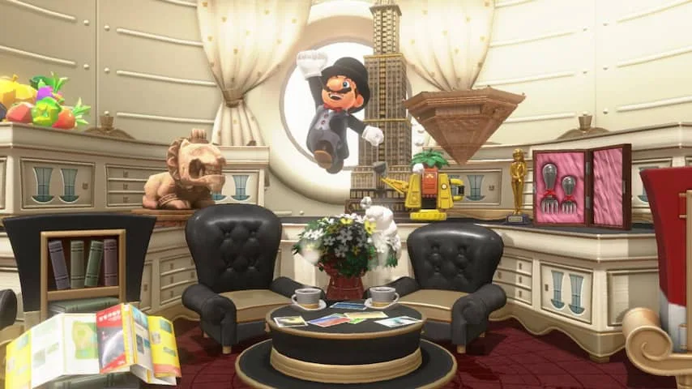
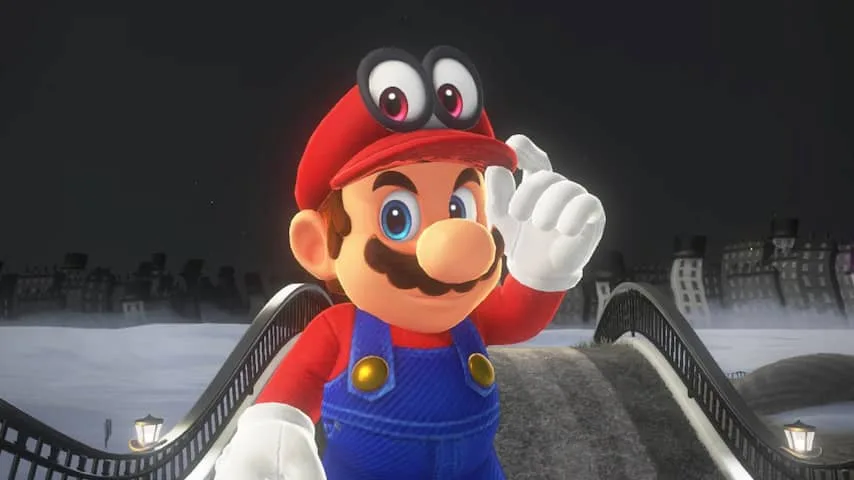
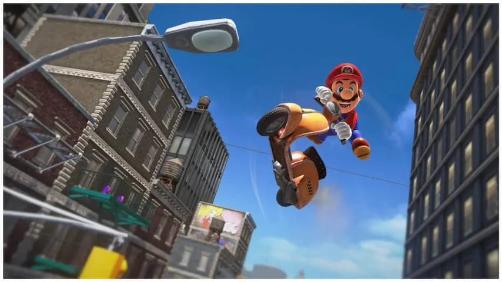
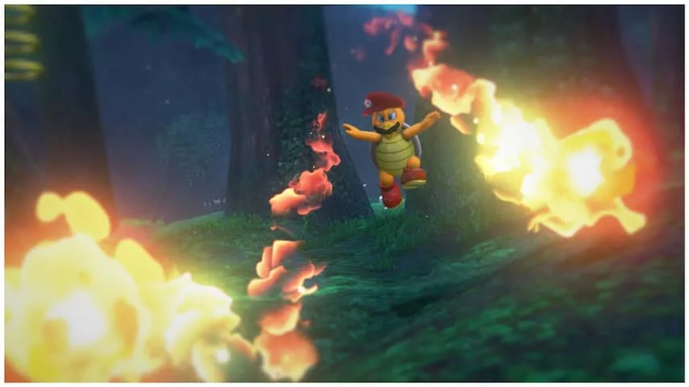

**Dik een half jaar nadat de Nintendo Switch op de markt verscheen, heeft Nintendo de eerste volwaardige Mario-game uitgebracht voor de spelcomputer. Biedt Super Mario Odyssey genoeg reden om de Switch in huis te halen?**

> [!NOTE]
> Deze recensie verscheen eerder op [NU.nl](https://www.nu.nl/reviews/4979900/review-super-mario-odyssey-blijft-continu-verrassen.html).

Oud-fans zal een hoop bekend voorkomen in het nieuwe _Mario Odyssey_. De besnorde loodgieter springt, rent en stampt op nagenoeg dezelfde manier als in eerdere games als _Mario Galaxy_.

De grote vernieuwing zit in de pet van Mario. Die kan met een druk op de knop naar voren worden gegooid. Het is een handig wapen om vijanden mee uit te schakelen, maar achter de pet schuilt een belangrijkere functie. Het is namelijk ook mogelijk om met een worp bepaalde objecten en wezens over te nemen.

Gooi de pet bijvoorbeeld naar een naderende kanonskogel om ineens grote afstanden met Mario te vliegen. Moet Mario in een meer duiken? Dan kan dat een stuk sneller door de pet op een vis te mikken. Ieder over te nemen onderwerp heeft unieke kenmerken en vaardigheden, die de manier veranderen waarop de game gespeeld wordt.

Het overnemen van monsters en objecten speelt in ieder level een andere rol. In één van de eerste gebieden duik je bijvoorbeeld in het lichaam van 'Chain Chomps', een soort balvormige honden die aan een ketting liggen. Trek de ketting strak en de hond wordt gelanceerd, waarbij hij alles op zijn pad verwoest. Een simpel spelprincipe, dat later in de game wordt gebruikt om een soort flipperkastpuzzels mee te spelen.

[Bekijk ingesloten media](https://content.jwplatform.com/players/rsseARYF-whqXCOFb.html)

## Levels

Zo heeft ieder level zijn eigen unieke momentjes. Met waterspuwende kwallen koel je lavaputten af, je hobbelt als een yeti een berg af en je verwoest gebieden als een met hamers gooiende schildpad. Hoewel de besturing van ieder personage simpel is, weet Nintendo voor elke mogelijkheid levels te ontwerpen die ingenieus en eigenwijs aanvoelen.

De designconcepten van ieder individueel level zouden prima op zichzelf staan in een zelfstandige game, maar Nintendo wisselt in _Mario Odyssey_ af tussen tientallen verschillende ontwerpen. De game voelt hierdoor als een masterclass in gamedesign, met daarin zoveel mogelijk voorbeelden van leuke Nintendo-games in één.

Speel je een beetje snel door, dan is het einde van _Mario Odyssey_ na tien uur in zicht. Daarna worden echter nog veel meer nieuwe levels en uitdagingen toegankelijk, waardoor er tientallen uren nodig zijn om alles uit Mario te halen.

## Geheimen

In ieder level moet Mario een bepaald aantal maanvormige objecten verzamelen. Deze 'energiemanen' zijn nodig om zijn hoedvormige vliegtuig van stroom te voorzien, zodat hij weer naar een nieuw level kan vliegen.

Ieder level heeft een begin- en een eindpunt, met op het einde een baasgevecht dat drie manen oplevert. Dat zijn er echter niet genoeg om Mario’s schip van voldoende stroom te voorzien. Het is daarom noodzaak om ieder hoekje van de levels te verkennen om verborgen extra’s te vinden. Dat kan soms zo simpel zijn als het platstampen van een glinsterend stuk grond, maar vaak liggen manen aan het einde van lastige springsegmenten of puzzels.

Het zijn deze zijstapjes waarbij _Mario Odyssey_ misschien wel het beste tot zijn recht komt. Niet iedere maan in levels is vereist om naar een nieuw level te gaan. Zo zul je er in het begin van de game bijvoorbeeld een stuk of tien moeten verzamelen, terwijl er rond de dertig in dat level verstopt zitten.

Omdat niet iedere maan verzameld hoeft te worden om verder te gaan naar een nieuw level, kan Nintendo het zich veroorloven om sommige van deze uitdagingen lastiger te maken. En het ontwerp van Nintendo’s levels komt het beste tot zijn recht bij die hoge moeilijkheidsgraad.

_Super Mario Odyssey — Beeld: Nintendo_

_Super Mario Odyssey — Beeld: Nintendo_

_Super Mario Odyssey — Beeld: Nintendo_

_Super Mario Odyssey — Beeld: Nintendo_

De game bevat ook een aantal verwijzingen naar oude spellen. In het stadslevel speelt bijvoorbeeld Pauline een bekend rol, een personage dat sinds 1981 niet meer een significante rol speelde in een grote Mario-game. Zij was in het Donkey Kong-arcadespel de vrouw die Mario steeds weer moest redden, voordat prinses Peach werd geïntroduceerd.

Verspreid door de levels zitten af en toe ook groene buizen die gemaakt zijn van ruwe pixelblokken. Hier kan Mario in duiken om in een 2D-wereld terecht te komen, waardoor het spel ineens speelt als een oude Mario-game voor de NES-spelcomputer.

## Absurd

Hoewel de stijl van _Mario Odyssey_ duidelijk aansluit op eerdere Mario-titels, zit de game ook vol met een aantal absurde toevoegingen die de grenzen van het Mario-universum verleggen. Mario komt in de stad bijvoorbeeld 'echte' mensen tegen, zonder de gekke cartoon-verhoudingen van andere personages. In dit level moet hij ook met een scooter de straat op en van dak naar dak manoeuvreren alsof hij in een nieuwe Grand Theft Auto-game zit.

Datzelfde realisme is ook terug te zien in het prehistorische level waar een T-Rex ligt te slapen. Niet een koddig gestileerd monster zoals de reptielenbaas Bowser, maar een dinosauriër die eerder in een nieuwe Jurassic Park-game op zijn plek lijkt te zijn.

We zullen hier niet iedere absurditeit verklappen, want het is juist zo leuk om ze onbevangen mee te krijgen. Het is in elk geval duidelijk: Nintendo probeert op creatieve manieren uit zijn comfortzone te stappen, waardoor jij als speler nooit helemaal weet wat te verwachten.

## Conclusie

Nintendo is er in geslaagd om ontzettend veel originele ideeën in één Mario-game te stoppen, waarbij het constant onduidelijk is welke kant ze in een volgend level weer op gaan.

Dit is één van de beste platformgames van de afgelopen jaren, die bovendien alleen maar leuker wordt nadat je hem hebt uitgespeeld. Een prima reden om een Switch in huis te halen. Petje af voor Nintendo.

_Super Mario Odyssey is vanaf 27 oktober verkrijgbaar voor Nintendo Switch._
