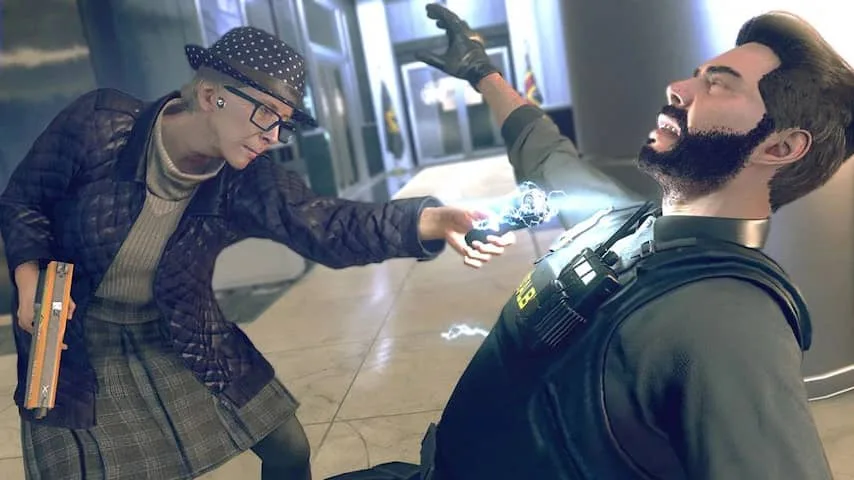
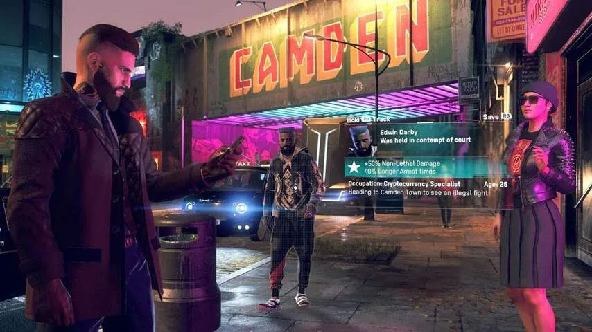

**De openwereldgame Watch Dogs: Legion vertelt een verrassend politiek verhaal. De makers schetsen een versie van Londen in de nabije toekomst waar de Brexit, zelfrijdende auto's en andere technologie voor grote problemen hebben gezorgd.**

> [!NOTE]
> Deze recensie verscheen eerder op [NU.nl](https://www.nu.nl/reviews/5934678/eerste-indruk-watch-dogs-legion-laat-speler-hackersteam-samenstellen.html).

Uitgever Ubisoft probeert van _Watch Dogs_ al jarenlang zijn grote gamereeks naast _Assassin's Creed_ te maken. Spelers kropen in voorgaande games in de huid van een hacker, met als opdracht om vijandelijke organisaties te bevechten.

Je kon camera's hacken om gebieden te verkennen, drones overnemen om soldaten aan te vallen of de stoplichten in de war brengen om verkeersongevallen te veroorzaken en achtervolgers te dwarsbomen.

De kern van de game is in _Legion_ onveranderd. Je speelt nog steeds een hacker die met zijn of haar smartphone alle technologie in de omgeving kan misbruiken. Ditmaal heb je echter niet één hoofdrolspeler, maar een legio aan personages over wie je de controle kunt krijgen.

_Watch Dogs Legion — Beeld: Ubisoft_

## Honderden persoonlijkheden in één game

Door een van de inwoners van de stad te scannen, wordt er automatisch een profiel samengesteld. Je ziet wat hun interesses zijn, welke andere Londenaren ze kennen en wat ze van het hackerscollectief vinden waarbij jij bent aangesloten. Ook krijg je hun agenda's te zien, zodat je ze door de stad heen kunt volgen.

Het is bijzonder hoeveel informatie er achter ieder personage schuilgaat. Je kunt gehele families in de game tegenkomen die, naarmate de speldag vordert, ook bij elkaar in huis slapen, naar werk of school gaan en vrienden bezoeken. Het geeft het gevoel dat de stad echt leeft, en niet alleen maar bestaat uit anonieme, rondlopende 3D-modellen.

Of dat gevoel blijft, moet nog blijken. In de demo die we 45 minuten konden spelen, leek het alsof iedere stadsbewoner een eigen achtergrond en persoonlijkheid heeft. In de achtergrond schuilt echter een algoritme dat ieder personage genereert. Het kan zijn dat je in de uiteindelijke game personages tegenkomt met exact dezelfde stem of persoonlijkheid als andere teamgenoten.

_Watch Dogs Legion — Beeld: Ubisoft_

## Rekruteren door te helpen

Heb je een spelfiguur gevonden dat je graag wil spelen, dan moet je hem of haar rekruteren in jouw hackersgroep. Dat doe je door ze op verschillende manieren te verleiden. Wij kwamen tijdens een speelsessie bijvoorbeeld een vrouw tegen die werd afgeperst. Door haar afperser in elkaar te slaan, stegen we in achting en konden we haar vragen om zich bij ons aan te sluiten.

Heb je iemand gerekruteerd, dan kun je vanuit het menu wisselen naar dit personage om als hem of haar te spelen. In totaal kun je twintig spelfiguren aan je team toevoegen, die allemaal een eigen soort bijdrage leveren. De ene hacker is overdag bijvoorbeeld bewaker en kan goed vechten, terwijl een oud vrouwtje vooral vaardig is in het besturen van drones.

Verschillende personages spelen daardoor fundamenteel anders. We speelden een missie als het oude vrouwtje dat slecht ter been was. Vanaf haar telefoon kon ze hacken om informatie te stelen. Ook kon ze met haar smartphone drones besturen om rond te kijken in de omgeving. Een tweede missie met een wapendealer verliep weer heel anders: we hackten een drone, vlogen boven een kamp en lieten exploderende gasflessen op doelwitten vallen.

We merkten wel dat een gerekruteerde hacker wat lomp in het verhaal wordt verwerkt. Toen we overschakelden naar een personage dat nog geen vijf minuten deel was van het hackerscollectief, sprak deze in filmpjes alsof ze al jarenlang lid was.

[Bekijk ingesloten media](https://content.jwplatform.com/players/RyDKtZZH-whqXCOFb.html)

## Een Londen na de Brexit

_Watch Dogs: Legion_ speelt in de nabije toekomst, in een tijd dat een aantal technologische en politieke ontwikkelingen grote gevolgen heeft gehad op de stad. Een daarvan is de Brexit, die in _Watch Dogs_ desastreus is uitgepakt: mensen worden op grotere schaal gedeporteerd, waarbij wordt gekeken naar wie er specifiek uit Europa komt.

De komst van de zelfrijdende auto heeft ook een grote invloed gehad. De bekende zwarte taxi's worden niet langer door chauffeurs rondgereden, maar zijn volledig geautomatiseerd. Voor het hoofdkantoor van het taxibedrijf staan daarom protesterende oud-medewerkers die roepen dat hun oude baas hun mensenrechten schendt door ze te vervangen door machines.

We moeten nog zien of die ondertonen ook echt een grote rol gaan spelen in het verhaal van _Watch Dogs: Legion_. De game kan de impact van technologie laten zien, zoals de televisieserie _Black Mirror_ dat ook doet. Maar dan moet de ontwikkelaar er wel iets mee doen, en de setting niet slechts inzetten om de wereld te kleuren.

Of dat ook gebeurt, zullen we volgend jaar pas weten. _Watch Dogs: Legion_ staat gepland voor maart 2020.
