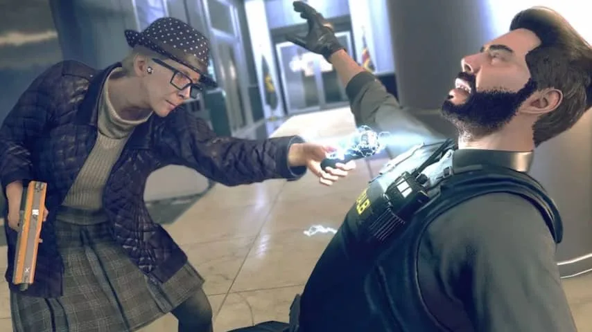
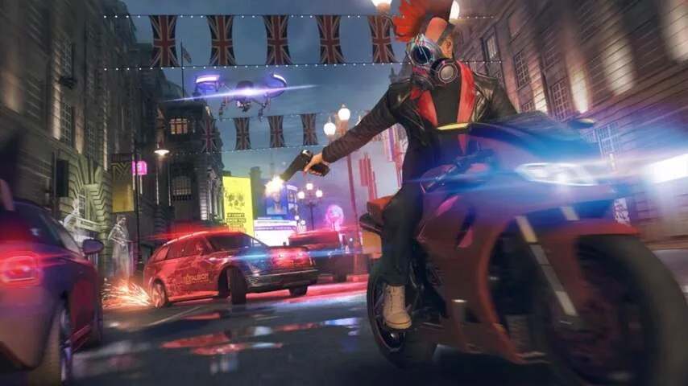

**In Watch Dogs Legion speel je geen soldaat of zwaardvechter, maar een groep rebelse hackers. De game schetst een gitzwarte toekomst voor technologische ontwikkelingen.**

> [!NOTE]
> Deze recensie verscheen eerder op [NU.nl](https://www.nu.nl/reviews/6064185/eerste-indruk-watch-dogs-legion-voelt-als-tamme-versie-van-black-mirror.html).

_Watch Dogs Legion_ speelt zich in de nabije toekomst af, vlak nadat Londen door een gigantische aanslag is getroffen. Door groeiende verdeeldheid is de stad veranderd in een politiestaat die wordt geregeerd door het ingehuurde leger Albion.

Tijdens een online demosessie konden we drie uur van de game alvast uitproberen. Daarbij begonnen we als een geheim agent die samen met hackerorganisatie Dedsec probeerde een aanslag op Londen te verijdelen, maar tevergeefs. Daarna sprong de game een paar maanden naar de toekomst. Dedsec kreeg de schuld van de aanval en wij moesten de naam van de groep proberen te zuiveren.

_Legion_ lijkt in grote lijnen op openwereldspellen zoals _Grand Theft Auto V_: je loopt, springt en schiet in een stad die je vrij kunt verkennen. Daaraan toegevoegd is de mogelijkheid om apparatuur in je omgeving te hacken.

Met een druk op de schouderknop van je controller kraak je een slim slot, zodat je ergens kunt inbreken. Daar kun je vervolgens een camera hacken om te zien wat je om de hoek te wachten staat, waarna je een stoppenkast overbelast om een nabije bewaker te elektrocuteren.

_Watch Dogs Legion — Beeld: Ubisoft_

## Nachtmerrie voor IT'ers

Daarmee schetst de game een nachtmerrie voor IT'ers: niet alleen is nagenoeg alles in de wereld verbonden met het internet, de beveiliging is zodanig slecht dat je met een druk op de knop kunt inbreken.

In de praktijk is het hacksysteem vooral een geinige bijkomstigheid. Het laat spelers een iets andere strategie kiezen, hoewel er meestal nog wel geschoten en geslopen moet worden, zoals in een traditioneel spel.

## Weinig te zeggen over de echte wereld

De setting van de game lijkt een ideale plek om politiek geladen verhalen over de gevaren van technologie te vertellen, maar tijdens onze speelsessie bleef het verhaal vrij tam. Een standpunt over de werkelijke wereld wordt zelden ingenomen.

De situatie in Londen wordt bijvoorbeeld op geen enkel moment aan huidige spanningen rondom bijvoorbeeld de Brexit gekoppeld. Daarnaast worden zorgen over technologische gevaren weggewuifd door een eigenwijze kunstmatige intelligentie, die jouw avonturen van commentaar voorziet. _Watch Dogs Legion_ speelt in op de moderne wereld, maar doet zijn best er niet al te veel van te vinden.

_Watch Dogs Legion — Beeld: Ubisoft_

## Hackers werven

Na de introductie konden we kiezen uit personages in een groep hackers. De één was gespecialiseerd in het bedienen van drones, terwijl een ander augmented reality gebruikte om rond te sluipen. Ook is het mogelijk om Londenaren te rekruteren, zodat ze onderdeel van het hackerscollectief worden en vervolgens ook speelbaar voor jou zijn.

Dat is een ambitieus systeem, waarbij letterlijk iedereen op straat een potentiële toevoeging is. Je hackt de smartphone van een interessante kandidaat, waarna je ontdekt hoe je ze kunt verleiden om zich bij de groep aan te sluiten.

Tijdens onze speelsessie liepen we bijvoorbeeld een getalenteerde dronevlieger tegen het lijf. Op haar telefoon stonden afpersberichten, waarna we besloten om in te breken bij de afperser en het chantagemateriaal te wissen. Uit dankbaarheid sloot de piloot zich vervolgens bij ons aan.

In de praktijk is overigens niet ieder personage een interessante kandidaat om aan Dedsec toe te voegen. Want hoewel ieder personage toegankelijk is, kom je slechts een handjevol tegen met vaardigheden die de moeite waard zijn. Die staan ook expliciet op de kaart van het spel gemarkeerd.

## Eigenlijk geen team

De game probeert het idee te geven dat je als een team speelt, maar in werkelijkheid voelt ieder personage slechts als een ander jasje voor de hoofdrolspeler. Dat merkten we vooral bij een gefaalde missie. Ons personage werd gearresteerd en de game schakelde ons naar een ander figuur. Maar vervolgens werden we aangesproken alsof we nog die eerste persoon waren.

Daarmee verdwijnt meteen de belofte van een grootse stad met duizenden speelbare personages. Eigenlijk is er maar één held die er soms iets anders uitziet en andere vaardigheden heeft.

[Bekijk ingesloten media](https://content.jwplatform.com/players/RyDKtZZH-whqXCOFb.html)

## Nog geen Black Mirror

Hoewel _Watch Dogs_ interessant gebruikmaakt van moderne zorgen over hackers, lijken de makers maatschappelijke onderwerpen toch een beetje uit de weg te gaan.

Dat is jammer, want een iets scherper randje zou de game interessanter maken. Dan zou het kunnen aanvoelen als een speelbare aflevering van de serie _Black Mirror_. Hopelijk zal dat wel het geval zijn in de definitieve versie die op 29 oktober verschijnt op PlayStation 4, Xbox One, Google Stadia en pc.
