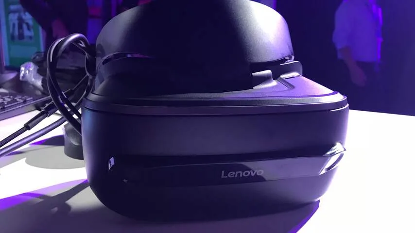
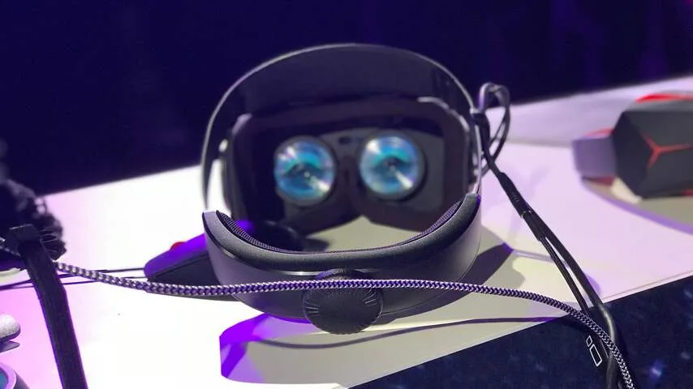
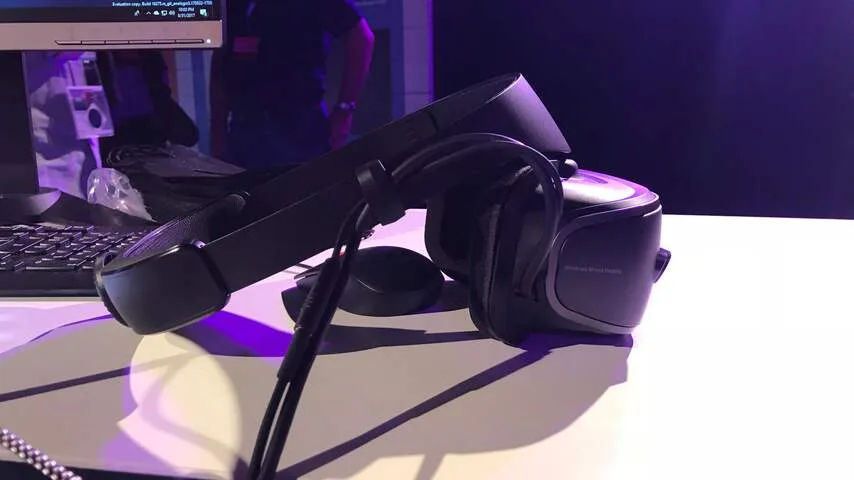
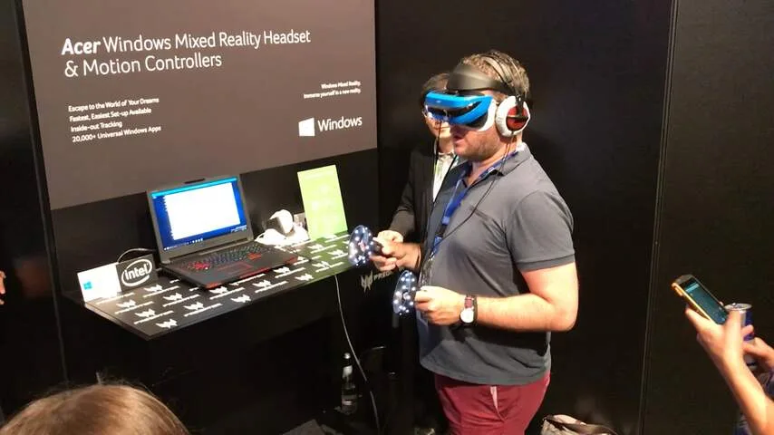
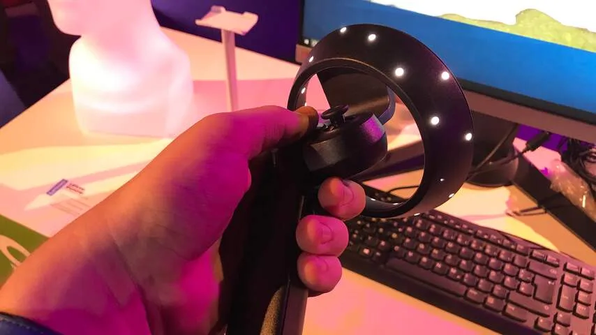

**Microsoft wil het met zijn Mixed Reality-platform gemakkelijker maken voor techbedrijven om virtualrealitybrillen (VR-brillen) voor Windows-computers te maken. De eerste brillen die hier gebruik van maken werden getoond op techbeurs IFA in Berlijn, waar wij ze alvast konden testen.**

> [!NOTE]
> Deze recensie verscheen eerder op [NU.nl](https://www.nu.nl/reviews/4904477/eerste-indruk-verlaagt-microsoft-met-mixed-reality-de-drempel-voor-vr.html).

We testten brillen van Asus, Acer, Dell en Lenovo, die verdacht veel op elkaar leken. Ze bevatten alle vier schermen met een totale resolutie van 2880 bij 1440 pixels (1440 bij 1440 per oog), een resolutie die de fabrikanten als 3K bestempelen.

Met deze resolutie zijn de schermen scherper dan die van concurrenten HTC Vive en Oculus Rift, die ieder een resolutie van 2400 bij 1080 pixels (1200 bij 1080 per oog) hebben. Dat klinkt als een klein verschil, maar heeft in de praktijk een verrassend groot effect. Er is veel minder sprake van het zogeheten hordeureffect, waarbij de ruimte tussen pixels een soort raster over het beeld toont.

We merkten ook weinig van lichtstralen die vanaf het scherm zijdelings worden geprojecteerd, een probleem waar moderne VR-brillen soms ook mee kampen. De kijkhoek van de Mixed Reality-brillen is wel kleiner dan bij de concurrenten. Er is echter genoeg te zien voor een natuurlijke ervaring.

## Camera’s

Op iedere bril zitten twee camera’s, die worden gebruikt om de omgeving buiten de bril in de gaten te houden. Het is hierdoor mogelijk om een stap opzij te zetten, zodat dit ook in een VR-game wordt geregistreerd.

Die bewegingen werden bij onze sessies meestal goed vastgelegd, maar bij een tweetal demo’s leek de functie te zijn vastgelopen. Hierdoor werkt zo’n bril ineens als een veredelde Google Cardboard, die alleen directe hoofdbewegingen vastlegt.

De Mixed Reality-brillen zouden ook de leefomgeving moeten kunnen vastleggen, zodat de gebruiker niet tegen bijvoorbeeld een muur aanbotst of een televisie kapotslaat. Bij geen van onze tests stond dit systeem echter aan.

[Bekijk ingesloten media](https://content.jwplatform.com/players/U6RKEAZ9-whqXCOFb.html)

## Zelfde hoofdband

De brillen hebben opmerkelijk genoeg ook allemaal hetzelfde bevestigingssysteem: een enkele hoofdband die met een tandwiel achterop strakker gedraaid kan worden. De bril zit aan een scharnier, zodat hij voor de ogen geplaatst kan worden.

Dit bevestigingssysteem gebruikte Sony al voor zijn PlayStation VR-bril en is ook verrassend handig. Je hoeft zelden de hoofdband op drie verschillende manieren af te stellen, zoals bij veel andere brillen wel zo is. Enkel het draaien van het tandwiel voor de hoofdband is genoeg om de juiste positie te vinden.

## Gamecontrollers

Microsoft maakt zelf de bewegingscontrollers die bij alle brillen worden gebruikt, zodat gebruikers altijd dezelfde apparatuur in handen hebben. Dat moet zorgen voor een ervaring die met iedere bril grotendeels gelijk is.

De Microsoft-gamepads voelen als een combinatie van HTC’s Vive-controllers en de Touch-gamepads van Oculus. Knoppen op het handvat maken het mogelijk om een vuist in VR te maken, terwijl een trackpad bij de duim subtiele bewegingen kan bijhouden.

De bewegingscontrollers zorgen ervoor dat echte handen in VR getoond worden - maar de daarvoor benodigde tracking werkte bij onze testsessies ondermaats. De camera’s op de VR-brillen worden gebruikt om de positie van de controllers te volgen, maar dan moeten ze zich wel binnen het blikveld van de bril bevinden. Dat blikveld voelt vrij klein, waardoor we vaak onze handen 'kwijt' waren.

## Software

Softwarebugs gooiden ook roet in het eten. De controllers verdwenen soms helemaal uit beeld, of werden in een compleet andere positie getoond dan dat ze zich in de echte wereld bevonden. Problemen die enkel opgelost konden worden door de testlaptops volledig opnieuw op te starten.

Mixed Reality-brillen gebruiken deze vorm van tracking waarschijnlijk omdat het consumentvriendelijker is dan de alternatieven. Bij de Vive en Rift moeten gebruikers sensoren in hun kamer installeren, waarbij vaak lange kabels in huis moeten worden weggewerkt. Bovendien vereisen die vele sensoren in het geval van de Rift tot wel drie USB-poorten, terwijl bij de Mixed Reality-brillen slechts één USB-poort en één HDMI-aansluiting nodig is.

Dat maakt het aansluiten van een virtualrealitybril benaderbaar voor minder technisch aangelegde gebruikers, maar het maakt de ervaring tegelijkertijd ook flink slechter dan bij de gevestigde orde.

Bij een Rift en Vive hoeft de gebruiker niet na te denken over de controllers, omdat ze een verlengde zijn van hun handen. Bij Mixed Reality zijn de gamepads onhandige afstandsbedieningen.

## Nog veel bugs

Naast de hierboven benoemde bugs hadden we bij onze tests ook sprake van veel andere technische problemen. Op een bepaald punt pauzeerde de videospeler bijvoorbeeld bij iedere hoofdbeweging.

Bij het rondwandelen door Microsofts virtuele woonkamer is het mogelijk om software te starten, maar in veel gevallen weigert een programma correct te openen, of wordt de gebruiker na een kort laadscherm ineens teruggestuurd naar de VR-kamer.

Tijdens onze tests liepen we tegen veel van dit soort fouten aan. Het zegt vermoedelijk niets over de brillen zelf, maar wel over de achterliggende software van Microsoft. Tijdens de IFA voelde het Mixed Reality-platform nog als een instabiel systeem, iets dat Microsoft hopelijk voor de introductie op 17 oktober weet op te lossen.

_Mixed Reality-bril Microsoft — Beeld: NU.nl/Bastiaan Vroegop_

_Mixed Reality-bril Microsoft — Beeld: NU.nl/Bastiaan Vroegop_

_Mixed Reality-bril Microsoft — Beeld: NU.nl/Bastiaan Vroegop_

_Mixed Reality-bril Microsoft — Beeld: NU.nl/Bastiaan Vroegop_

_Controller van Mixed Reality-brillen Microsoft — Beeld: NU.nl/Bastiaan Vroegop_

## Goedkoop

Softwareproblemen en matig werkende bewegingscontrollers maken de Mixed Reality-brillen op dit moment nog wat onaantrekkelijk. Daar staat echter tegenover dat de beeldkwaliteit ondanks een kleinere kijkhoek een stuk indrukwekkender is dan bij de huidige concurrenten. Bovendien verschijnen ze pas over anderhalve maand, wat bedrijven de kans geeft de mankementen deels op te lossen.

Met prijskaartjes vanaf 299 euro (of 399 euro inclusief controllers) zijn de Mixed Reality-brillen wel veel goedkoper. Ter vergelijking: een Rift kost op dit moment 449 euro, maar dat is wegens een tijdelijke kortingsactie. De HTC Vive kost 699 euro.

Omdat de Windows-brillen geen woonkamers vol met sensoren en overdadig veel USB-poorten vereisen, zijn ze ook een stuk makkelijker aan te sluiten dan het huidige premium-aanbod. Daarmee lijkt Microsoft in elk geval de drempel van VR te verlagen.

De eerste Mixed Reality-brillen worden vanaf 17 oktober verkocht.
