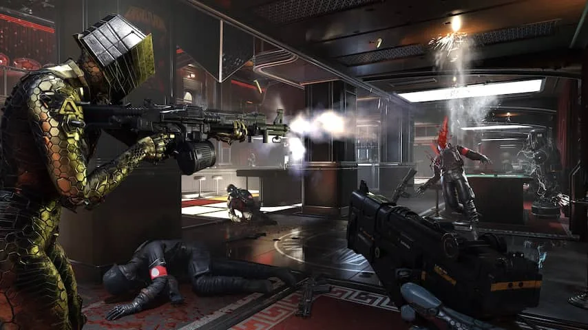
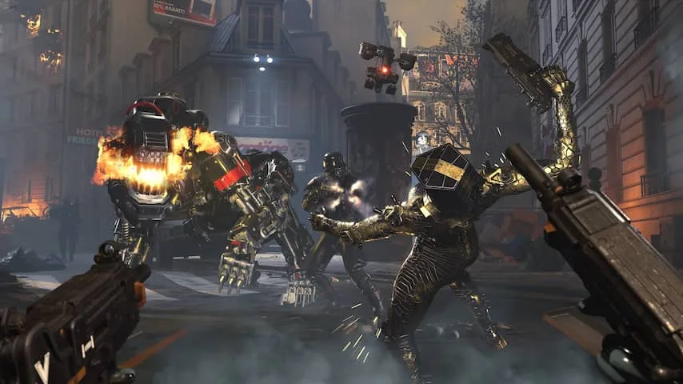

**Het schietspel Wolfenstein: Youngblood schetst een grimmige spelwereld, waarin de nazi's al decennialang Europa bezetten. Een wereld die beter verkend kan worden dan in voorgaande delen.**

> [!NOTE]
> Deze recensie verscheen eerder op [NU.nl](https://www.nu.nl/reviews/5936928/eerste-indruk-samen-op-nazis-schieten-in-wolfenstein-youngblood.html).

De eerste _Wolfenstein_\-game is een van de grondleggers van het schietgamegenre. Het idee was simpel: je speelde een geharde soldaat die zich een weg moest schieten door een leger aan nazi's om uiteindelijk Hitler te vermoorden.

Naarmate het gamesmedium ouder werd, moest ook _Wolfenstein_ zichzelf hervinden om relevant te blijven. Na een reboot enkele jaren terug, probeert de game daarom een wat complexer verhaal te vertellen.

In de reboot speelde je nog steeds de soldaat uit de eerste game die op nazi-jacht ging, maar het verhaal schetste tegelijkertijd een wereld waarin de nazi’s aan de macht waren - en bleven. In de _Wolfenstein_\-series heersen de Duitsers zelfs nog in de jaren tachtig over Europa. Een tijdperk dat meteen ook de setting is van de nieuwste game.

In _Youngblood_ speel je een van de tweelingdochters van de originele hoofdrolspeler. Hun vader is vermist en ze trekken zelf naar een door de nazi's bezet Parijs om hem terug te vinden.

_Wolfenstein: Youngblood — Beeld: Bethesda_

## Gemaakt voor twee spelers

Wat volgt, is een avontuur dat voornamelijk bedoeld is voor twee spelers. Ieder heeft de controle over een van de zussen, die kamer voor kamer doorkruisen om nazi's uit te schakelen en langzaam hun einddoel te bereiken.

Hoewel het mogelijk is om de game met een computergestuurde metgezel te spelen, is _Youngblood_ duidelijk ontworpen met interactie met anderen op het oog. Je moet samen zware deuren openmaken, elkaar overeind helpen en zelfs een duim omhoog geven om de ander een boost te geven.

Op die tweespelermodus na voelt _Youngblood_ als standaard schietspel. Je hebt meerdere soorten wapens om tussen te wisselen en de mogelijkheid om te sluipen en vijanden in één klap uit te schakelen.

De zussen worden door sommige tegenstanders vrij snel neergehaald. Dat is vooral het geval bij baasgevechten, waarbij de vijanden ook tientallen kogels nodig hebben om neer te gaan. In die situaties is het cruciaal om één speler de vijand af te laten leiden, terwijl de ander salvo's lost.

## Een meer open naziwereld

In onze demo werden de spelomgevingen een stuk opener. De nadruk kwam minder te liggen op actie, waardoor we zagen hoe Parijs zich houdt onder het naziregime. Een interessante setting: dit zijn immers niet de Duitsers die vijf jaar Europa hebben bezet, maar al decennialang de macht hebben.

De game schuwt zijn bronmateriaal ook niet. Levels hangen vol hakenkruizen en Duitse officieren schreeuwen fascistische leuzen. Een schril contrast met uitgever EA, die recent niet durfde te erkennen dat een Duitse soldaat in zijn game over de Tweede Wereldoorlog voor de nazi's vocht.

We kregen wel het idee dat _Youngblood_ wat moeite heeft met het vinden van zijn toon. De zussen maken grapjes over hun vijanden, maar zijn iets later ineens geschokt als ze eraan worden herinnerd dat de nazi's de vijand zijn.

_Wolfenstein: Youngblood — Beeld: Bethesda_

De game opent met een flashback, waarbij een van de zussen met haar vader op een geit jaagt. Iets waar ze moeite mee lijkt te hebben. Ze is nog geen vaardige schutter en lijkt het lastig te vinden om de trekker over te halen.

Enkele momenten later springt ze echter in een speciaal pantser, grijpt ze een geweer en schiet ze links en rechts nazi's neer. Ze maakt nog de grap dat ze "het doden van beesten lastig vindt, niet het doden van nazi's". Maar het personage maakt desalniettemin een wat extreme sprong zonder dat dit goed wordt opgebouwd.

## Vroege versie van de game

Dat kan liggen aan de demo die we speelden. De ontwikkelaar liet een vroege versie zien, waarbij geheid delen van het spel zijn samengevat om snel een idee te geven van alle elementen. Of de echte game secuurder omgaat met zijn personages, zal deze zomer blijken als de uiteindelijke versie verschijnt.

Overigens had de demo die wij speelden nog enkele bugs. Filmpjes werden halverwege afgekapt, waardoor we minutenlang moesten wachten tot de andere speler klaar was met kijken. Daarnaast bleven lijken vaak trillend in de lucht hangen.

De ontwikkelaar verzekert dat dit pijnpunten zijn die niet in de uiteindelijke game zullen zitten, omdat de gespeelde versie een paar maanden geleden is afgerond. De volledige game moet beter afgewerkt zijn.
