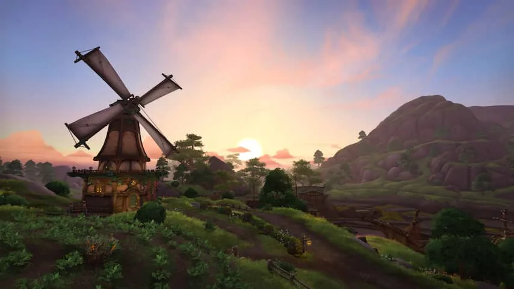
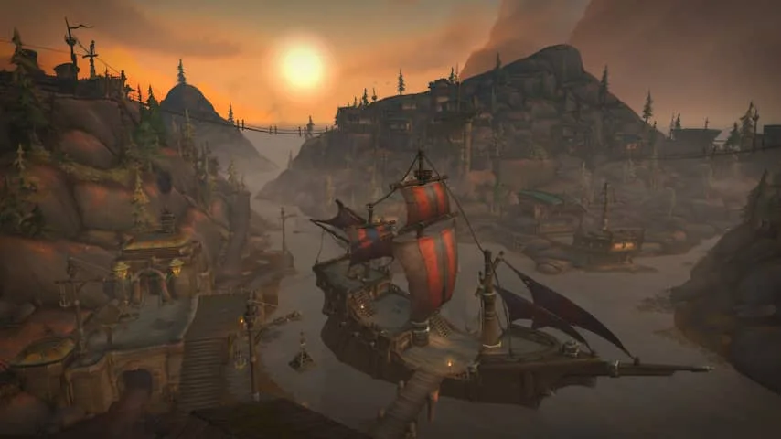
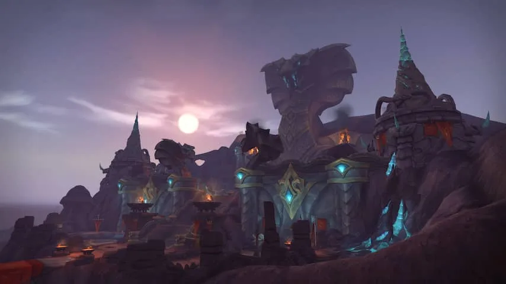
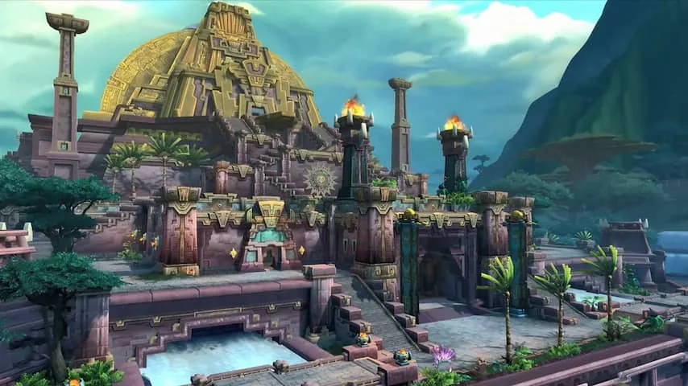
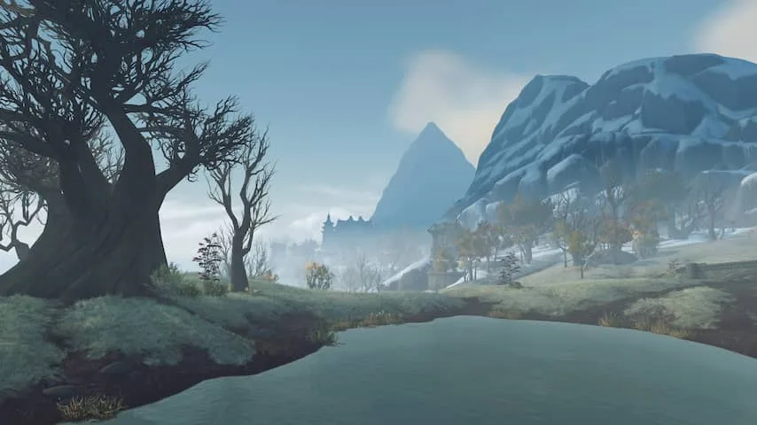

**Het is inmiddels ruim dertien jaar geleden dat World of Warcraft voor het eerst in de winkels verscheen. Weet de alweer zevende uitbreiding het klassieke spel nieuw leven in te blazen?**

> [!NOTE]
> Deze recensie verscheen eerder op [NU.nl](https://www.nu.nl/reviews/5435510/review-battle-for-azeroth-blaast-world-of-warcraft-met-oude-strijd-nieuw-leven-in.html).

Ongeveer elke twee jaar geeft ontwikkelaar Blizzard zijn online rollenspel _World of Warcraft_ een nieuwe lik verf. In uitbreidingspakketten worden nieuwe gebieden toegevoegd, kunnen spelers naar een hoger level groeien en zijn er nieuwe kerkers om te verkennen.

De essentie van de game wordt daarbij zelden grootschalig veranderd; het blijft een gigantische open wereld waarin gamers kunnen reizen en medespelers tegen kunnen komen. Wel wordt die wereld steeds iets mooier en soms worden oude gebieden zelfs helemaal opnieuw gemaakt, zodat ze moderner en gelikter aanvoelen.

In het vorige uitbreidingspakket, _Legion_, besloot Blizzard een kleine aanpassing in de formule te doen. De nieuwe speelgebieden waren veel meer op het verhaal gericht, met volledig ingesproken dialogen die de plotontwikkelingen vormgaven.

[Bekijk ingesloten media](https://content.jwplatform.com/players/HLu31SGw-whqXCOFb.html)

## Verhaal is benaderbaar, ook voor terugkerende spelers

Diezelfde structuur keert nu terug in _Battle for Azeroth_. Het is oorlog tussen de volkeren van _World of Warcraft_, die nog steeds zijn onderverdeeld in twee facties waar een speler vooraf tussen kan kiezen. De met orcs, ondoden en trollen gevulde Horde heeft de hoofdstad van de elfen gebombardeerd, wat al snel tot een vergeldingsactie op een van hun kernlocaties leidde.

Daarmee keert _Warcraft_ voor het eerst in lange tijd terug naar de basis. Het verhaal speelt zich ook 'gewoon' af op Azeroth, de thuiswereld van de _World of Warcraft_\-personages, terwijl de volkeren zich tegen elkaar verzetten in een steeds verder escalerende strijd.

Dat maakt _Battle for Azeroth_ veel beter benaderbaar dan voorgaande uitbreidingspakketten. Het in 2016 verschenen _Legion_ werd geprezen om zijn sterke verhaal en presentatie, maar was ook gevuld met ruimtereizen, geheime genootschappen en andere elementen die het verhaal voor zelfs de fanatiekste _Warcraft_\-fan verwarrend kon maken.

## Engeland en een gigantische stad

Iedere factie heeft een nieuw eiland om te verkennen. De Alliance, gevuld met onder meer mensen, dwergen en elfen, trekt naar Kul Tiras. Dit eiland is hevig geïnspireerd door het regenachtige noorden van Engeland, met in het midden een van de grootste steden die ooit in de game zat.

De Horde trekt in de tussentijd naar Zandalar, een jungle-eiland vol met groene bossen en rondlopende dino's. Beide zones ademen sfeer en bevatten ook nog eens goed uitgewerkte verhaallijnen.

Nog niet eerder werd het verhaal zo sterk verteld in _World of Warcraft_. Indrukwekkende filmpjes rijgen momenten aan elkaar, met tussendoor veel ingesproken dialogen om de wereld tot leven te wekken.

Het is ook prijzenswaardig hoe Blizzard het verhaal vertelde voordat het uitbreidingspakket uitkwam. De game werd voorzien van kleine updates, met daarin filmpjes en missies die de speler alvast voorbereidden op de grote nieuwe verhaalontwikkelingen. Het zorgt ervoor dat Azeroth tot leven komt - en we hopen dat Blizzard dit voortzet nu _Battle for Azeroth_ uit is.

_Review: Battle for Azeroth blaast World of Warcraft met oude strijd nieuw leven in — Beeld: Blizzard_

_Review: Battle for Azeroth blaast World of Warcraft met oude strijd nieuw leven in — Beeld: Blizzard_

_Review: Battle for Azeroth blaast World of Warcraft met oude strijd nieuw leven in — Beeld: Blizzard_

_Review: Battle for Azeroth blaast World of Warcraft met oude strijd nieuw leven in — Beeld: Blizzard_

_Review: Battle for Azeroth blaast World of Warcraft met oude strijd nieuw leven in — Beeld: Blizzard_

## Veel variatie, maar niet alles is nieuw

Speltechnisch is er echter niet héél veel veranderd sinds het afgelopen uitbreidingspakket. Het maximumlevel is doorgetrokken naar 120, maar personages krijgen er geen nieuwe vaardigheden bij. Een nieuw upgradesysteem voor je uitbreiding biedt iets meer variatie in hoe je personage groeit, maar echt significante vernieuwingen zitten daar niet in.

Bereik je eenmaal level 120, dan valt _Battle for Azeroth_ ook terug in ouderwetse patronen. Je moet je personage dan sterker maken door nieuwe uitrusting te verzamelen, zodat je kerkers kan spelen. In kerkers nemen groepjes van vijf spelers het op tegen sterkere vijanden en eindbazen. Daarmee verdienen zij betere uitrusting, zodat nog moeilijkere kerkers - en op termijn de zogenoemde raids; kerkers die spelers met tien tot dertig spelers samen in gaan - beschikbaar worden.

Een expeditiesysteem laat je met twee vrienden naar onbekende eilanden reizen voor beloningen, maar daar ligt vooralsnog weinig nadruk op.

## Conclusie

_World of Warcraft: Battle for Azeroth_ bevat geen gigantische innovaties. De meeste vernieuwingen uit dit uitbreidingspakket zaten immers al in zijn voorganger uit 2016. Het is echter wel een ontzettend sfeervolle game, met een wat gegronder verhaal dat de game benaderbaar maakt voor nieuwkomers en mensen die al jarenlang niet hebben gespeeld. Levellen van 110 naar 120 is daarnaast ontzettend leuk en voelt aan als een verhaalgame in plaats van een ouderwets online rollenspel.

_4 sterren — Beeld: NU.nl_
