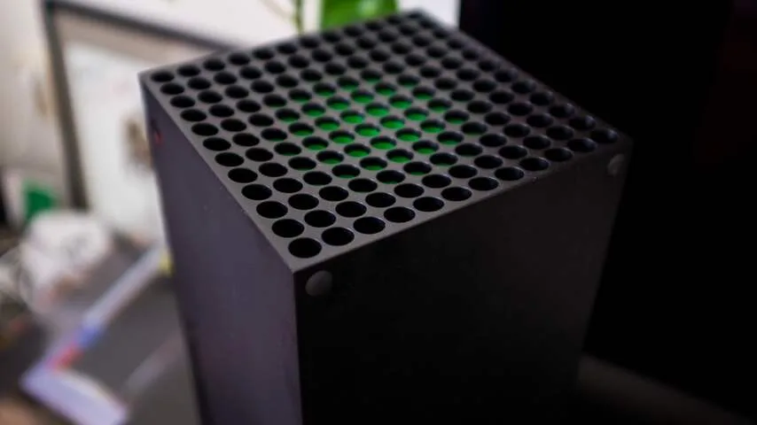
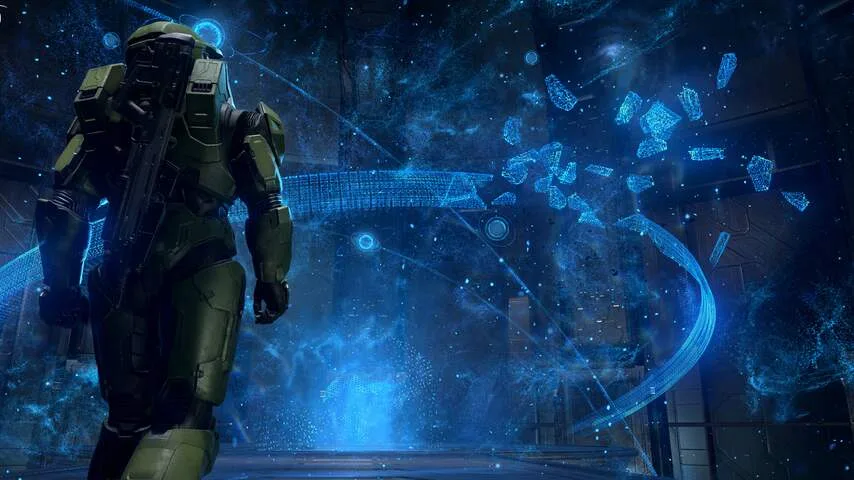

**De Xbox Series X is vooral een veel snellere spelcomputer, die ook oude spellen mooier maakt. Handig voor iedereen die tijdens de vorige generatie consoles een PlayStation had en Microsofts grote titels heeft gemist.**

> [!NOTE]
> Deze recensie verscheen eerder op [NU.nl](https://www.nu.nl/reviews/6088531/review-xbox-series-x-moet-het-nu-vooral-van-oude-games-hebben.html).

Microsoft is in Nederland bezig aan een inhaalrace. Omdat de Xbox One pas een jaar later in Nederland werd verkocht, wist Sony het merendeel van de markt te veroveren met zijn PlayStation 4. Dat is een voorsprong die de Xbox-maker tot op heden nog niet heeft ingehaald, maar de nieuwe generatie spelcomputers biedt kansen. Zowel de nieuwe Xbox als PlayStation wordt in november dit jaar uitgebracht, waardoor Nederlanders mogelijk overstappen naar het kamp van Microsoft.

Microsoft brengt twee nieuwe modellen uit: de Xbox Series S en de Series X. Van die twee hebben we de laatste getest - de Series S is grotendeels identiek, maar goedkoper en minder krachtig. De nieuwe hardware maakt mooiere games mogelijk die ook sneller zijn opgestart.

Van die twee vernieuwingen is de visuele upgrade het kleinst. Geoptimaliseerde games gebruiken realistischere lichteffecten en zijn mooier op hogere resoluties, maar het zijn verschillen die pas opvallen als je ze rechtstreeks vergelijkt met het oude model. De visuele sprong is minder groot dan bij de introductie van de Xbox 360 en Xbox One.

[Bekijk ingesloten media](https://content.jwplatform.com/players/V2PbardB-whqXCOFb.html)

## Games laden veel sneller

Het verschil in laadtijden is bij de nieuwe spelcomputer veel groter. Games starten twee tot vier keer zo snel op vergeleken met een Xbox One-spelcomputer, wat bij sommige spellen een gigantisch verschil maakt. Red Dead Redemption is in veertig seconden gestart, in plaats van ruim twee minuten. Final Fantasy XV doet er niet langer een minuut over, maar slechts vijftien seconden.

De wachttijden worden verder verkort door de introductie van Quick Resume. De vorige Xbox en PlayStation 4 konden al één game in het geheugen vasthouden, waardoor je meteen verder speelt na het opstarten van de hardware. De Series X onthoudt je plek in meerdere spellen tegelijk. Hierdoor hoef je niet langer door het hoofdmenu te navigeren en een savegame te laden.

Daarmee reageert Microsoft op veelgehoorde klachten over lange laadtijden bij games. Bovendien lijkt de techgigant te luisteren naar feedback over oude spelcomputers. Waar oude, compacte spelcomputers als helikopters klonken door hard blazende ventilatoren, kan de Series X dankzij het wat grotere ontwerp beter omgaan met warmte. Hierdoor is hij muisstil.

_Xbox Series X — Beeld: NU.nl/Rutger Otto_

_De Xbox is groter en daardoor stiller. Bron: NU.nl/Rutger Otto._

## Oude games zijn mooier

De Xbox One draaide op dag één bijna geen oudere spellen, maar op de Series X werken nagenoeg alle eerder uitgebrachte titels meteen. Wie oudere games op de nieuwe hardware draait, heeft dan vaak ook mooiere versies van die games.

Spellen worden automatisch aangepast voor modernere televisies met HDR-schermen, wat zorgt voor een hoger contrast en kleurbereik. Sommige titels krijgen updates die de resolutie en ververssnelheid van het beeld verhogen.

De verbeterde ondersteuning voor oudere spellen is broodnodig, want het aanbod van games speciaal gemaakt voor de Series X is bij verschijning van de console schaars. Op termijn verschijnen exclusieve titels zoals _Halo Infinite_ en _Fable_ voor de machine, maar tot dan moeten gamers het doen met oude titels. Sommige recente spellen verschijnen voor zowel de Series X als Xbox One en PlayStation 4, zoals _Assassin's Creed Valhalla_.

_Halo Infinite_

_De exclusieve Xbox-game Halo Infinite laat nog even op zich wachten. Bron: Microsoft._

## Game Pass maakt gemis van nieuwe games deels goed

Maar waar een gebrek is aan nieuwe exclusieve titels, biedt de Series X wel toegang tot een grote bibliotheek spellen via een abonnementsdienst. Microsoft biedt vanaf 10 euro per maand een abonnement aan op Game Pass, waarmee je toegang krijgt tot een bibliotheek met ruim honderd titels.

Daartussen staan ook grote, exclusieve Xbox-titels die eerder uitkwamen op de Xbox One. Gezien die spelcomputer in Nederland werd overschaduwd door de PlayStation 4, zit er veel in Game Pass dat velen niet hebben gespeeld. Alleen al dat aanbod maakt de Series X reuze interessant. Het biedt genoeg lol tot de eerste echt unieke games verschijnen.

> [!INFO] Xbox Series X
>
> -   CPU: Zen 2 (AMD) met 8 kernen op 3,8 GHz (3,6 GHz met SMT)
> -   GPU: 12 teraflops, 52 cu's op 1,825 GHz
> -   Geheugen: GDDR6 van 16 GB met een geheugenbus van 320 bits
> -   Bandbreedte: 10 GB op 560 GB/s, 6 GB op 336 GB/s
> -   Opslagcapaciteit: 1 TB
> -   SSD-bandbreedte: 2,4 GB/s (ruw), 4,8 GB (gecomprimeerd)
> -   Prestatiedoel: 4K op 60 fps, tot 120 fps

## Conclusie

De Xbox Series X maakt niet alleen nieuwe, maar ook oude spellen mooier. Daarnaast zijn de veel snellere laadtijden indrukwekkend. Veel exclusieve games zijn er nog niet, maar het grote aanbod aan klassiekers op Game Pass maakt voor nu veel goed.

_De Xbox Series S en Series X zijn vanaf 10 november te koop voor respectievelijk 299 en 499 euro._
