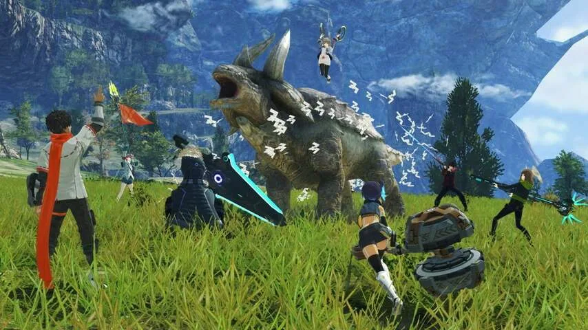
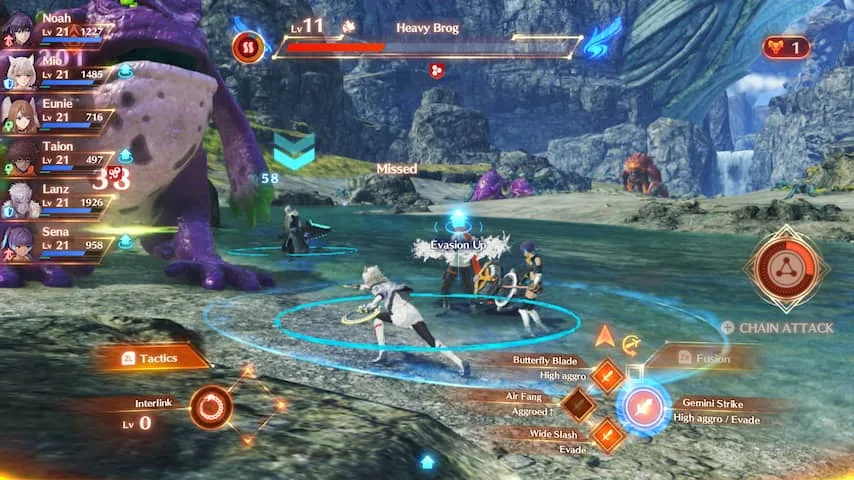

**Het derde deel in Nintendo's rollenspelreeks Xenoblade is grootser en diepgravender dan de eerdere delen, maar heeft ook tientallen uren nodig om op gang te komen.**

> [!NOTE]
> Deze recensie verscheen eerder op [NU.nl](https://www.nu.nl/reviews/6214371/review-xenoblade-chronicles-3-wordt-na-twintig-uur-spelen-geweldig.html).

Al sinds 2010 maakt het Japanse Monolith Soft de _Xenoblade_\-games voor Nintendo-spelcomputers. Die games bevatten grootse, open werelden om te verkennen. Deze werelden bevinden zich vaak boven op een gigantische reus, waar je als een soort mier overheen beweegt.

In het derde deel is zo'n wereld verwikkeld in een aanhoudende oorlog. De mensheid is afhankelijk geworden van zielenmotors. Deze zogenoemde Flame Clocks hebben de gebruikelijke voeding en andere levensbehoeften vervangen. Dood je niet genoeg vijanden, dan raakt je motor leeg en verhonger je.

Jouw kleine groep soldaten is daar ook afhankelijk van, tot je samen met een vijandelijke divisie ineens wordt losgesneden van jullie Flame Clocks. Jij en die vijanden hebben ineens geen reden meer om te vechten, maar moeten wel op de vlucht voor de mysterieuze krachten die achter de eindeloze oorlog zitten.

Het verhaal komt langzaam op gang en gaat pas tegen het eind verrassende kanten op. Het dient vooral als een achtergrond voor je team van zes speelbare personages, die je langzamerhand leert kennen. Ze verwerken hun oorlogstrauma's en moeten langzaam leren elkaar te vertrouwen, nadat ze jarenlang elkaars kameraden hebben vermoord.

## Grote wereld imponeert met mooie uitzichten

Hoewel het verhaal je van gebied naar gebied leidt, is de wereld van _Xenoblade Chronicles 3_ grotendeels vrij te verkennen. Zo kun je op zoek naar grondstoffen voor upgrades, optionele bazen vinden om te verslaan of zijmissies voltooien.

De wereld ziet er verbluffend uit, mits je een beetje omhoogkijkt: het is een game die imponeert met zijn uitzichten op bergen en mooie sterrenhemels. De grond is iets minder indrukwekkend, al zien personages er wel goed uit en loopt alles soepel.

_Review: Xenoblade Chronicles 3 wordt na twintig uur spelen geweldig — Beeld: Monolith Soft_

## Gevaarlijke monsters houden je alert

Er zijn een paar manieren waarop _Xenoblade_ die wereld leuk weet te houden. Geheime gebieden zorgen ervoor dat er altijd iets te verkennen valt. En naarmate de game vordert, ontgrendel je nieuwe manieren om je voort te bewegen. Zo kun je later terugkeren naar een oude vallei, omdat je daar dan kunt klimmen of een kabelbaan kunt gebruiken.

Door de wereld gevaarlijk te maken, houden de makers je alert. Je kunt bijvoorbeeld een gevaarlijk monster van tientallen levels hoger tegen het lijf lopen. Daar moet je dan voorzichtig omheen sluipen.

## Gevechten worden gedurende het spel complexer

Het is vechten wat de klok slaat in _Xenoblade 3_. In eerste instantie verloopt dat simpel: je hebt drie aanvallen op de actieknoppen van je controller, die je eens in de zoveel seconden mag gebruiken. Sommige zijn sterker vanaf de zij- of achterkant van een monster, terwijl andere bijvoorbeeld schade herstellen.

Naarmate de game vordert, komen daar allerlei systemen bij die de gevechten langzaamaan complexer maken. Je leert hoe de personages fuseren tot één grote robot voor speciale aanvallen en moet op het juiste moment aanvallen afkappen voor meer schade. Ook kun je zogeheten _chain attacks_ uitvoeren om in één keer het maximale uit je team te halen.

_Review: Xenoblade Chronicles 3 wordt na twintig uur spelen geweldig — Beeld: Monolith Soft_

## Je kunt zelf bepalen hoe je team gevormd wordt

Ieder van je zes personages heeft een eigen klasse, maar ze kunnen vrij wisselen naar een andere. De game moedigt je aan om dat ook te doen: als bijvoorbeeld jouw zwaardvechter level 10 heeft, kun je de aanvallen daarvan gebruiken als je daarna een genezer speelt. Door alles te trainen, worden je personages dus langzamerhand veelzijdiger en sterker.

Naarmate je langer speelt, ga je ook op reis met Heroes: extra, zevende teamleden die zich tijdelijk bij je team scharen. En als je een speciale missie voor ze afrondt, kun je hun klasse ook voor jouw personages gebruiken. Dat alles zorgt voor veel variatie: je kunt helemaal zelf bepalen hoe jouw team gevormd wordt.

## Duurt lang om alles te leren kennen

Het duurt lang totdat alle systemen in de game geïntroduceerd zijn. Wij hadden pas na een uur of twintig het idee dat we echt invloed hadden op een gevecht en strategieën konden toepassen.

Maar tegen die tijd was de hoeveelheid systemen ook zodanig groot, dat we vaak een database in de game moesten raadplegen om te lezen hoe alles ook alweer werkte. Het voelt soms als het leren van een groot, lang durend bordspel met een dikke handleiding. Sommigen vinden dat het leukste wat er is, maar anderen hebben er wellicht niet het geduld voor.

## Conclusie

_Xenoblade Chronicles 3_ is een grootse game die werkelijk honderden uren aan inhoud bevat. Alles steekt feilloos in elkaar, maar je moet wel geduld hebben om het begin van de game te doorkruisen en al die onderliggende systemen te leren kennen. Bijt je een uur of twintig door, dan is dit een geweldig rollenspel.

_4 sterren — Beeld: NU.nl_
