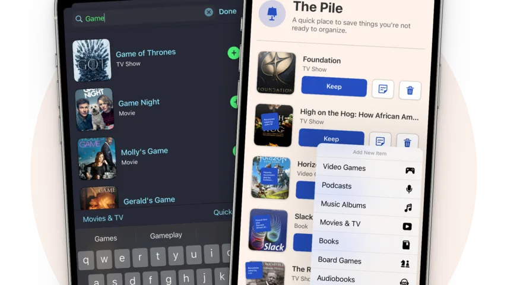
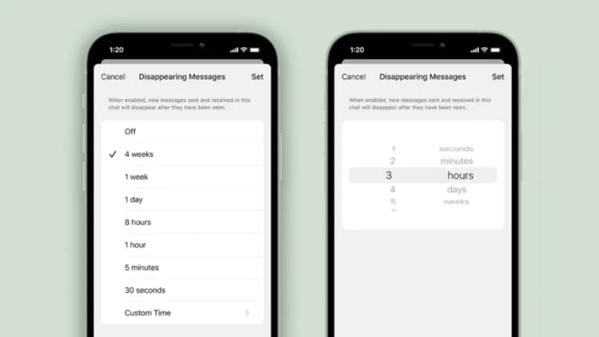

## Sofa

De smartphoneapp Sofa biedt een manier om bij te houden wat je allemaal hebt gezien, gelezen, bekeken of zelfs gespeeld. Zo kun je een logboek maken van bijvoorbeeld welke films je leuk vond en nog eens nalezen wat je allemaal hebt geconsumeerd.

> [!NOTE]
> Deze recensie verscheen eerder op [NU.nl](https://www.nu.nl/tech/6150827/apps-van-de-week-een-verzamelplek-voor-al-je-films-series-en-boeken.html).

In maart dit jaar kreeg de applicatie al een update die apps, audioboeken en bordspellen toevoegde, maar nu is hij volledig onder handen genomen door de ontwikkelaar.

In de grote 3.0-update is het ontwerp van de software veranderd, met bijvoorbeeld post-its voor extra commentaar bij je kijklijst. Je kunt je eerder bekeken materiaal nu ook filteren, zodat je iets specifieks kunt vinden.

Er is één keerzijde: voor veel van de nieuwe functies heb je een abonnement nodig. Hiervoor betaal je zo'n 4 euro per maand.

_Download [Sofa](https://apps.apple.com/nl/app/sofa-downtime-organizer/id1276554886) voor iOS._

_Apps van de week: Een verzamelplek voor al je films, series en boeken_

## Signal

Chatapp Signal groeide ineens fors toen WhatsApp nieuwe maatregelen aankondigde, waardoor gegevens van niet-Europese gebruikers worden uitgewisseld tussen Facebook en WhatsApp. Nu heeft de app een nieuwe functie gekregen: de mogelijkheid om chatberichten te laten verdwijnen.

Bij chats staat voortaan een timeroptie waarbij je een tijdslimiet kunt instellen. Een bericht kan daarmee verdwijnen binnen enkele seconden, maar ook na bijvoorbeeld een maand.

De optie kan handig zijn voor wanneer je bijvoorbeeld een wachtwoord moet delen, maar niet wil dat dit jarenlang in je chatgeschiedenis blijft hangen. Een verdwenen bericht wordt gewist voor zowel jouzelf als de ontvanger.

_Download Signal voor [Android](https://play.google.com/store/apps/details?id=org.thoughtcrime.securesms&hl=nl&gl=US) en [iOS](https://apps.apple.com/nl/app/signal-priv%C3%A9berichtenapp/id874139669)._

_Apps van de week: Een verzamelplek voor al je films, series en boeken_

## Fantasian Part 2

De originele ontwerper van de geroemde rollenspelreeks _Final Fantasy_ bracht eerder dit jaar een game uit voor Apple Arcade, waarvan nu het tweede deel verschenen is. _Fantasian_ is een groots avontuur waarvan deze tweede helft tot zestig uur aan speeltijd moet bevatten.

Opmerkelijk is de manier waarop de spelwereld is vormgegeven. Die bestaat niet uit digitale 3D-modellen, maar uit foto's van miniatuuromgevingen die het ontwerpteam met de hand heeft gemaakt. Hierdoor lijkt het alsof het spel plaatsvindt in een soort Madurodam.

Omdat het spel op Apple Arcade staat, moeten geïnteresseerde gamers eerst een abonnement afsluiten om het te downloaden. Daarnaast is de game niet beschikbaar op bijvoorbeeld Android.

_Download [Fantasian](https://apps.apple.com/us/app/fantasian/id1517339045) voor iOS (Apple Arcade vereist)_
