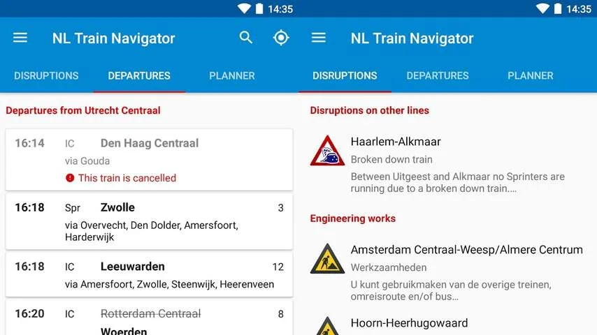

## League of Legends: Wild Rift

_League of Legends_ is tot de dag van vandaag een van de populairste pc-games. Spelers nemen het in kleine teams tegen elkaar op, met als doel om zo snel mogelijk elkaars bases te verwoesten en de overwinning te claimen.

> [!NOTE]
> Deze recensie verscheen eerder op [NU.nl](https://www.nu.nl/tech/6125325/apps-van-de-week-league-of-legends-en-een-razendsnelle-treinapp.html).

Een mobiele versie genaamd _Wild Rift_ is al een tijdje in ontwikkeling en vanaf deze week voor iedereen speelbaar. Helemaal af is het spel nog niet: ontwikkelaar Riot Games noemt het een "uitgebreide test". Maar iedere geïnteresseerde is welkom om aan die test deel te nemen.

_Wild Rift_ lijkt in grote lijnen erg op zijn oudere broer, met teams van vijf tegen vijf. Wel is het spel geoptimaliseerd voor smartphones met een analoge joystick en een vijftal knoppen om mee aan te vallen.

Het spel is gratis te downloaden, maar het is mogelijk om met echt geld extra personages te kopen. Riot Games belooft dat ieder personage ook vrijgespeeld kan worden zonder geld te betalen.

_Download League of Legends: Wild Rift voor [iOS](https://apps.apple.com/app/id1480616990) of [Android](https://play.google.com/store/apps/details?id=com.riotgames.league.wildrift&referrer=singular_click_id%3D083f240a-63e9-4b17-ac94-f4619fa37704) (gratis)_

## Loom

Het maken van schermopnames kan handig zijn, als je bijvoorbeeld een collega snel wil uitleggen hoe een app werkt. De recent vernieuwde Android-app Loom laat je dit soort video's maken terwijl in een hoek ook het beeld van je selfiecamera te zien is. Op iOS is de app ook beschikbaar.

Dat is volgens de ontwikkelaar een handige manier om uitgebreide en persoonlijke uitlegvideo's te maken. Opnemen begint nadat je op drie knoppen hebt gedrukt, waarna de video wordt geüpload. Je krijgt dan een linkje dat je met anderen kunt delen.

De app is gratis te gebruiken, maar bedrijven kunnen voor geavanceerde functies een abonnement afsluiten. Dat kost dan minstens een tientje per maand en per gebruiker.

_Download Loom voor [iOS](https://apps.apple.com/us/app/loom-quick-videos/id1474480829) of [Android](https://play.google.com/store/apps/details?id=com.loom.android) (gratis)_

## Rijden de Treinen

De nieuwe navigatieapp Rijden de Treinen doet vooral één ding: laten zien of de treinen rijden. Het biedt een makkelijk overzicht van vertragingen op je traject en storingen die bij de NS bekend zijn.

Bestaande apps van de NS en 9292OV bieden vaak ook al deze informatie, maar Rijden de Treinen opent meteen op een pagina waar de voor jou relevante vertragingen vermeld staat. Daarmee kun je deze specifieke informatie net wat sneller vinden.

Daarmee moet het vooral een handige app zijn voor reizigers die iedere dag hetzelfde traject pakken. Zij weten hun treintijden immers al en hoeven enkel de vertragingsinformatie te raadplegen.

_Download Rijden de Treinen voor [iOS](https://apps.apple.com/us/app/rijden-de-treinen/id1546303305) of [Android](https://play.google.com/store/apps/details?id=nl.calips.rijdendetreinen) (gratis)_

_Apps van de week: League of Legends en een razendsnelle treinapp_
