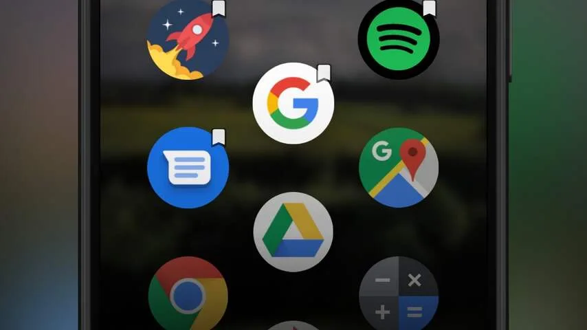

**Verken een serene wereld in Sky: Children of Light, verander het iconenscherm van je Android-telefoon met Ceri Launcher en meer.**

> [!NOTE]
> Deze recensie verscheen eerder op [NU.nl](https://www.nu.nl/tech/5968263/apps-van-de-week-sky-children-of-light-en-ceri-launcher.html).

## Sky: Children of the Light

De nieuwe smartphonegame _Sky: Childen of the Light_ liet lang op zich wachten. Apple toonde het spel enkele jaren geleden tijdens een presentatie, om de grafische krachten van de nieuwe Apple TV te laten zien. Sindsdien was het stil rond het spel, tot hij deze week ineens in de App Store verscheen.

_Sky_ is gemaakt door thatgamecompany, een spelontwikkelaar die eerder bekend werd met PlayStation-titels _Flower_ en _Journey_. Deze nieuwe telg van het bedrijf lijkt vooral op die laatste. Je wandelt door woestijnen en vliegt door de lucht terwijl je de gamewereld verkent.

Tijdens je ontdekkingstocht kom je maximaal zeven andere spelers tegen, met wie je onder meer puzzels oplost.

Op het moment is _Sky_ alleen te downloaden voor de iPhone, iPad en iPod touch. De eerder beloofde Apple TV-versie is op het moment nog niet beschikbaar. Volgens de ontwikkelaar komt die versie nog en zal de game ook voor andere platformen verschijnen. _Sky: Childen of the Light_ kan gratis gedownload worden. Spelers kunnen extra's kopen, zoals een seizoenspas om extra levels te mogen spelen. Die levels worden later met updates toegevoegd.

_Download Sky: Children of the Light voor [iOS](https://apps.apple.com/nl/app/sky-children-of-the-light/id1462117269) (gratis)_

[Bekijk ingesloten media](https://content.jwplatform.com/players/1IwspqW9-whqXCOFb.html)

## Ceri Launcher

Met de Ceri Launcher kun je het iconenscherm van je Android-telefoon naar eigen smaak aanpassen. De apps op je beginscherm worden in een soort honingraat gezet, met drie of vier kolommen naast elkaar.

Je vindt in Ceri Launcher geen opzichtige extra's. De app is gemaakt als een snel en lichtgewicht alternatief voor je standaard iconenscherm, waarmee je snel je gewilde app kunt vinden. De ontwikkelaar belooft bovendien geregeld updates uit te brengen om de launcher verder te verbeteren.

De ontwikkelaar belooft nooit advertenties aan de launcher toe te voegen. In plaats daarvan kunnen gebruikers een Pro-versie kopen voor extra functies, zoals notificatiebadges. Je mag zelf bepalen of je daar 89 cent of maximaal 20 euro voor betaalt.

Op het moment bevindt de app zich in 'early access'. Je kunt hem downloaden, maar er bestaat een kans dat je last hebt van sommige bugs die nog aanwezig zijn. Op Samsung-telefoons verschijnen iconen bijvoorbeeld weleens dubbel. Daarnaast blijven badges soms bij de iconen in beeld staan.

Ceri Launcher is alleen beschikbaar voor Android, gezien het op iPhones niet mogelijk is het iconenscherm met een app te veranderen.

_Download Ceri Launcher voor [Android](https://play.google.com/store/apps/details?id=me.jckpn.cerilauncher) (gratis)_

_Apps van de Week: Sky: Children of Light en Ceri Launcher_

## Aumi

De iPhone-app Aumi is gemaakt door een achttienjarige autistische jongen, die een manier zocht om zijn humeur, energieniveaus en activiteiten goed bij te houden. In de app houd je bij wat je op een dag doet en hoeveel energie het je kost, zodat je weet waar je energie voor hebt.

De app stuurt je verspreid over de dag notificaties, waarmee je snel kunt aangeven hoe jij je voelt en wat voor humeur je hebt. Die informatie wordt in grafieken verwerkt die je in de app kunt bekijken. Je kunt ook op ieder gewild moment die informatie toevoegen via een widget op het beginscherm van je telefoon.

De ontwikkelaar hoopt met zijn app gebruikers met angststoornissen en naderende burn-outs te helpen om balans te vinden in hun levens.

De app wordt aangeboden voor 3,49 euro, maar bevat geen advertenties of in-app aankopen. Na de aanschaf hoeven gebruikers niks te betalen.

_Download Aumi voor [iOS](https://apps.apple.com/nl/app/id1454283852) (€3,49)_
