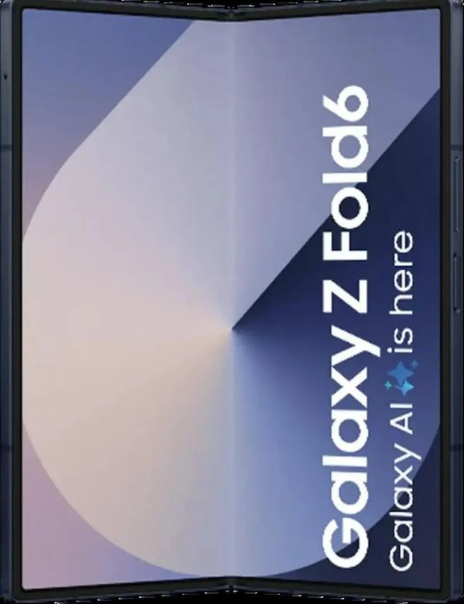
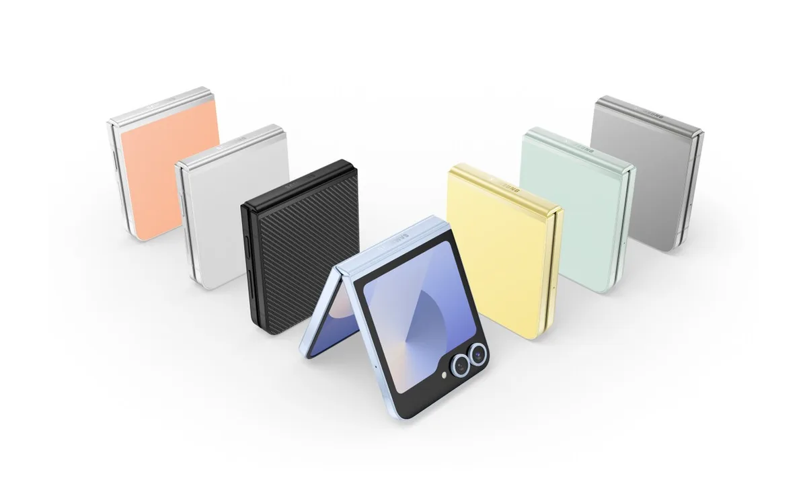

De ouderwetse klaptelefoon is helemaal terug. Dankzij flexibele schermen kun je nu steeds meer telefoons opvouwen en zo veilig in je zak steken - maar wat zijn de beste modellen van het moment? Techsite Tweakers zette ze op een rij.

> [!NOTE]
> Deze recensie verscheen eerder op [AD](https://www.ad.nl/tech/comeback-van-de-klaptelefoon-deze-vouwbare-smartphones-zijn-het-beste~a24a7e2e/).

Wie een opvouwbare telefoon koopt in 2024, kan doorgaans uit twee varianten kiezen. Je hebt een model met een groot scherm dat je dubbel kunt vouwen, met daar bovenop een kleinere display. Hierdoor heb je altijd een tablet tot je beschikking in je broekzak. Daarnaast heb je de ‘klaptelefoon’, met een scherm van reguliere grootte dat kan worden dichtgeklapt om hem extra compact met je mee te nemen. Hieronder vind je de beste modellen in allebei deze categorieën - waarbij één fabrikant de lijsten domineert.

## De beste tabletvormige telefoon: Samsung Galaxy Z Fold6

Samsung Galaxy Z Fold6. © RV

Heel veel is er niet aan de Galaxy Z Fold 6 veranderd vergeleken met de Z Fold 5 van een jaar eerder. Het scherm is wat helderder, het ontwerp is dunner en bij gebruik van het kleine scherm aan de buitenzijde verbruikt hij minder batterij. De vouw in het midden van het scherm is iets minder duidelijk, maar je ziet hem nog steeds goed zitten. Daarnaast is de camera ongeveer hetzelfde als bij het oude model.

Toch staat dit nieuwe model met stip bovenaan de lijst. Dat heeft te maken met enkele unieke functies waardoor je beter kunt multitasken met het toestel. Dat is ideaal op het grotere scherm aan de binnenzijde. Groot voordeel van Samsung vergeleken met concurrenten is bovendien de ondersteuning van een speciale stylus, die je er dan wel los bij moet kopen. De Galaxy Z Fold6 wordt voor circa 1250 euro verkocht.

## De beste klaptelefoon: Samsung Galaxy Z Flip6

Samsung Galaxy Z Flip6 © RV

Op dit moment zijn veel goede klaptelefoons verkrijgbaar, maar de 800 euro kostende Galaxy Z Flip6 wint het nipt. Het apparaat oogt minimalistisch, is vrij compact en kan zelfs als waterdicht worden bestempeld. Al is het apparaat minder goed bestand tegen stof en krassen als een gewone smartphone in deze prijsklasse. Het openvouwen voelt wel een beetje stroef door het gebruikte scharnier.

De camera’s zijn prima: naast een 50 megapixel-camera heeft het toestel ook een ultragroothoeklens. Daarnaast krijgt de software updates tot maar liefst 2031, waardoor de smartphone nog jaren gebruikt kan worden.

Daar staat tegenover dat de prestaties onder doen aan een reguliere telefoon: de chip is trager dan in niet-vouwbare concurrenten en ook de accuduur valt tegen. Zaken die je voor lief moet nemen bij een klaptoestel.

De opvouwbare telefoons zijn geselecteerd door de redactie van Tweakers, die het hele jaar door honderden apparaten test om de beste te selecteren. De volledige [test](https://tweakers.net/best-buy-guide/smartphones/beste-goedkope-smartphone) vind je op deze pagina.

_Verantwoording_

_In deze rubriek schrijven we over technologische apparaten die door Tweakers zijn beoordeeld. Bij Tweakers wordt ieder apparaat onderzocht door het testlab, waar onder andere accuduur, snelheid en andere belangrijke aspecten worden getoetst._

_De redactie van Tweakers is volledig onafhankelijk. Bedrijven betalen op geen enkele manier om in deze artikelen behandeld te worden._
