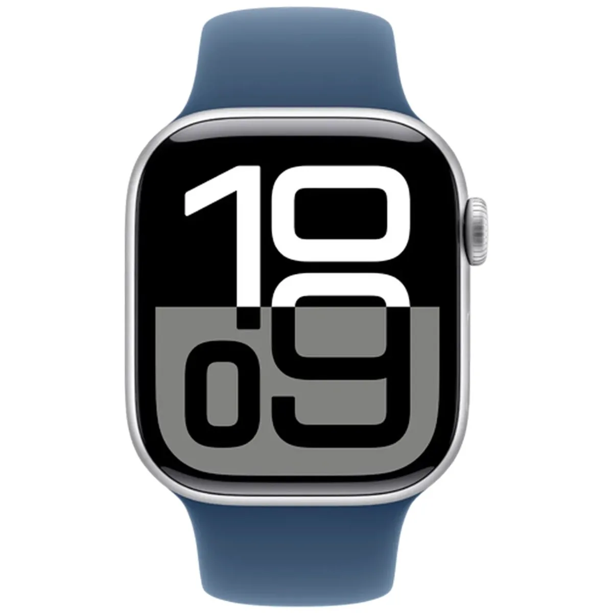
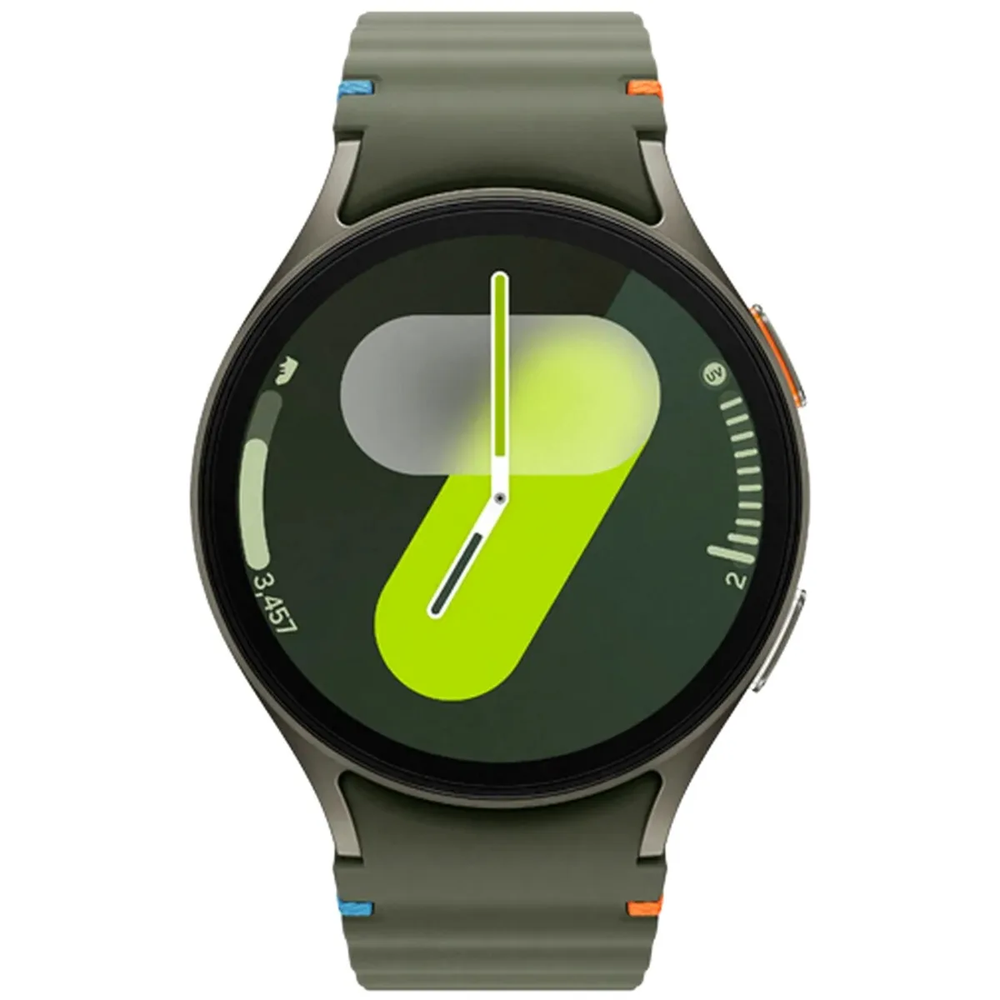
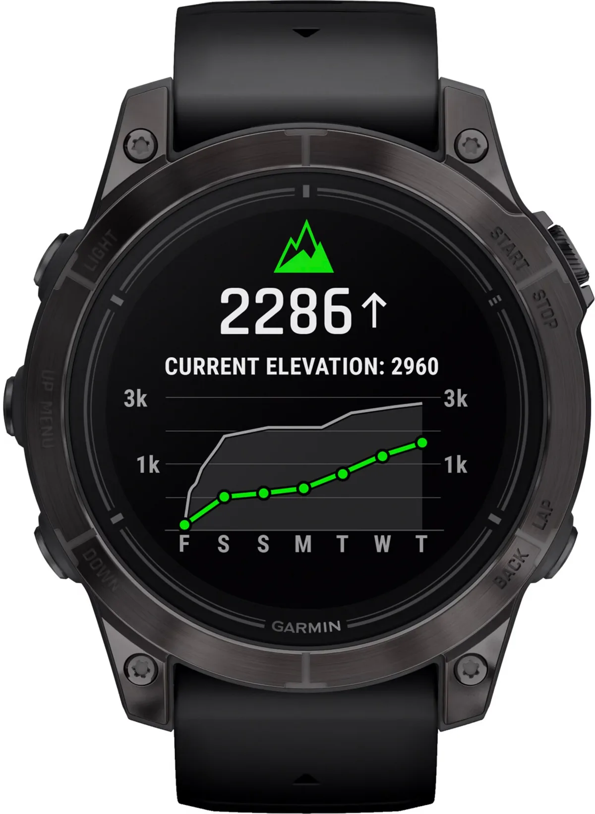
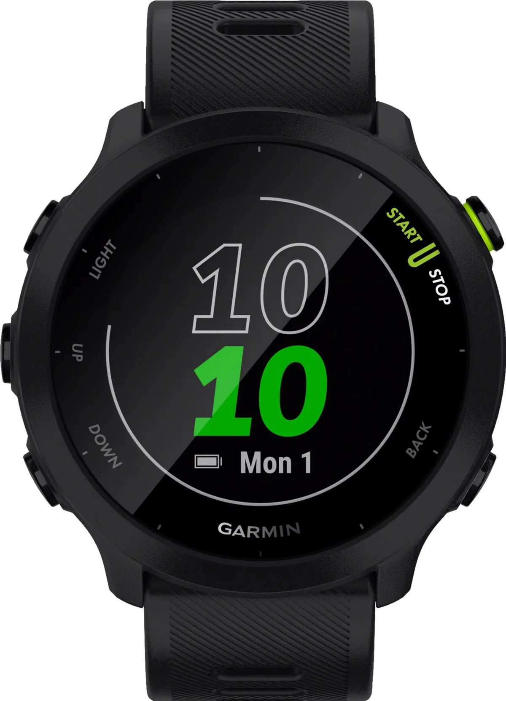

Welke smartwatch past bij jouw levensstijl? Met zoveel opties en technologie kan het lastig zijn om de juiste keuze te maken. Smartwatchtester Eric van Ballegoie van techsite Tweakers zet de beste horloges van dit moment op een rij. Van de Apple Watch tot een meer budgetvriendelijk sporthorloge van Garmin.

> [!NOTE]
> Deze recensie verscheen eerder op [AD](https://www.ad.nl/tech/de-beste-4-smartwatches-op-een-rij-ook-modellen-met-hartslagsensor-voor-actieve-gebruikers~a8f0d415/).

Een slim horloge kan voor iedereen een andere toepassing hebben. De één gebruikt het apparaat om dagelijkse stappen en de gemiddelde hartslag te meten, terwijl de ander het ook nog gebruikt om mee te bellen en telefoonberichtjes te ontvangen.

Een fitness-smartwatch heeft bijvoorbeeld superieure sensoren om je gezondheid te tracken, maar heeft weer minder flexibele software, weet smartwatchtester Eric van Ballegoie. ,,Op die horloges zijn niet of nauwelijks apps te downloaden die iets anders dan sportfuncties toevoegen. Als je dus graag je smarthome vanaf het horloge bedient, kan dat niet op sportsmartwatch.’’

Van Ballegoie zet de beste smartwatches van dit moment op een rij, onderverdeeld in de meest gezochte categorieën. Zo kun je degene uit de lijst plukken die het beste bij jouw wensen past.

## Voor alledaags gebruik met een iPhone: Apple Watch Series 10 (480 euro)

Apple Watch Series 10. © RV

Heb je een iPhone, dan is een horloge van Apple de meest voor de hand liggende keuze. De techreus beperkt namelijk wat smartwatches van andere fabrikanten kunnen met een iPhone, wat bijvoorbeeld betekent dat alleen een Apple Watch rechtstreeks kan reageren op binnenkomende berichtjes.

De aanrader van dit moment is de **Apple Watch Series 10**, die sinds kort in de winkels ligt. Het horloge heeft een iets groter scherm dan zijn voorganger, wat meer ruimte geeft voor informatie. Ook is hij iets dunner en lichter, en laadt hij sneller op. De gebruikte schermtechnologie zorgt ervoor dat het scherm altijd aan staat om de tijd te tonen zonder dat je accu snel leeg gaat. In de praktijk is hij gewoon groter, dunner en lichter, maar dat is genoeg om hem aan te raden. Al is de Series 9 van vorig jaar ook prima als je op een aanbieding stuit.

## Voor alledaags gebruik met een Android-telefoon: Samsung Galaxy Watch 7 (280 euro)

Samsung Galaxy Watch 7. © RV

De **Galaxy Watch 7** is de directe opvolger van de Watch 6 van vorig jaar. Aan het ontwerp is niet veel veranderd, maar de hardware van het horloge is verbeterd met onder andere meer geheugen, een snellere processor en preciezere sensoren. Dat maakt het horloge lekker vlug in gebruik. De prijs is ook best aantrekkelijk, vooral als je rondshopt voor deals rond Black Friday.

Bijkomend voordeel zijn de gezondheidsfuncties, die goed presteerden bij de tests. Ook de software wordt uitstekend ondersteund, waardoor het horloge nog jaren aan updates zal krijgen. Daar staat een wat teleurstellende batterijduur tegenover: op één lading houdt het horloge het hooguit anderhalf tot twee dagen vol.

## Het beste sporthorloge: Garmin epix Pro (840 euro)

Garmin epix Pro. © RV

Dit is het horloge voor sporters bij wie geld geen rol speelt. Hij is verkrijgbaar in veel maten, met diameters tussen de 42 en 51 millimeter. Wil je een zo stevig mogelijk model? Neem dan de **Sapphire Edition**. Die heeft een lens op het scherm die extra goed bestand is tegen krassen.

Qua sport- en gezondheidsfuncties heeft de epix Pro alles in huis, met als belangrijkste nieuwe functies een zeer nauwkeurige hartslagsensor. Ook handig is een zaklamp, zodat je tijdens de donkere winterdagen ook nog kunt zien waar je hardloopt. Naast het aanraakscherm heeft het horloge veel knoppen, zodat je hem gemakkelijk met bezwete vingers bedient.

De accuduur van de epix Pro is uitmuntend: bij tests houdt hij het op één lading maar liefst negen dagen vol, wat betekent dat je hem slechts eens per week hoeft op te laden.

## Een budgethorloge voor sporters: Garmin Forerunner (167 euro)

Garmin Forerunner. © RV

Sporters die liever niet de hoofdprijs betalen komen ook uit bij Garmin: hun veel goedkopere **Forerunner 55** komt namelijk ook goed uit de test. Dat horloge is al een tijdje verkrijgbaar, wat vermoedelijk de reden is dat de prijs nu lager ligt. Je vindt hier geen luxe oled-scherm zoals bij dure alternatieven, maar het hier gebruikte beeldscherm is ook erg zuinig. Hierdoor gaat dit horloge prima een week mee op een volle batterij.

De sportfuncties van dit horloge zijn dik in orde, maar andere luxe-opties moet je bij deze lagere prijs missen. Zo kun je geen route instellen tijdens het fietsen en hardlopen en ook geen Spotify-afspeellijsten downloaden om offline te luisteren. Extra functionaliteit voor triatlons en powermeters ontbreekt ook. Dit is echt een horloge voor alledaags sporten, met wel de nauwkeurige hartslag- en gps-metingen die we van Garmin gewend zijn. De aanwezige knoppen maken het horloge ook makkelijk om snel te bedienen.

_Verantwoording_

_In deze rubriek schrijven we over technologische apparaten die door Tweakers zijn beoordeeld. Bij Tweakers wordt ieder apparaat onderzocht door het testlab, waar onder andere accuduur, snelheid en andere belangrijke aspecten worden getoetst._

_De redactie van Tweakers is volledig onafhankelijk. Bedrijven betalen op geen enkele manier om in deze artikelen behandeld te worden._
