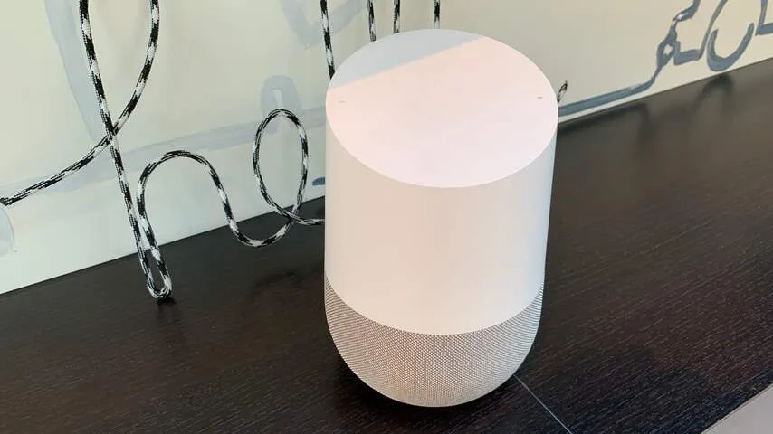
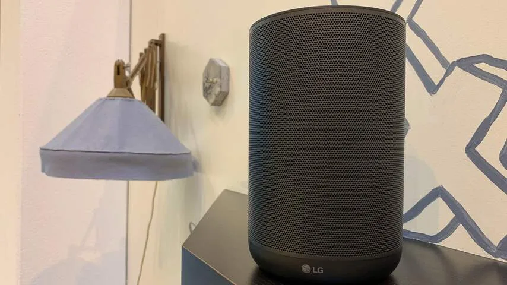
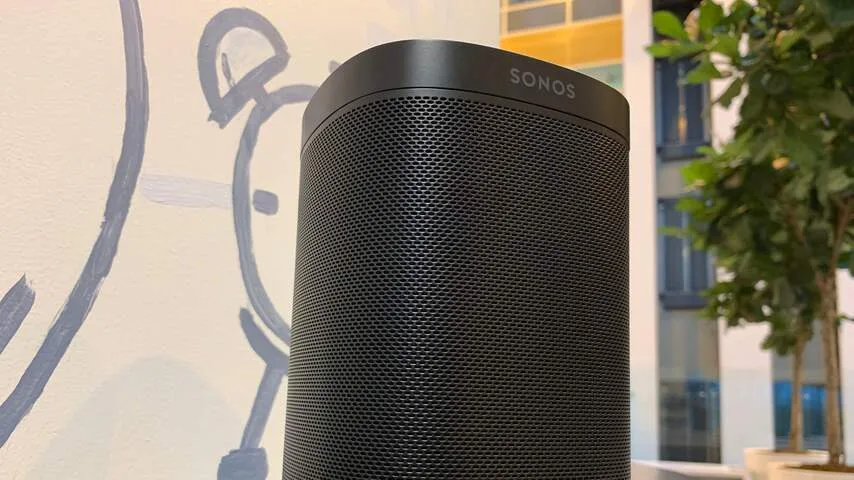

**Nu de stemassistent van Google Nederlands spreekt, worden er steeds meer slimme speakers in Nederland verkocht. We zetten vijf goede opties op een rij.**

> [!NOTE]
> Deze recensie verscheen eerder op [NU.nl](https://www.nu.nl/reviews/5644103/de-beste-slimme-speakers-in-nederland.html).

Steeds meer techbedrijven maken slimme luidsprekers. Spreek ze aan met commando's als "Hé Siri" of "Oké Google" en je kunt allerlei vragen stellen. Ze vertellen in meerdere talen bijvoorbeeld wat het huidige weer is en kunnen een wekker instellen.

In dit overzicht kijken we naar de speakers die op dit moment in Nederland verkrijgbaar zijn. We beperken ons hierdoor voor een groot deel tot luidsprekers die de Google Assistent ondersteunen. Hoewel Apple en Amazon alternatieven hebben, zijn die hier nog niet via officiële kanalen hier te koop.

## Beste koop: Google Home

> [!INFO] Details
>
> -   14 centimeter hoog.
> -   Verkrijgbaar in het wit.
> -   Klinkt prima bij gangbare volumes. Bij hoog volume een beetje hol.
> -   Kost 149 euro.

_Google Home — Beeld: NU.nl/Bastiaan Vroegop_

Voor wie een relatief goede slimme speaker voor een redelijk bedrag wil kopen, is de Home van Google op het moment de beste keuze. Met een prijskaartje van 149 euro is hij goedkoper dan veel luidsprekers van derden, zonder dat er ingeleverd wordt op audiokwaliteit. De Google Home klinkt namelijk verrassend goed voor een luidspreker van 150 euro, met een gebalanceerd en warm geluid.

Lampjes bovenop laten met animaties en kleuren zien of de speaker luistert of een commando verwerkt. Hoewel er bovenop geen knoppen zitten, kun je met simpele veegbewegingen boven op de speaker wel muziek bedienen. Een veeg met de klok mee verhoogt bijvoorbeeld het volume.

**Kopen als:** Je een speaker met een redelijke prijs-kwaliteitverhouding zoekt.
**Mijden als:** Je fysieke knoppen wil om de speaker mee te bedienen.

> [!INFO] Details
>
> -   [Koop de speaker bij Bol.com](https://www.bol.com/nl/p/google-home-smart-speaker-wit-nederlandstalig/9200000100219755/)
> -   [Koop de speaker bij MediaMarkt](https://www.mediamarkt.nl/nl/product/_google-home-wit-1587557.html)
> -   [Koop de speaker bij Coolblue](https://www.coolblue.nl/product/803578/google-home.html)

## Beste budgetkeuze: Home Mini

> [!INFO] Details
>
> -   4,2 centimeter hoog
> -   Verkrijgbaar in zwart, wit en roze.
> -   Klinkt hol bij hoge volumes.
> -   Kost 59 euro.

_Google Home — Beeld: NU.nl/Bastiaan Vroegop_

Het kleinere broertje van de Google Home doet wat onder qua geluidskwaliteit, waardoor muziek soms wat hol kan klinken. Daar staat echter een prijskaartje van 59 euro tegenover, wat hem de goedkoopste in deze lijst maakt.

We merkten bij onze tests dat de Home Mini soms wat meer moeite heeft om stemcommando's goed te verstaan dan de grotere Home. Soms moeten we meerdere malen achter elkaar "Oké Google" zeggen om hem te activeren, in plaats van de enkele keer bij andere speakers. Dat zijn echter uitzonderingsmomenten. In de meeste gevallen hoort de Home Mini prima wat je zegt.

Door de mindere audiokwaliteit is de Home Mini niet een speaker waarop je muziek in de woonkamer afspeelt. Hij is echter wel prima in combinatie met bijvoorbeeld een Chromecast Audio te gebruiken, zodat je met stemcommando's muziek kunt afspelen op een 'ouderwetse' muziekinstallatie.

**Kopen als:** Je zo weinig mogelijk wil betalen voor een slimme speaker.
**Mijden als:** Je goede audiokwaliteit verwacht.

> [!INFO] Details
>
> -   [Koop de speaker bij Bol.com](https://www.bol.com/nl/p/google-home-mini-smart-speaker-wit-nederlandstalig/9200000100219731/)
> -   [Koop de speaker bij MediaMarkt](https://www.mediamarkt.nl/nl/product/_google-home-mini-wit-1587555.html)
> -   [Koop de speaker bij Coolblue](https://www.coolblue.nl/product/803581/google-home-mini-wit.html)

## Alternatieven:

## LG WK7

> [!INFO] Details
>
> -   21 centimeter hoog
> -   Verkrijgbaar in het zwart.
> -   Klinkt ook bij hoge volumes prima.
> -   Kost 200 euro.

_LG WK7 — Beeld: NU.nl/Bastiaan Vroegop_

De WK7 van LG is 50 euro duurder dan de Google Home, maar klinkt ook een stuk beter. Hij levert met een capaciteit van 30 watt een luid geluid, waarbij zowel diepe tonen als hoge klanken goed klinken. Qua audiokwaliteit heeft hij een streepje voor op alle concurrenten die we hebben getest.

De microfoons in de WK7 zijn ook buitengewoon gevoelig. De speaker activeert zelfs als we hem proberen aan te spreken aan een totaal andere kant, ruim 10 meter verderop. In eerste instantie een voordeel, al pikt de speaker hierdoor ook buitengewoon foute commando's op als hij denkt iets anders in huis te horen.

Er staat wel iets tegenover die betere hardware: de WK7 is een buitengewoon forse luidspreker. Dat is prima als je de ruimte hebt, maar op een klein bijzettafeltje neemt hij al snel het volledige oppervlak in beslag.

**Kopen als:** Je iets meer wil betalen voor betere audiokwaliteit.
**Mijden als:** Je op zoek bent naar een compacte speaker.

> [!INFO] Details
>
> -   [Koop de speaker bij Bol.com](https://www.bol.com/nl/p/lg-wk7/9200000093097874/)
> -   [Koop de speaker bij Coolblue](https://www.coolblue.nl/product/822623/lg-wk7-thinq.html?cmt=c_a,cid_1659277590,aid_63727601197,tid_pla-592740218106,gn_g,d_c&ref=849010&gclid=CjwKCAiAu_LgBRBdEiwAkovNsEwF3FN0OzSM0_NNnypVbWj76VdLZuyeDX2c6tqaRnUTR8ttZx3xeRoC4yMQAvD_BwE)

## Sonos One

> [!INFO] Details
>
> -   16,1 centimeter hoog
> -   Verkrijgbaar in zwart en wit.
> -   Klinkt ook goed bij hoge volumes.
> -   Kost 204 euro.

_Sonos One — Beeld: NU.nl/Bastiaan Vroegop_

De Sonos One is strikt gezien nog niet 'slim' in Nederland. Op dit moment ondersteunt de speaker slechts één stemassistent, Amazon Alexa, die nog geen Nederlands spreekt en hier alleen via een omweg met VPN-programma's geactiveerd kan worden.

Sonos test wel ondersteuning voor de Google Assistent, die op een later moment voor alle gebruikers beschikbaar moet worden. Vermoedelijk zal de assistentfunctie dan ook voor Nederlandse eigenaars werken.

Door gebruikers te laten kiezen welke assistent ze het liefst gebruiken, wordt de Sonos One misschien wel de flexibelste slimme speaker op de markt. Daarnaast ondersteunt hij ook Apples AirPlay-protocol en heeft Sonos een eigen app voor muziekdiensten, waardoor je makkelijker muziek uit smartphoneapps kunt afspelen. Door de AirPlay-ondersteuning kun je ook muziek afspelen via Siri op je telefoon.

Dat is echter toekomstmuziek: in zijn huidige vorm werkt de Sonos One alleen nog maar via een omweg met Alexa en met AirPlay. Wil je een volwaardige Nederlandse assistent in een Sonos-speaker, dan moet je nog even geduld hebben.

Qua geluidskwaliteit is de Sonos One een prima, solide speaker, met een natuurlijk geluid dat verrassend veel details laat horen. Voor 204 euro een prima investering, als je nog even kan wachten op stembediening.

**Kopen als:** Je bereid bent om te wachten op de slimme functies.
**Mijden als:** Je per direct een Nederlandse stemassistent wil bedienen.

> [!INFO] Details
>
> -   [Koop de speaker bij Bol.com](https://www.bol.com/nl/p/sonos-one-wit/9200000083962846/)
> -   [Koop de speaker bij MediaMarkt](https://www.mediamarkt.nl/nl/product/_sonos-one-wit-1542981.html)
> -   [Koop de speaker bij Coolblue](https://www.coolblue.nl/product/795383/sonos-one-wit.html)

_De speakers in bovenstaand overzicht zijn geselecteerd door de onafhankelijke redactie van NU.nl. Als je een speaker koopt, kan het zijn dat NU.nl hier geld aan verdient._
