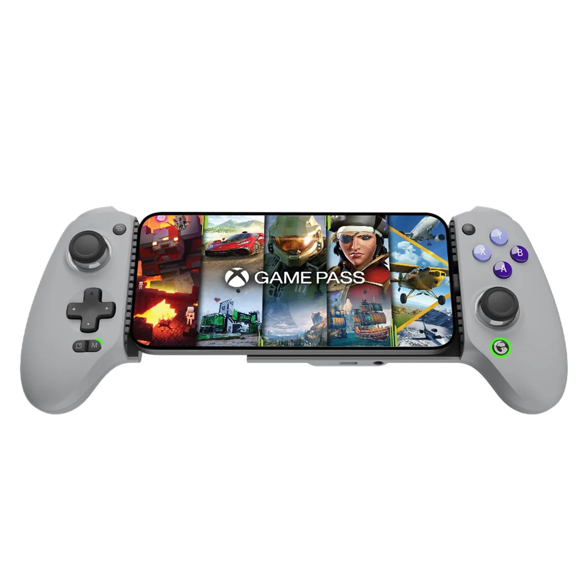

Voor een snel spelletje is je touchscreen prima, maar gamers die diep in een serieuze game willen duiken pakken er toch liever een controller bij. Op smartphones is dat ook steeds interessanter: op de [iPhone](https://www.bright.nl/onderwerpen/iphone) kun je nu bijvoorbeeld Resident Evil 4 Remake en Assassin’s Creed Mirage spelen, console-ervaringen zonder dat je er een extra spelcomputer voor hoeft te halen. Apps voor gamestreaming laten je bovendien de bibliotheek van je spelcomputer op de telefoon draaien, handig als iemand in de woonkamer de tv bezet houdt.

> [!NOTE]
> Deze recensie verscheen eerder op [Bright](https://www.bright.nl/nieuws/1176110/de-gamesir-galileo-g8-is-de-beste-gamecontroller-voor-je-smartphone.html).

Controllers om dat mee te doen bestaan al een tijdje, maar de meesten hadden toch nog wel een paar nadelen. Onze favoriet was lange tijd bijvoorbeeld de Backbone One, maar de klikkerige knoppen voelen na lang spelen wat goedkoop en heel ergonomisch is hij niet.

## Frisse wind

Wat dat betreft voelt de Galileo G8 als een frisse wind: voor het eerst gebruikten we een [smartphone](https://www.bright.nl/onderwerpen/smartphone)\-controller waarbij we nooit het gevoel kregen dat het een inferieure ervaring was vergeleken met de gamepad van een gameconsole. Het is een fijn, ergonomisch apparaat waar je met gemak urenlang op kunt spelen.

In de eerste plaats komt dat door het ontwerp: de Galileo is veel ergonomischer dan zijn concurrenten, met handvatten vergelijkbaar met een Xbox-controller aan weerszijden. Dat maakt hem ook iets forser, maar dat is een prima compromis om te maken: waar de Backbone One na een tijdje wat krampachtig voelt, is dit een comfortabele controller om op te spelen.

## Een Xbox-controller om je telefoon

Qua lay-out is de controller ook vergelijkbaar met die van Microsoft: twee sticks, een d-pad en vier actieknoppen met daarop A, B, X en Y. De trekkers bovenop zijn analoog, de sticks hebben halsensoren. Hierdoor is de kans op zogeheten driftproblemen waardoor de stick uit zichzelf beweegt minimaal. Staan de sticks je niet aan, dan kun je de bovenkant van de controller losmaken en ze verwisselen met alternatieve pookjes. De controller wordt geleverd met een kleinere stick, een hoger alternatief en één met een gebolde bovenkant. Voor ons was de standaard-optie prima, maar het is fijn dat de keuze er is.

Daarnaast zitten er wat leuke extra’s in de controller verstopt. Houd je de speciale M-knop ingedrukt en tik je op een knop, dan verandert deze in een turbo-optie. Die kun je dan ingedrukt houden, waarbij de game denkt dat je hem continu achter elkaar inklikt. Handig in games waarbij je continu moet drukken om te blijven schieten. Op vergelijkbare wijze kun je ook de trekkers op de achterkant van de controller koppelen aan één van de toetsen aan de voorzijde, zodat je meer manieren hebt om [games](https://www.bright.nl/onderwerpen/games) te bedienen. Houd de M- en A-knoppen lang ingedrukt en de actieknoppen worden van plek gewisseld, zodat de gamepad dezelfde layout heeft van een Nintendo Switch-controller.

## Verschillende standen

Houd de start- en selectknoppen ingedrukt en je kunt wisselen tussen drie standen. In de standaard smartphone-modus koppelt de telefoon als een Xbox-controller, of je zet hem in PlayStation-modus zodat hij als Sony-gamepad door je telefoon wordt geregistreerd. Dat laatste is handig als je de Remote Play-app wil gebruiken om PlayStation-games naar je telefoon te streamen.

Gebruik je een Android-toestel, dan is er zelfs een speciale touchscreenmodus. Met een bijbehorende app koppel je dan delen van het scherm aan de toetsen, zodat je een game zonder controller-ondersteuning ook ermee kunt spelen.

Hoewel de controller werkt met zowel iOS als Android (mits je een iPhone 15 of nieuwer hebt, want hij verbindt via usb-c), zijn er nog een paar Android-exclusieve functies. Je kunt bijvoorbeeld de home-knop en de d-pad tegelijkertijd indrukken om het volume te verhogen en verlagen, of op de screenshot-knop klikken om het huidige beeld vast te leggen. Ook kun je op Android de controller specifieker kalibreren vanuit een bijbehorende app.

## Conclusie

Het is bij elkaar een hoop, maar de strekking moge duidelijk zijn: je kunt bijna alles dat je zou willen aanpassen aan deze controller. Games die bij andere gamepads voor problemen zorgden, hadden op de Galileo altijd wel een trucje om ze alsnog perfect speelbaar te maken.

Combineer het met een premium uitstraling en ergonomisch ontwerp, en je hebt de beste telefoon-gamecontroller die we afgelopen jaren hebben getest.

Lees meer nieuws over [gadgets](https://www.bright.nl/onderwerpen/gadget) en abonneer gratis op onze [nieuwsbrief](https://www.bright.nl/dossiers/newsletter).
