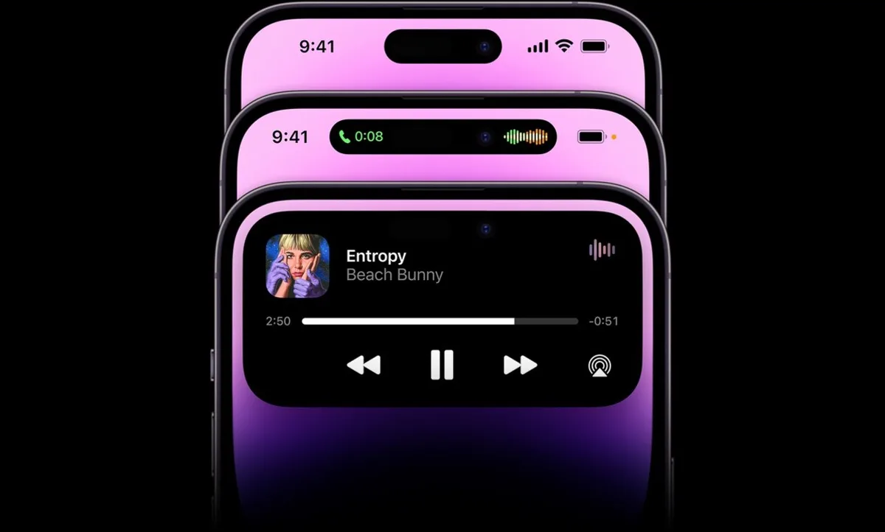
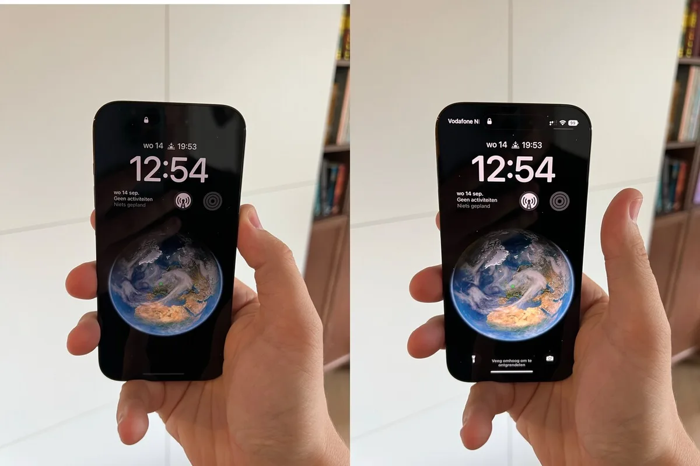

Apple heeft dit jaar twee nieuwe iPhones, waarvan één echt significant veranderd is. Maar ze zijn ook flink duurder geworden vergeleken met vorig jaar.

> [!NOTE]
> Deze recensie verscheen eerder op [AD](https://www.ad.nl/tech/de-iphone-14-pro-is-een-smartphone-die-je-minder-hoeft-te-gebruiken-en-dat-is-slim-bedacht~a36f82b3/).

Wie een iPhone 14 in het wild tegenkomt, kan wellicht moeite hebben die te onderscheiden van de 13 van vorig jaar: het ontwerp is hetzelfde en aan de binnenzijde zit zelfs de chip van de iPhone 13 Pro uit 2021, wat hem ongeveer even snel maakt.

Er zijn wel een paar kleine, unieke dingen aan de software toegevoegd. Zo is er crashdetectie, waardoor de iPhone bij een ernstig auto-ongeluk automatisch 112 belt. En bij het maken van video’s kun je een soort GoPro-modus activeren, waardoor zelfs extreem bewogen shots zeer stabiel blijven.

## Het nieuwe zit in de iPhone 14 Pro

Grote keerzijde is dit jaar de iPhone 14 Pro, die met twee grote aanpassingen de grootste update sinds 2017 belooft te zijn. Het meest opvallende is de inkeping boven het scherm, met daarin de selfiecamera en sensor voor gezichtsherkenning. Die is iets naar beneden verplaatst en omgedoopt tot de ‘Dynamic Island’.

Dat lijkt een kleine verandering, maar Apple heeft iets slims gedaan: aan weerszijden van de Dynamic Island kunnen apps simpele informatie laten zien. Hier wordt bijvoorbeeld getoond welke muziek je luistert, of zie je de timer van een klok aftellen. Zo wordt die camera-inkeping ineens onzichtbaar: het is geen hap meer van het scherm, maar onderdeel van de software.

Het kleine eilandje maakt de software van je iPhone ook overzichtelijker. Je hoeft niet langer het Bedieningspaneel open te vegen om naar je muziek te gaan, of naar de muziekspeler om zeker te zijn dat je AirPods zijn verbonden. En omdat het op dezelfde plek staat, raak je nooit kwijt waar je moet kijken.

Rond het nieuwe 'Dynamic Island' kunnen apps informatie tonen. © Apple

## Een scherm dat nooit uitgaat

Daarnaast is er het beeldscherm van de iPhone, dat nu bijna altijd aan blijft staan. Zo’n always-on-display zagen we eerder ook bij Android-concurrenten, maar zit bij Apple net iets anders in elkaar. Op een Android-toestel wordt het oled-scherm uitgeschakeld om alleen bepaalde onderdelen op te lichten, terwijl bij een iPhone 14 Pro het beeld gedimd langzamer ververst.

Een scherm dat altijd aanstaat verbruikt op papier meer stroom, maar in de praktijk merkten we bij de tests afgelopen dagen weinig van: de iPhone 14 Pro houdt het prima een dag vol op een volle accu.

Dat komt ook deels door hoe dit nieuwe scherm wordt gebruikt. Omdat Apple het hele beeld dimt, zie je op ieder moment wat voor berichten er zijn binnengekomen - en hoeft de telefoon niet te worden geactiveerd om dit af te lezen. Op die manier bespaar je indirect stroom.

_Op zoek naar een goedkope smartphone? De redactie van BestGetest zette_ [de beste telefoons van max. 500 euro](https://bestgetest.nl/de-beste-midrange-smartphones-tot-500-euro-van-2022?utm_source=ad&utm_medium=tekstlink&utm_term=byo&utm_campaign=redactioneel&utm_content=a36f82b3) _op een rij._

## Apps op een ‘uitgeschakelde’ iPhone bekijken

Sommige apps spelen daar slim op in. Naast de Klok-app kun je bijvoorbeeld de Kaarten-app op het vergrendelde scherm bekijken, zodat je ziet waar je de bocht moet omslaan zonder constant je iPhone op volle kracht te laten werken. Je hebt dan geen kaartje, maar voor simpele routes zijn de instructies voldoende.

Op termijn moet de iPhone 14 Pro nog meer gaan doen vanaf het always-on-scherm, als apps zogeheten ‘Live Activiteiten’ mogen toevoegen. Dan zie je onderin het beeld bijvoorbeeld wanneer je Uber arriveert of wat de stand bij een voetbalwedstrijd is. Zo verandert de iPhone 14 Pro langzamerhand in een telefoon die je straks amper aan hoeft te zetten.

Links een iPhone 14 Pro die 'uit' staat, rechts staat hij aan. © Bastiaan Vroegop

## Betere camera’s

Op cameragebied hebben beide iPhones een upgrade gehad, die vooral merkbaar is als je bij lage lichtomstandigheden foto’s maakt. Bij de 14 Pro merkten we dat vooral bij gebruik van de zoomlens. Bij de 13 Pro kon beeld dan soms grauw en korrelig worden, bij de 14 Pro is dat minder zo.

Het verschil met de 13 wordt pas groot op de 14 Pro, als je besluit raw-foto’s te maken. Dit staat standaard uitgeschakeld, maar zorgt ervoor dat je de volledige 48 megapixel-sensor gebruikt. Dat zorgt overigens wel voor gigantische fotobestanden, waardoor een iPhone best snel volraakt.

## De iPhones zijn duurder - net als alles

Dit jaar is er nog één punt flink veranderd vergeleken met vorig jaar: de prijs. Waar je in 2021 de goedkoopste iPhone 13 kocht voor 800 euro, beginnen de prijzen ditmaal boven de 1.000 euro. Dat is deels door het verdwijnen van de goedkopere mini-telefoon, maar bij nagenoeg ieder model is de prijs 100 tot 200 euro omhoog.

Het is makkelijk om dat toe te schrijven aan Apples geldzucht, maar de realiteit ligt genuanceerd. iPhone-prijzen worden gebaseerd op dollarkoersen, die dit jaar buitengewoon hoog liggen. Tegelijkertijd zien we dat in tijden van inflatie alles duurder wordt - iets dat hier bij de iPhone ook het geval lijkt.

Maar de realiteit blijft hetzelfde: wie dit jaar naar de winkel loopt voor een iPhone, betaalt flink meer dan bij de nieuwste exemplaren in 2021. En juist nu alle vaste lasten stijgen, kan dat een bittere pil zijn.

## Overweeg een iPhone 13 Pro, tenzij je een groot scherm wil

Er is trouwens één kleine uitzondering voor mensen die een zo goedkoop mogelijke iPhone met een zo groot mogelijk scherm willen. Die betalen dit jaar 1169 euro, in plaats van de 1259 vorig jaar. Dat komt simpelweg door de komst van de nieuwe iPhone 14 Plus, waardoor je niet meer een duurdere Pro-telefoon hoeft te kopen voor een gigascherm. Je hebt dan de ‘gewone’ 14 met een groot scherm.

Wie de kleinere iPhone 14 overweegt, kan dit jaar misschien net zo goed de 13 Pro van vorig jaar kopen. Die gaat nu voor 800 tot 850 euro over de toonbank bij veel winkels en is door de gebruikte chip even snel als de 14.

## Conclusie

De gewone iPhone 14 voelt conservatief: het is een oud ontwerp, een al bekende processor en een kleine upgrade aan de camera en software. Prima voor wie nu een iPhone wil, maar van een wow-factor is geen sprake.

Dat is bij de 14 Pro wel anders. Die is gemaakt is met een heel bijzonder doel: om te zorgen dat je hem zo min mogelijk hoeft te ontgrendelen. Zo wordt de iPhone een wat passiever apparaat - een trend die wellicht bij toekomstige iPhones doorontwikkelt. Een geweldige telefoon als je er het geld voor hebt.
