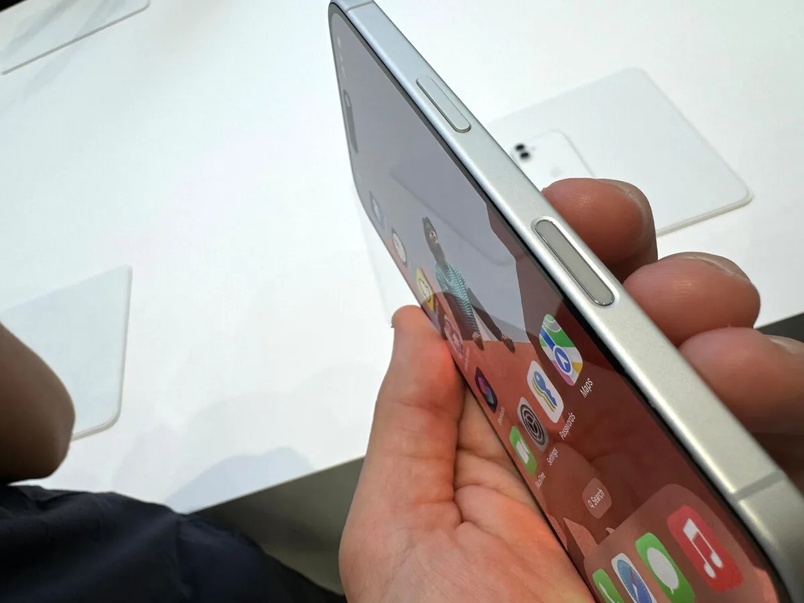
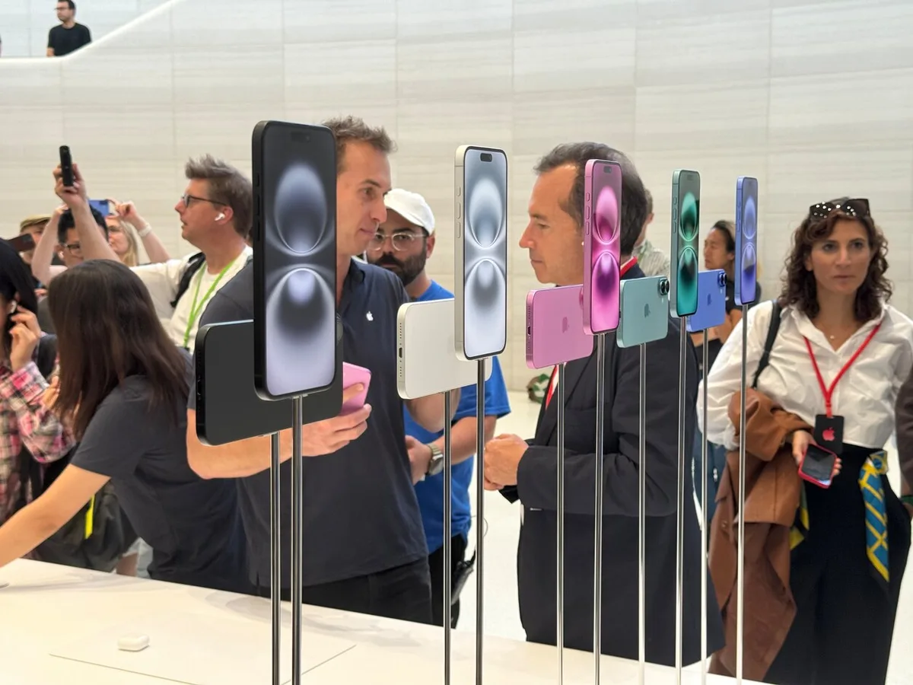
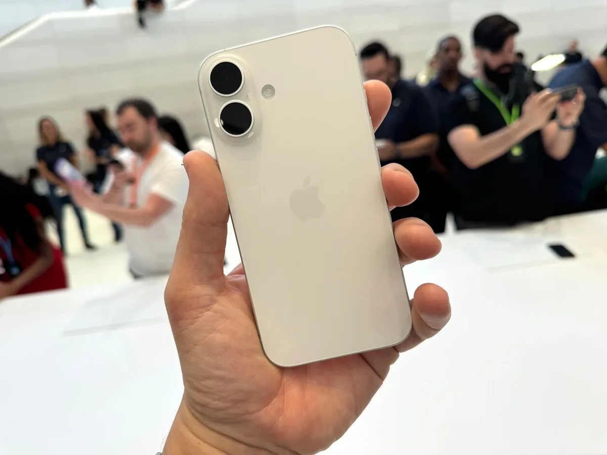

De nieuwe iPhone 16 moet vooral revolutionair worden op AI gebied. Vooralsnog hebben we daar in Nederland niets aan. Welke functionaliteiten biedt de smartphone nog meer? Techjournalist Bastiaan Vroegop test de iPhone 16 en iPhone 16 pro alvast kort uit in San Francisco en concludeert: het nieuwste foefje voelt nu nog Apple-onwaardig.

> [!NOTE]
> Deze recensie verscheen eerder op [AD](https://www.ad.nl/tech/de-nieuwe-iphone-16-is-prima-maar-op-een-front-onwennig~a4b450aa/).

Traditiegetrouw staan na de [presentatie van Apple](https://www.ad.nl/tech/nieuwe-telefoons-gepresenteerd-belangrijkste-functie-iphone-16-is-nog-niet-in-nederland-te-gebruiken~ac4c4eff/) lange tafels gevuld met de nieuwe iPads, AirPods en Apple Watches klaar, zodat de pers ze alvast kan proberen. Een vriendelijke Apple-medewerker begeleidt de probeersessie en laat meteen alle handige vernieuwingen van Apples nieuwe AI-software zien. Met een paar snelle vegen is stemassistent Siri menselijker, herschrijft AI een sms’je en wordt een stapel ongelezen e-mails binnen een seconde voor ons samengevat.

Logisch dat daar de nadruk op ligt. Volgens Apple-baas Tim Cook is de nieuwe iPhone 16 speciaal ontworpen om van AI gebruik te maken. Maar wie gelijk staat te juichen, komt van een koude kermis thuis. De AI-fuctie is vooralsnog enkel in de Verenigde Staten bruikbaar. Het is afwachten of Apple Intelligence ook naar Europa komt, het techbedrijf vermijdt ons continent uit angst voor regulering van de Europese Unie.

## Wat biedt de nieuwe iPhone in Nederland wel? Nieuwe knoppen

Apple’s AI is voorlopig dan wel in Nederland taboe, het toestel bevat meer vernieuwingen. Zoals de knoppen aan weerszijden. Met de actieknop boven de volumetoetsen kun je één app of handeling koppelen om snel te gebruiken, zodat je bijvoorbeeld je dictafoon-app kunt opstarten zonder de iPhone te ontgrendelen. Eerder was de actieknop exclusief voor de iPhone 15 Pro, ditmaal zit hij ook op de goedkopere standaardmodellen.

Lees verder onder de foto.

Apple heeft op de iPhone 16 aan weerszijden van het toestel nieuwe knoppen toegevoegd. © Bastiaan Vroegop

## Camera control

Rechts onder de sluimerknop zit nu een inkeping waar je Apples nieuwe ‘camera control’ vindt. Dit is een knop die eigenlijk geen knop is: aan de binnenzijde zit een kleine aanraaksensor, met daarnaast een trilmotortje die je vinger de sensatie van een knopdruk geeft. Duw hem naar beneden en je voelt een klik, maar de toets kan ook veegbewegingen registreren.

Apple gebruikt deze nieuwe toets om je camera-app te bedienen. Is de camera niet geopend, dan kun je hem eenmaal indrukken om de app te starten. Daarna wordt het een sluiterknop om een foto mee te maken. Je kunt ook over het aanraakpaneel vegen om het camerabeeld te manipuleren. Standaard zoom je in, maar door tweemaal te tappen wissel je naar andere functies zoals kleurenfilters.

Het is op papier een welkome toevoeging. Een losse sluiterknop maakt het makkelijker om foto’s te maken zonder dat je vingers het scherm blokkeren, of om een selfie met de achtercamera te schieten terwijl je het beeld niet kunt zien. Maar bij onze eerste probeersessie voelde de knop wat onwennig en nodeloos complex.

## Apple-onwaardig

Je tikt, veegt en drukt om de camera control-knop te bedienen - alsof je op de fysieke knoppen van een oude camera zit te klikken. Staat jouw gewenste functie niet geselecteerd, dan is het omslachtig om de juiste optie aan te tikken - terwijl het aanraakscherm dan wel makkelijk werkt.

Het voelt bij een eerste impressie wat Apple-onwaardig. Het bedrijf is ooit groot geworden door complexe technologische handelingen vanzelfsprekend te maken. Ze introduceerde decennia geleden de muis, waardoor we met gemak konden wijzen naar dingen op het computerscherm. Daarna was het de iPhone die het intuïtief aantikken van dingen met je vinger de norm maakte. ‘Camera control’ is daar het tegenovergestelde van: het maakt de logische bediening van een iPhone-scherm lastiger en minder vanzelfsprekend.

Uiteraard voelt dat zo na slechts een kort moment om de functie te gebruiken. Wellicht dat de knop intuïtiever in gebruik wordt na een paar dagen oefenen en dan voordelen met zich meebrengt.

## Bekend terrein

Verder is de iPhone 16 bij onze probeersessie vooral bekend terrein: het is een goede iPhone. Het scherm is wederom erg mooi, de camera’s schieten prima foto’s. Over batterijduur kunnen we nog niks zeggen, maar gezien Apples belofte deze te verlengen, maken we ons weinig zorgen. Hetzelfde geldt voor de processor: die is sneller en moet beter bepaalde AI-taken uitvoeren, maar de chip van de iPhone 15 was ook al hartstikke snel. Qua algehele specificaties is het gewoonweg een prima ding.

Het is onder de streep geen revolutionair apparaat. Bij sommige iPhones vindt Apple het wiel opnieuw uit, bijvoorbeeld met de introductie van Apple Pay in de iPhone 6 of gezichtsherkenning in de iPhone X. De nieuwe functie van dit jaar, ‘camera control’, voelt nog niet alsof het van die orde is. Wellicht is Apple Intelligence dat wel, maar dat is op dit moment alleen leuk voor de Amerikanen. Het maakt dit voor Europeanen ‘gewoon’ een prima, nieuwe telefoon. Prima voor wie wil upgraden, een beetje saai voor de fanatieke tech nerd.

De nieuwe iPhones worden verkocht vanaf 969 euro voor de gewone modellen en 1229 euro voor de Pro-toestellen. Ze liggen 20 september in de winkels.

## Lees ook:

[Review: nieuwe iPads pro en air zijn lichter, sneller en dunner](https://www.ad.nl/tech/review-nieuwe-ipads-pro-en-air-zijn-lichter-sneller-en-dunner~a6b4a0bf/)

Apple heeft de nieuwe iPhone 16 en iPhone 16 pro gepresenteerd. © Bastiaan Vroegop

Apple heeft de nieuwe iPhone 16 gepresenteerd. © Bastiaan Vroegop
