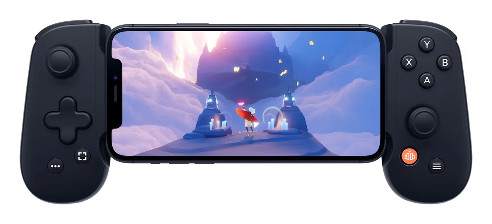
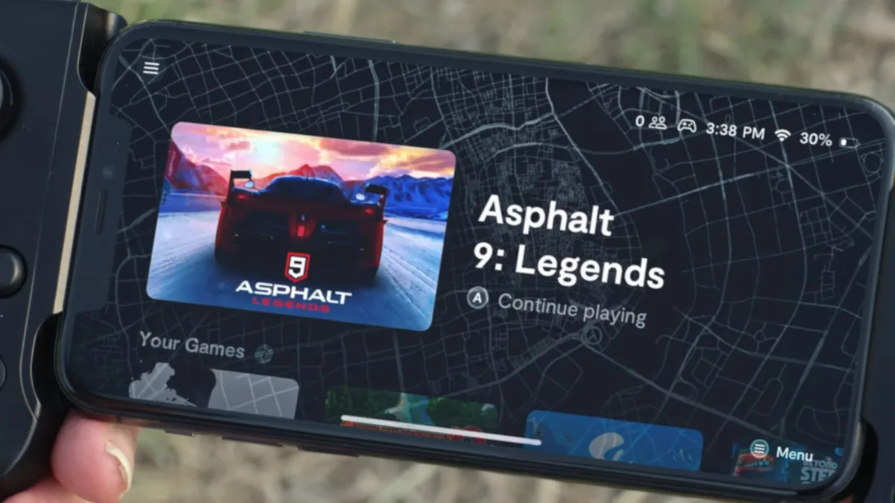

**Bright Review**

> [!NOTE]
> Deze recensie verscheen eerder op [Bright](https://www.bright.nl/nieuws/1128530/deze-gadget-maakt-van-je-iphone-een-switch-concurrent.html).

Hoewel je zonder gamecontroller kunt gamen op een iPhone, is het niet altijd even handig. Je moet dan met je handen over het scherm zitten terwijl je virtuele knoppen en sticks moet bedienen die je niet met je vingertoppen kunt aanvoelen. Hierdoor zie je maar de helft van het speelveld en druk je regelmatig op de verkeerde toets.

Een gamecontroller zoals de Backbone One moet daar verandering in brengen. Door de iPhone ertussen te klemmen en via de Lightning-poort te verbinden, heb je bij ondersteunde spellen ineens extra toetsen tot je beschikking. Opladen hoeft niet, omdat hij via de verbinding stroom van je iPhone gebruikt. Bij onze tests had dat een minimale impact op onze telefoonaccu.

Zo'n iPhone-controller is op zich niks nieuws: bedrijven zoals Gamevice en Razer verkopen ze al langere tijd. Maar de Backbone One is zonder twijfel de beste die we ooit getest hebben. Hij ligt beter in de hand dan de recente Razer Kishi en heeft inklikbare analoge sticks die ontbraken op de Gamevice-controllers. Daarnaast ligt hij door de uitstekende onderkanten veel beter in de hand.

[Bekijk ingesloten media](https://www.youtube.com/embed/cq8zEp9bczo?autoplay=1&modestbranding=1)

Knoppen maken een klein klikgeluid en reageren snel. De trekkers achterop zijn wat gevoelig maar werken in de meeste spellen ook prima. Daarnaast is de springveer die de controllerhelften tegen je iPhone aanduwt vrij flexibel: een iPhone 12 Pro past er in, maar een grotere 11 Pro Max of kleinere iPhone SE ook.

Overigens verkoopt Backbone op dit moment alleen een model voor iPhones. Een vergelijkbare gamepad die via USB-C op een Android-telefoon aansluit bestaat nog niet, en het is onduidelijk of deze op korte termijn zal volgen.

## Briljante app

Het echt grote voordeel van de Backbone One zit in de software. De makers hebben een bijbehorende app gemaakt die als een soort thuisbasis voor je controllerspellen dient. Hij is vergelijkbaar met het beginscherm van een Xbox of PlayStation, waar al je ondersteunde spellen vermeld staan. Je start de app door op de thuisknop van de controller te starten.

Het betekent dat je nooit je iPhone ongemakkelijk hoeft te draaien om een nieuw spel op het aanraakscherm op te starten. Bovendien heeft de app opties voor het opnemen van video's of maken van screenshots, zodat je tijdens het gamen makkelijk je hoogtepunten kunt vastleggen. Het zorgt ervoor dat de Backbone One aanvoelt als een heuse spelcomputer, in plaats van als een onhandig accessoire zoals bij veel andere controllers het geval is.

De app heeft ook een plek om vrienden toe te voegen om samen mee te spelen. Een leuk idee, al valt het in de praktijk wat tegen. Op het moment hebben maar weinig mensen zo'n Backbone-controller, waardoor de kans nihil is dat je vrienden hebt om in je lijst toe te voegen.

## Streaming

Het aantal iOS-games met controllerondersteuning is op het moment wat teleurstellend. Tussen het aanbod zitten slechts een paar pareltjes, zoals Stardew Valley, Star Wars: Knights of the Old Republic en de Zelda-achtige Oceanhorn-games, maar de gamesbibliotheek kan zich niet meten met wat Nintendo voor zijn Switch uitbrengt.

Daar staat tegenover dat de controller werkt met de meeste gangbare gamestreamingdiensten. Google Stadia en Geforce Now kunnen gebruikt worden om honderden spellen naar je telefoon te streamen en vervolgens te besturen met je Backbone.

Microsoft brengt later dit jaar zijn streamingdienst Game Pass ook naar de iPhone, waarop je voor een vast bedrag per maand toegang hebt tot ruim honderd games plus het volledige aanbod op EA's platform. Volgens geruchten zal Game Pass binnenkort ook de games van Ubisoft aan het aanbod toevoegen.

## Honderden grote games

Daarmee wordt de lijst met spellen die je op de Backbone One kunt spelen ineens gigantisch uitgebreid. En niet met simpele, mobiele spelletjes: op Stadia, Geforce Now en Game Pass vind je hoogwaardige titels die je ook op pc en spelcomputers aantreft, zoals Call of Duty, Destiny 2, Gears 5 en FIFA. Het omstreden Cyberpunk 2077 lijkt zelfs beter op Stadia te draaien dan op veel spelcomputers.

Het maakt van je iPhone een gameconsole met een uitmuntende bibliotheek. De afgelopen weken dat we Stadia gebruikten met de Backbone waren een geweldige verrassing: games oogden geweldig, speelden perfect met de controller en van zichtbare latency was bijna geen sprake.

## Conclusie

Uiteraard is een Backbone One inclusief iPhone wel een stukje duurder dan een Nintendo Switch: voor een iPhone SE betaal je op dit moment rond de 400 euro, waar dan nog de 100 euro van de controller bovenop komt. Maar wie al een iPhone heeft, is aan enkel die controller minder kwijt dan aan de aanschaf van een geheel nieuwe Switch. En dan is dit, mede dankzij de handige app en het groeiende streamingaanbod, een interessante optie.
