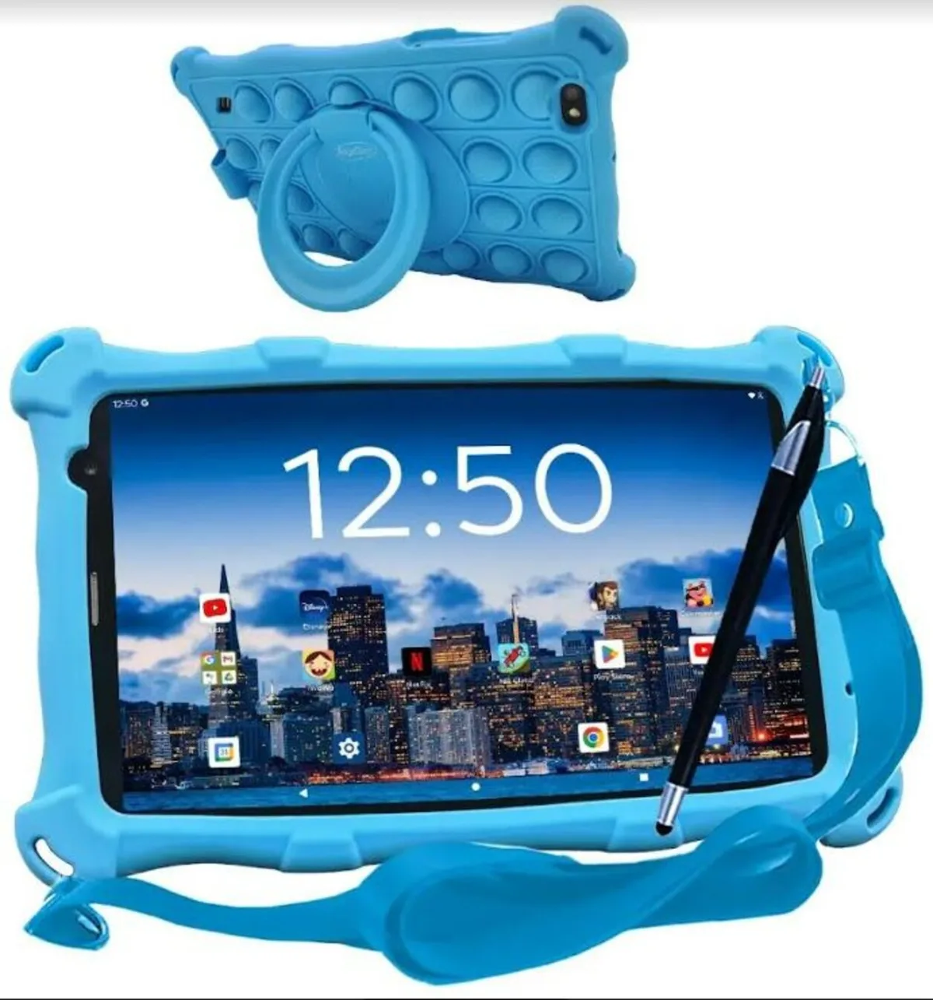
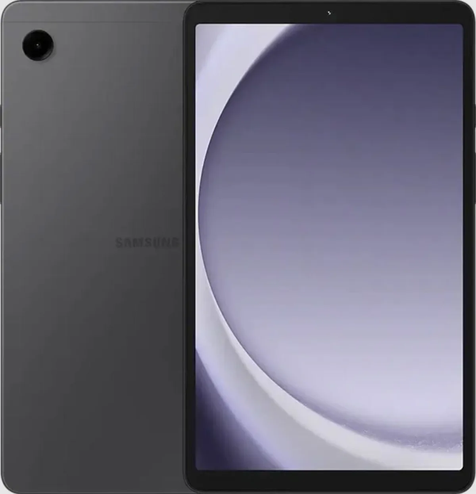

Kinderen kunnen prima met een reguliere tablet uit de voeten, maar bij echt regelmatig tabletgebruik is een speciale kindertablet soms een beter idee. Tweakers zet de beste tablets speciaal gemaakt voor jonge gebruikers op een rij.

> [!NOTE]
> Deze recensie verscheen eerder op [AD](https://www.ad.nl/tech/deze-samsung-tablet-is-ook-geschikt-voor-kinderen-maar-koop-er-wel-een-extra-hoesje-bij~a4719d59/).

In principe kun je als ouder veel ‘gewone’ tablets zo instellen dat je kroost in een speciale omgeving terechtkomt waar ze niet in apps voor volwassenen kunnen rondneuzen. Maar in de winkels verschijnen ook steeds meer speciale kindertablets: modellen die naast speciale software ook een stevigere, valbestendige behuizing hebben.

Onze keuze is hieronder gevallen op die laatste optie - al hebben we als alternatief ook een reguliere tablet die snel kindvriendelijk gemaakt kan worden.

Onderstaande tablets zijn geselecteerd door de redactie van Tweakers, die het hele jaar door honderden apparaten test om de beste te selecteren. De volledige test vind je [op deze pagina](https://tweakers.net/best-buy-guide/tablets/beste-tablet-voor-kinderen).

## De beste koop: AngelTech Kindertablet Pro MAX

AngelTech Kindertablet Pro MAX. © RV

De naam doet vermoeden dat dit een reusachtig apparaat is, maar het scherm is een vrij bescheiden 8 inch groot. De meegeleverde, stootbestendige hoes maakt hem wel een slagje groter en zorgt dat het gehele apparaat 560 gram weegt. Die hoes is optioneel, maar raden wij wel aan: de tablet zelf voelt namelijk niet heel erg stevig aan.

De AngelTech Kindertablet wordt geleverd met een verzameling accessoires, zoals een draagkoord om potentiële valpartijen te voorkomen. Ook heeft het een pennetje om mee te tekenen. De bijgeleverde handleiding is duidelijk en helpt je op weg in de iWawa-omgeving, de speciale software bedoeld voor jonge gebruikers. Daar vind je dan wel weer Engelstalige applicaties, wat voor de jongste gebruikers wat onhandig kan zijn.

iWawa zorgt dat kinderen niet zomaar op foute inhoud stuiten, al is dat systeem niet perfect: websites worden bijvoorbeeld slecht gefilterd, waardoor een slim kind in de browser alsnog op plekken terecht kan komen waar deze niet hoort te zijn. Gelukkig kun je er ook gewoon voor kiezen om te wisselen naar Googles eigen Google Kids Space-omgeving, die de tablet beter afschermt tegen foute inhoud.

Qua specificaties is dit geen hoogvlieger, maar meer zal een jonge gebruiker ook niet nodig hebben. En hierdoor weet AngelTech de prijs met 128 euro wel vrij laag te houden.

## Goed alternatief: Samsung Galaxy Tab A9

Samsung Tab A9. © RV

De Galaxy Tab A9 van Samsung is een reguliere tablet voor zowel jonge als volwassen gebruikers, maar wel één die met zijn 127 euro pakweg net zo duur is als bovenstaand alternatief. Voor dat geld krijg je dan zelfs een iets betere tablet met een moderner scherm en een behuizing die mooier is afgewerkt.

De accuduur is ook iets langer en het apparaat krijgt nog tot zeker 2027 updates. Wel moet je voor dat bedrag zelf investeren in een stevig hoesje - wat een must kan zijn bij gooi-grage kinderen.

Samsung levert op zijn tablets een eigen kinderomgeving. Die is flexibel in gebruik, maar ook een beetje karig qua opzet. Je kunt websites filteren en instellen wanneer het apparaat gebruikt mag worden, maar hierbij heb je alleen de meest basale keuzes om te configureren. Daarnaast heb je bij sommige apps een Samsung-account nodig om ze te gebruiken.

Net als bij de AngelTech-tablet kun je op dit apparaat de Google Kids Space installeren, waar we meer over te spreken zijn. Die werkt alleen niet heel erg goed samen met Samsungs eigen gebruikersinterface, wat betekent dat je een andere lay-out voor je telefoon moet instellen.

_Verantwoording_

_In deze rubriek schrijven we over technologische apparaten die door Tweakers zijn beoordeeld. Bij Tweakers wordt ieder apparaat onderzocht door het testlab, waar onder andere accuduur, snelheid en andere belangrijke aspecten worden getoetst._

_De redactie van Tweakers is volledig onafhankelijk. Bedrijven betalen op geen enkele manier om in deze artikelen behandeld te worden._
