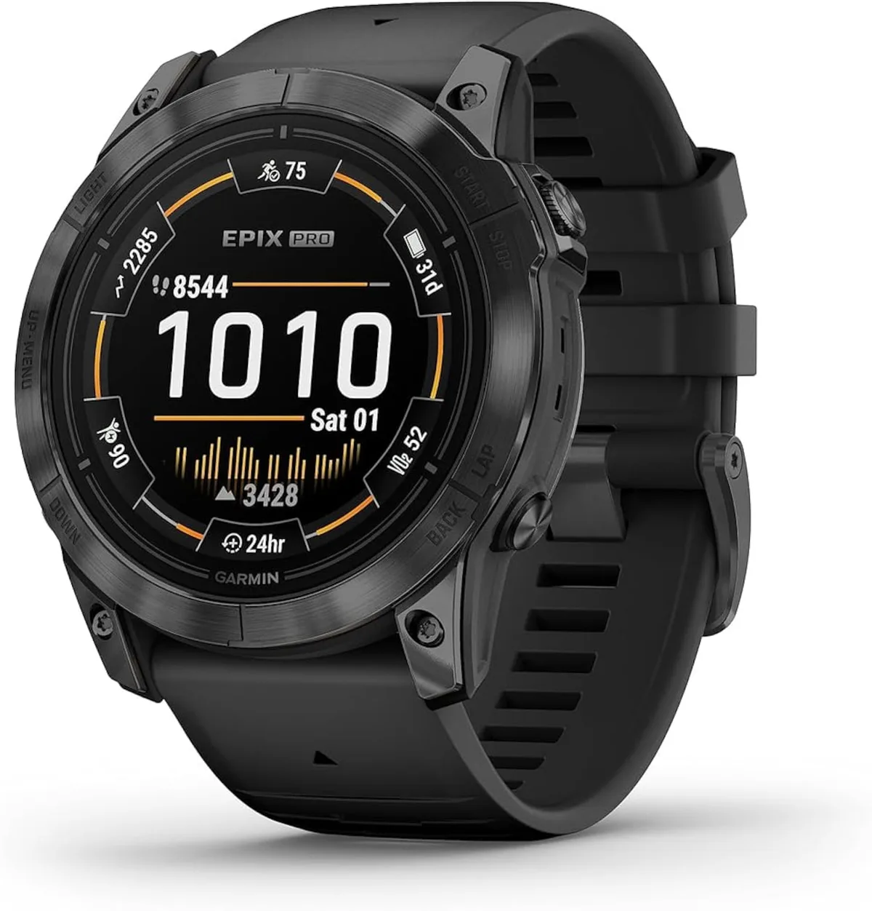
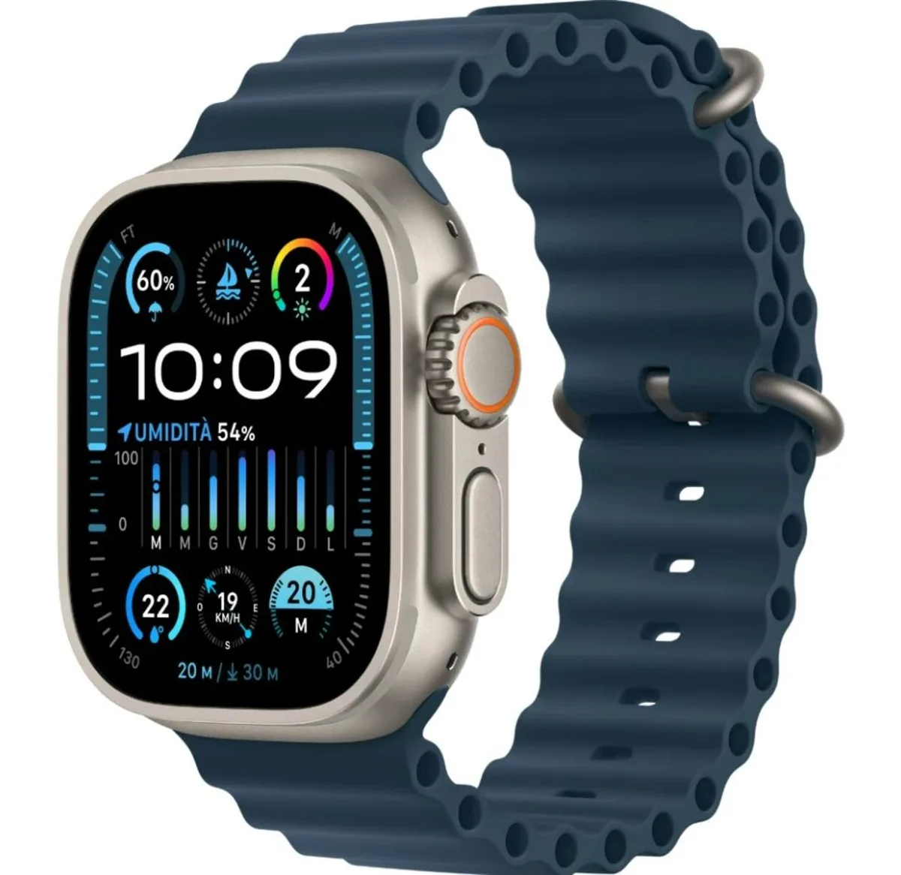
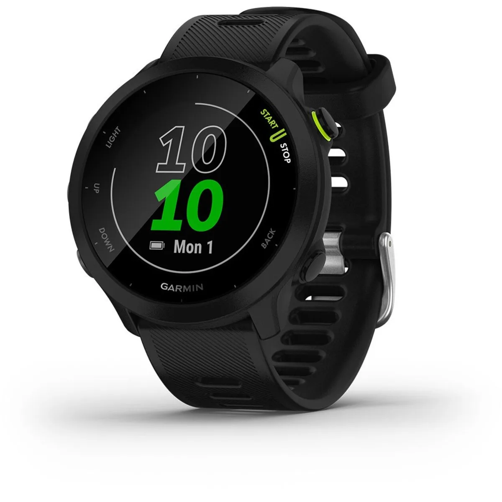

Het ultieme sportmaatje om je pols: een smartwatch. Maar welke is de kampioen onder de digitale coaches? We selecteren de beste opties van dit moment.

> [!NOTE]
> Deze recensie verscheen eerder op [AD](https://www.ad.nl/tech/deze-smartwatch-is-een-goed-alternatief-voor-de-sporter-met-een-klein-budget~a021d1d2/).

Onderstaande smartwatches zijn geselecteerd door de redactie van _Tweakers_, die het hele jaar door honderden apparaten test om de beste te selecteren. De volledige test vind je op [deze pagina](https://tweakers.net/best-buy-guide/smartwatches/beste-smartwatch-voor-sport).

## Beste boven de 600 euro: Garmin epix Pro Gen2

Garmin epix Pro Gen2. © Garmin

Speelt geld geen rol, dan is de **Garmin epix Pro Gen2** de beste optie van dit moment. Het horloge is in meerdere versies verkrijgbaar, maar alleen de duurdere Sapphire Edition heeft een titanium behuizing en een extra krasbestendig schermpje.

Op sportgebied vind je in dit horloge alles wat Garmin maar te bieden heeft, met als grote nieuwe functies een extra nauwkeurige hartslagmeter, speciale profielen voor bepaalde sporten en een ingebouwde zaklamp - handig als je ’s avonds laat op pad gaat. Uit onze tests blijkt bovendien dat de locatiebepaling van dit horloge preciezer is dan bij concurrenten, waardoor bijvoorbeeld je hardlooprondje nauwkeuriger wordt vastgelegd.

Handig zijn de extra knoppen aan de zijkant, waardoor je het horloge zo nodig ook zonder het aanraakscherm kunt bedienen - wat in combinatie met zweterige vingers bij het sporten vaak van pas komt. Dat scherm is trouwens helder en kleurrijk, waardoor je het overdag prima kunt lezen. De accuduur is ook in orde: op een volle lading konden we het horloge bijna negen dagen lang gebruiken.

## Het Apple-alternatief: Apple Watch Ultra 2

Apple Watch Ultra 2. © Apple

Heb je een iPhone, dan is ook de Apple Watch een prima keuze. Dat komt deels door beperkingen van Apple zelf: alleen de horloges van de techreus zelf kunnen bijvoorbeeld op berichten reageren.

Voor sporters is dan de duurdere **Apple Watch Ultra 2** de beste optie. Dit horloge heeft een stevigere behuizing en een minder kwetsbaar scherm, dat ook nog eens helderder is dan op de reguliere Apple Watch. Ook is de accuduur bij de Ultra 2 een stuk langer.

Aan de zijkant van de Apple Watch Ultra 2 zit een extra oranje actieknop, die je kunt koppelen aan functies van het horloge. Zo open je bijvoorbeeld snel de Workout-app.

## Beste koopje: Garmin Forerunner 55

Garmin Forerunner 55. © Garmin

De **Garmin Forerunner 55** is het aangewezen horloge voor de prijsvechter: hij is met een prijs van zo’n 160 euro maar liefst vijf keer goedkoper dan bovengenoemde opties van Garmin en Apple.

Het betekent ook dat je hier minder geavanceerde onderdelen vindt: het scherm is bijvoorbeeld veel minder fraai en je kunt niet mobiel betalen via Garmin Pay. Toch krijg je hier best veel horloge voor je geld, wat je terugziet in de uitgebreide sportfuncties en de accuduur van maar liefst een week.

## _Verantwoording_

_In deze rubriek schrijven we over technologische apparaten die door Tweakers zijn beoordeeld. Bij Tweakers wordt ieder apparaat onderzocht door het testlab, waar onder andere accuduur, snelheid en andere belangrijke aspecten worden getoetst._

_De redactie van Tweakers is volledig onafhankelijk. Bedrijven betalen op geen enkele manier om in deze artikelen behandeld te worden._
