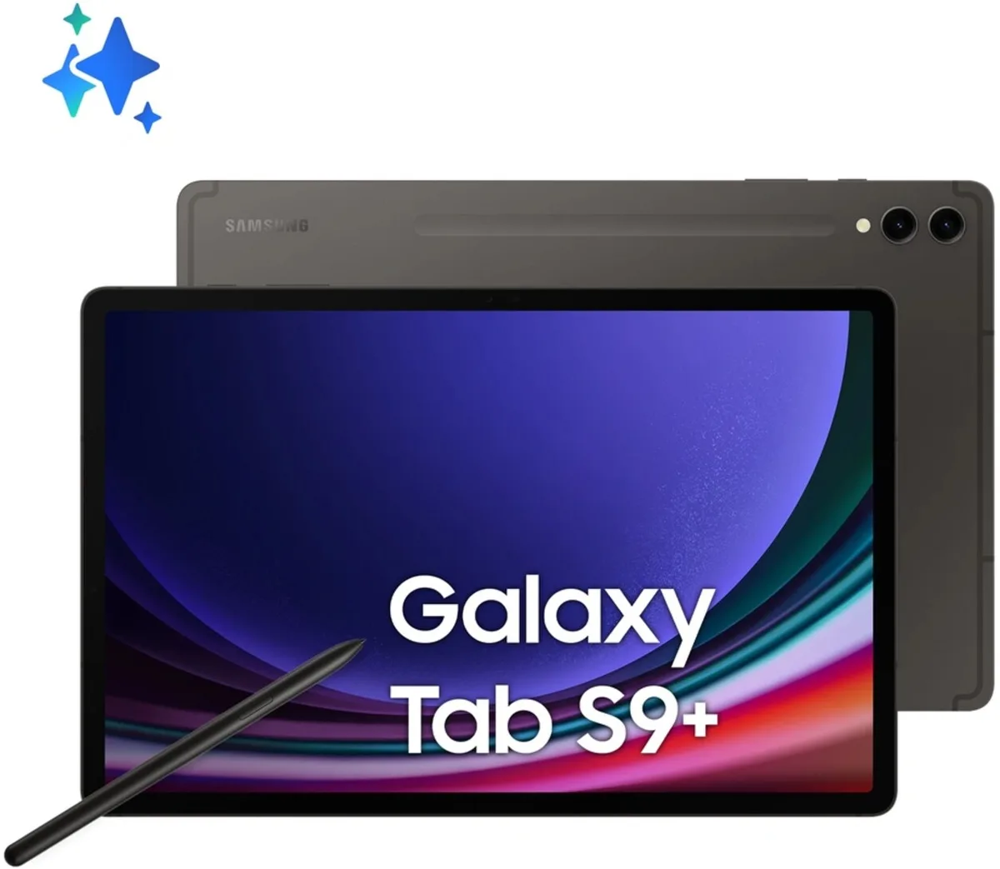
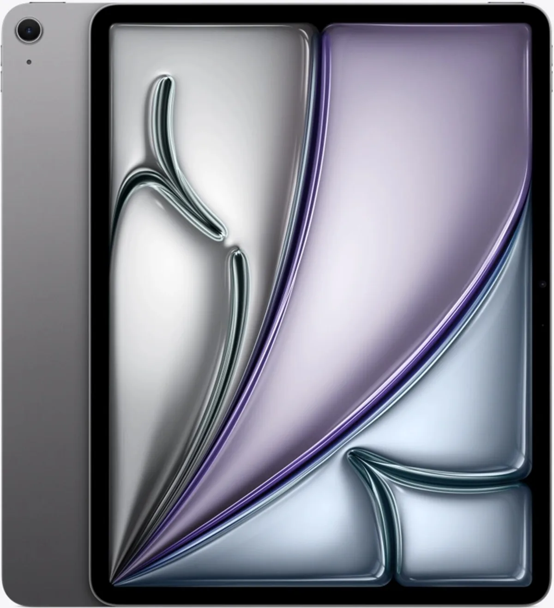
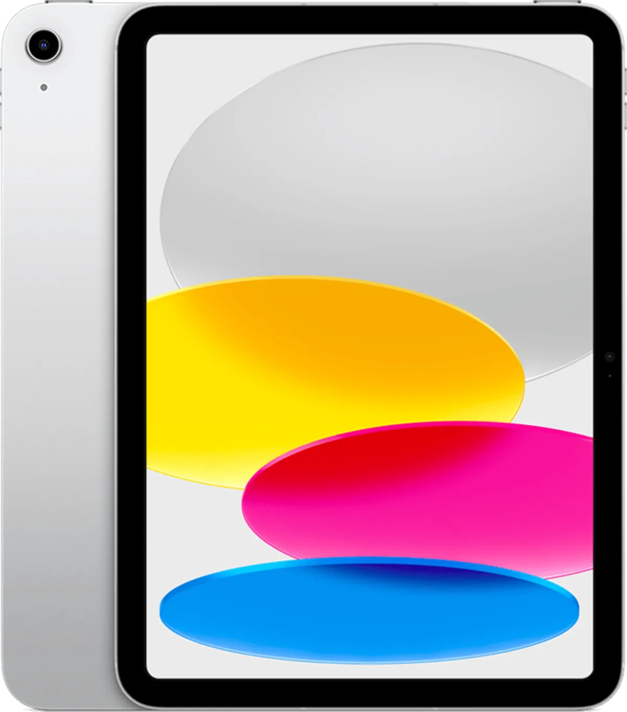
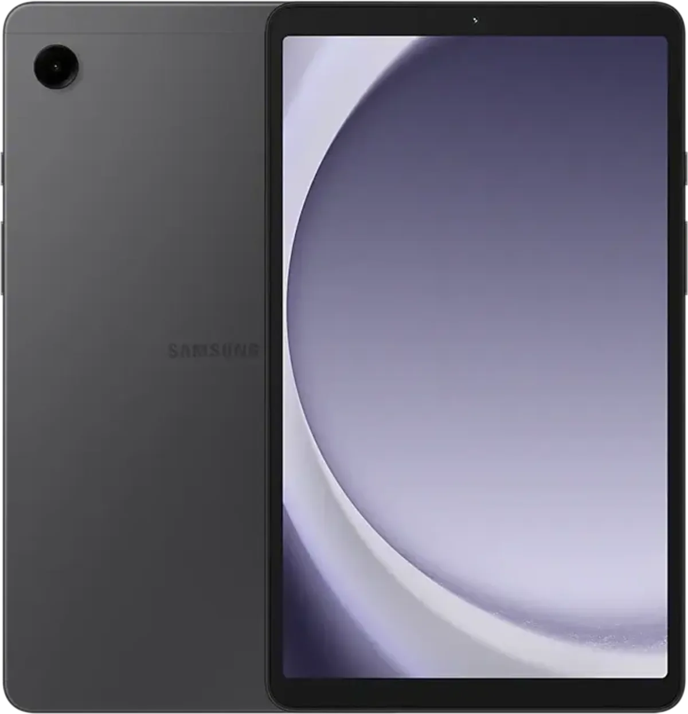

Tijdens de lange vakantieritten door Europa is een goede tablet een must om de achterbank een beetje gezellig te houden. Maar wat zijn de beste modellen die je op dit moment kunt halen? We zetten ze op een rij.

> [!NOTE]
> Deze recensie verscheen eerder op [AD](https://www.ad.nl/tech/dit-is-de-beste-kindertablet-voor-op-de-achterbank-slechts-125-euro~aafe1650/).

Onderstaande tablets zijn geselecteerd door de redactie van Tweakers, die het hele jaar door honderden apparaten test om de beste te selecteren. [De volledige test vind je op deze pagina](https://tweakers.net/best-buy-guide/tablets/).

## De beste: Samsung Galaxy Tab S9+

Tab S9+. © Tweakers

De **Galaxy Tab S9+** is volgens de testers van Tweakers **een van de beste Android-tablets van dit moment**. Het is een handzaam apparaat met een dunne behuizing die meteen ook waterdicht is. Het scherm van 12,9 inch groot is dankzij een hoog contrast, goede kleurweergave en uitstekende kijkhoeken een lust voor het oog.

Standaard meegeleverd is een pennetje waarmee je op het scherm kunt tekenen of schrijven. De processor in de Tab S9+ is buitengewoon krachtig voor een tablet, hoewel hij zich niet kan meten met recente iPads. Daar staat een best redelijke prijs tegenover: voor minder dan 1.000 euro heb je een tablet met maar liefst 512 gigabyte aan opslagruimte.

## Apple-alternatief: iPad Air (2024)

iPad Air. © Tweakers

Apples meest recente **iPad Air is voorzien van een erg snelle M2-processor**, die het bedrijf eerder in zijn laptops gebruikte. Het beeldscherm heeft een mooie kleurweergave en kan goed helder worden, maar heeft niet zo’n hoog contrast als bij een duurder oled-beeldscherm.

Voor het geld van bovenstaand Android-alternatief krijg je een tablet met slechts 128 gigabyte aan opslagruimte en geen extra accessoires - wil je een pen, dan moet je die er los bij kopen. Wel is de accuduur van deze iPad flink verbeterd, waardoor hij veel langer meegaat dan concurrerende apparaten.

## Beste koop: iPad (2022)

iPad 2022. © Tweakers

Wil je niet tegen de duizend euro uitgeven aan een tablet, dan is de **iPad uit 2022** de beste optie. Deze is al wat op leeftijd, maar biedt ondanks dat betere prestaties dan concurrenten in zijn prijssegment van 400 euro. Het scherm is prima helder en toont mooie kleuren, maar heeft iets minder goede kijkhoeken dan bij duurdere tablets.

Alles aan deze oudere iPad is wat minder premium. Dat zie je zelfs terug in de accessoires die Apple er los bij verkoopt: de optionele stylus en toetsenbordhoes zijn net wat minder veelzijdig en luxe als bij de duurdere iPad Air. De accu blinkt met zijn tien uur gebruikstijd ook niet meer uit, omdat concurrenten datzelfde aantal ook aantikken.

## Beste kindertablet: Samsung Galaxy Tab A9

Galaxy Tab A9. © Tweakers

De 125 euro kostende **Galaxy Tab A9** is dankzij zijn kindermodus **erg geschikt voor de jongste gebruikers**. Voor zijn lage prijs krijg je een apparaat dat relatief snel is en een goed scherm heeft.

## Verantwoording

_In deze rubriek schrijven we over technologische apparaten die door Tweakers zijn beoordeeld. Bij Tweakers wordt ieder apparaat onderzocht door het testlab, waar onder andere accuduur, snelheid en andere belangrijke aspecten worden getoetst._

_De redactie van Tweakers is volledig onafhankelijk. Bedrijven betalen op geen enkele manier om in deze artikelen behandeld te worden._
