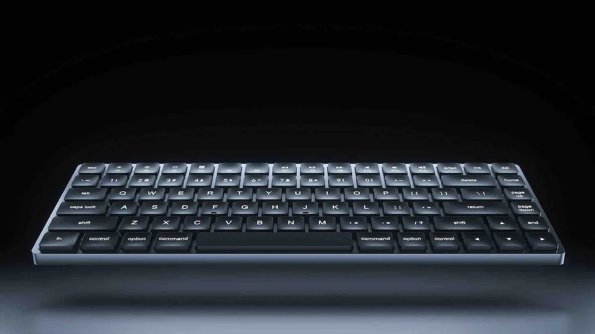
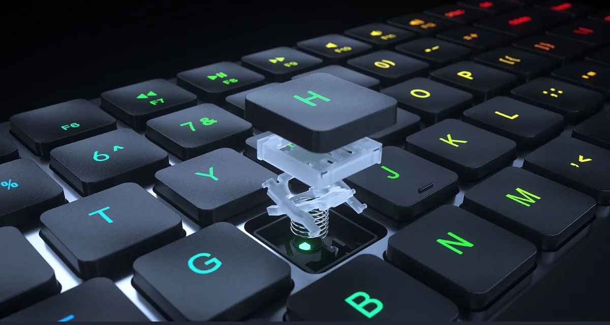

Dit nieuwe toetsenbord lijkt verdraaid veel op dat van Apple, maar streeft de techreus op veel fronten voorbij. Accessoiremaker Vissles heeft een flinterdun, Appleachtig toetsenbord met razendsnelle optische knoppen gemaakt.

> [!NOTE]
> Deze recensie verscheen eerder op [AD](https://www.ad.nl/tech/dit-toetsenbord-lijkt-op-dat-van-apple-maar-is-eigenlijk-veel-beter~aefa605d/).

Wie een nieuw toetsenbord wil kopen, moet vaak een keuze maken: wil je een dun, strak vormgegeven apparaat, of liever snelle, goed voelende knoppen? Wie dat laatste kiest heeft namelijk mechanische of optische knoppen nodig, waarbij iedere klik goed te voelen is en signalen met veel precisie worden doorgegeven. Maar de meeste van deze toetsenborden zijn groot en log, zoals de keyboards die in de jaren 90 ook veel werden gebruikt.

De Vissles LP85 probeert een pad tussen deze twee te bewandelen. Hij oogt precies als Apples Magic Keyboard, met een aluminium frame, platte knoppen en een klein beetje ruimte tussen iedere toets. De iconen op de bovenste knoppenrij lijkt identiek aan die van Apple, en je kunt zelfs een editie kopen waarbij de knoppen voor _control_, _option_ en _command_ op de onderste rij zitten.

LP85. © Vissles

## Precieze knoppen die niet snel stukgaan

Wat de LP85 bijzonder maakt is het gebruik van optische knoppen in een best dunne behuizing. Daarbij zit in iedere toets een klein lichtje, waarvan je het signaal blokkeert zodra je een knop indrukt. Hierdoor weet het toetsenbord met de snelheid van het licht wanneer je een knop indrukt.

Veel geavanceerde toetsenborden gebruiken op het moment zo’n optisch systeem. Omdat iedere knop een eigen signaal doorgeeft, is er geen kans dat je per ongeluk de knop ernaast intikt als je te hard induwt. Het wordt ook gezien als de opvolger van mechanische toetsenborden, omdat een lichtje minder snel kapotgaat dan fysieke onderdelen die tegen elkaar komen.

## Optisch, maar toch heel dun

Zulke optische en mechanische toetsenborden zijn normaal gesproken vrij groot en log, maar Vissles is er in geslaagd de gebruikte technologie in een dun ontwerp te stoppen. De LP85 is alsnog dikker dan Apples dunne toetsenborden, maar het is een verschil van slechts 3 millimeter. Dat valt alleen op als je beide naast elkaar legt.

Je voelt het verschil in gebruik. Gebruik je een dun toetsenbord van Apple of Logitech, dan is iedere knopindruk wat dof, alsof je met je vingers op een hard oppervlak tikt. Bij de LP85 voelt de landing van iedere toets fijner - al is hij tegelijkertijd ook een stuk luider. Je hoort een duidelijk geklik tijdens het tikken. Daar wen je snel aan, maar het maakt de LP85 niet het fijnste toetsenbord voor op een druk kantoor.

De optische knoppen op de LP85 zijn vrij dun. © Vissles

## Aansluiten op meerdere apparaten

Vissles biedt ook een paar leuke extra’s, zoals de mogelijkheid om het toetsenbord aan drie apparaten tegelijk te hangen. Je houdt dan de functieknop linksonder ingedrukt en tikt op q, w of e om draadloos tussen de computers te wisselen. Een handigheidje dat toetsenbordmakers zoals Keychron en Logitech ook al langer bieden, wat werken met meerdere apparaten tegelijkertijd veel makkelijker maakt.

Wel zitten de knoppen voor dat wisselen op een wat onhandige plek. Het gebeurde bij onze tests best vaak dat we op bijvoorbeeld control-1 wilden drukken en per ongeluk de functieknop en ‘q’ raakten, waardoor het keyboard ineens zijn verbinding verloor. Dat gebeurt minder naarmate je de positie van de knoppen beter in de vingers krijgt, maar andere toetsenborden hebben een minder frustrerende positie voor de wisseltoetsen.

## Disco

Achterop het toetsenbord zit een usb-c-poort om hem mee op te laden, maar hiermee kun je hem ook bekabeld op de computer aansluiten. Handig als je even wil opladen zonder te stoppen met werken, of een snellere responstijd wil bij het gamen.

Ook kun je de lampjes achter iedere knop van kleur laten veranderen. Het maakt de LP85 een wat spannender toetsenbord, al zit wellicht niet iedereen te wachten op een regenboog op het bureau.

## Conclusie

Je hebt niet langer een log apparaat met een jaren 90-ontwerp nodig om een geavanceerd, hoogwaardig toetsenbord op je bureau te hebben. De Vissles LP85 oogt alsof hij door Apple is gemaakt, maar biedt wat ons betreft een veel fijnere type-ervaring. Dat je hem met drie apparaten tegelijk kunt verbinden, maakt het daarmee een uitstekend toetsenbord.

Vissles verkoopt het toetsenbord op zijn website, al moeten geïnteresseerden wellicht wat geduld hebben: de eerste exemplaren worden pas eind maart verzonden, omdat het bedrijf eerst nog druk bezig is om iedereen die geld doneerde op crowdfundsite Kickstarter een model te sturen.
