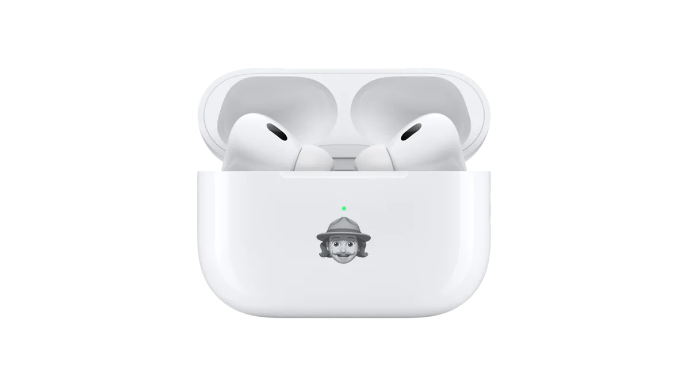
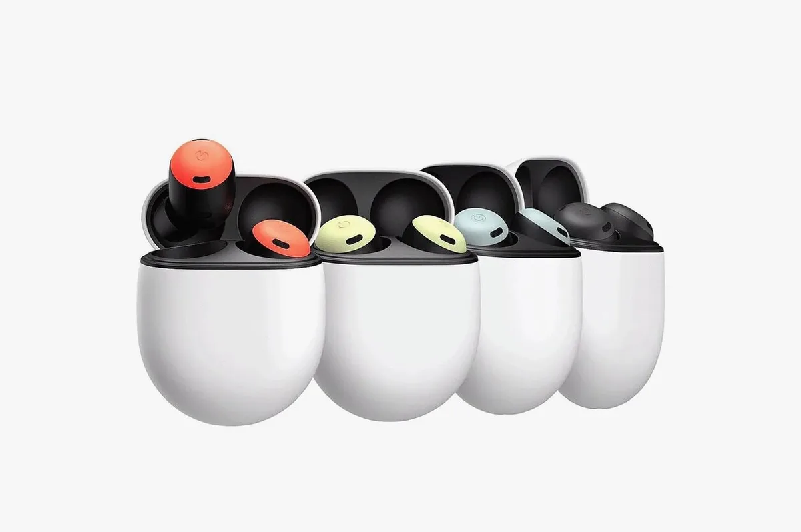
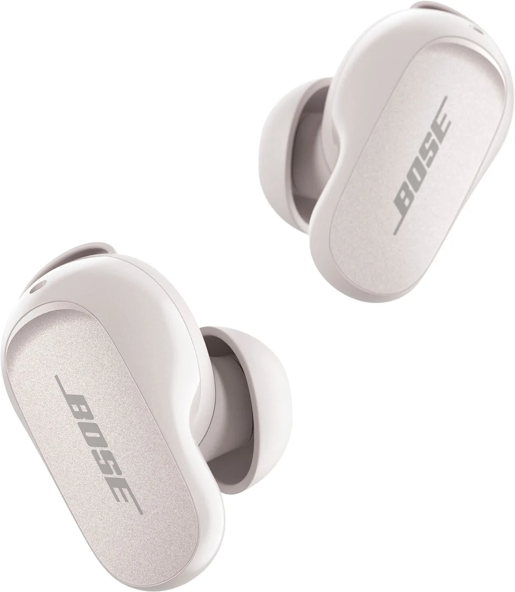
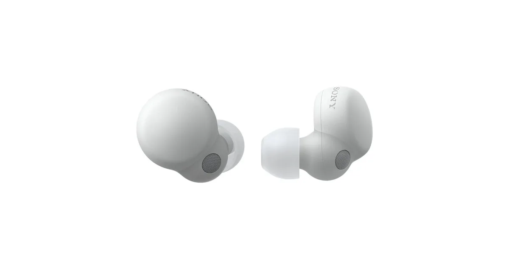
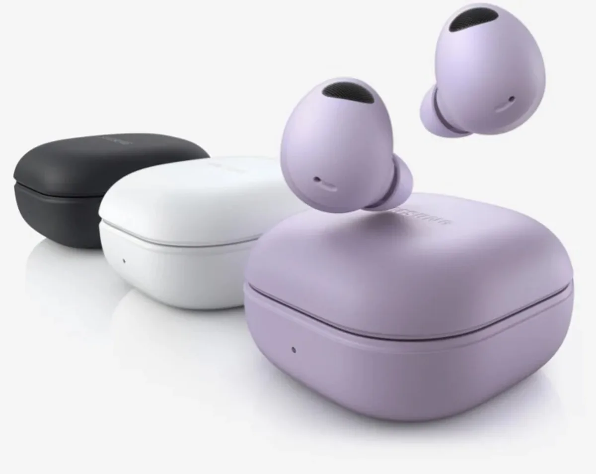
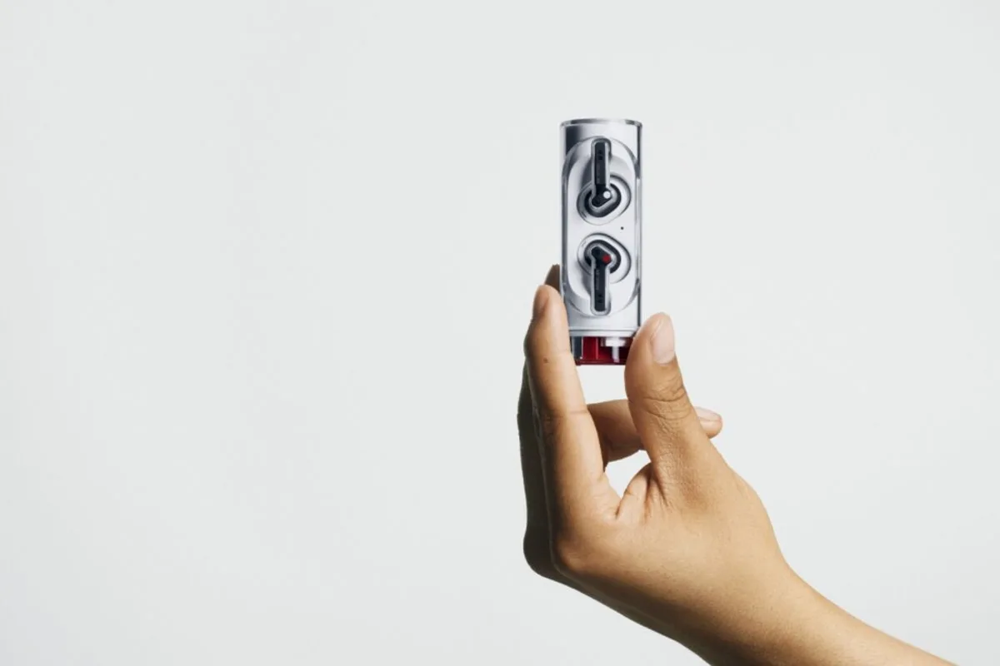

De ene na de andere techreus brengt nieuwe slimme oordopjes op de markt. Dat is geen toeval: met de feestdagen en Black Friday voor de deur vermoeden de bedrijven dat ze massaal als cadeautjes gekocht worden. Om je keuze makkelijker te maken vergelijken we de laatste modellen.

> [!NOTE]
> Deze recensie verscheen eerder op [AD](https://www.ad.nl/tech/dit-vinden-we-van-de-nieuwste-draadloze-oordoppen~a605e354/).

## Onze favoriet: AirPods Pro 2

Apple is met zijn AirPods grotendeels verantwoordelijk voor de populariteit van draadloze oordopjes. Hoewel concurrenten steeds betere alternatieven maken, staan de nieuwe AirPods Pro nog steeds bovenaan onze lijst. De algehele geluidskwaliteit is sinds de vorige Pro’s van Apple beter geworden, wat je vooral merkt aan de beter klinkende bas.

Ook de ruisonderdrukking is er op vooruitgegaan, waardoor deze kleine dopjes zelfs in een vliegtuig prima hun werk doen. Daarnaast kun je nu over een klein paneeltje vegen om je volume aan te passen. Eén klein detail: heb je geen iPhone, dan zullen niet alle functies van de AirPods Pro goed werken.

De nieuwe AirPods Pro (2022). © Apple

## Het beste op de fiets: Google Pixel Buds Pro

Googles Pixel Buds Pro kwamen afgelopen zomer al uit, maar zijn pas sinds oktober in Nederland te koop. Het zijn prima oordopjes die net wat anders in elkaar steken: op de Pixel Buds vind je geen uitstekend antennes, waardoor ze verborgen in je oor zitten. Je draait ze in feite in je oor, zodat ze ‘op slot’ gaan en niet zomaar uitvallen.

Dat draaiontwerp brengt een groot voordeel met zich mee: het is haast onmogelijk voor wind om je oor in te waaien. Andere in-ears sluiten ook je oren af, maar laten af en toe nog wat binnen door de flinke luchtdruk. Het betekent dat deze dopjes uitstekend zijn op de fiets, omdat je muziek amper door waaigeluiden wordt overstemd. De ruisonderdrukking zorgt daarnaast dat tijdens je tijdens het bellen prima te verstaan bent, zelfs als je tegen de wind in fietst.

Pixel Buds Pro © Google

## Uitstekende ruisonderdrukking: Bose QuietComfort EarBuds II

Bose is al jaren marktleider op het gebied van ruisonderdrukkende koptelefoons, maar heeft een inhaalslag moeten maken qua oordopjes toen Apple met zijn AirPods kwam. Als we de QuietComfort EarBuds II bekijken, is dat aardig gelukt. Dit zijn dopjes die niet gemaakt zijn om hip te ogen - alleen al het oplaaddoosje is fors groter dan de concurrentie - maar die wel uitstekend presteren.

Vooral de ruisonderdrukking is indrukwekkend: die zit grotendeels op het niveau van de AirPods en Pixel Buds Pro, soms er misschien zelfs een beetje boven. Je hoort je omgeving amper. Dat komt ook deels door het tweedelige ontwerp, waarbij je meerdere onderdelen kunt vervangen zodat ze nauwer in je oren passen. Dat is anders dan bij concurrenten, waarbij je alleen de oortips kunt vervangen voor grotere of kleinere alternatieven.

QuietComfort EarBuds II © Bose

## Een prima prijsvechter: Sony LinkBuds S

Na jaren aan moeilijke, technische namen, zoals de ‘WF-1000XM4', heeft Sony nu eindelijk een paar oordopjes met een logische titel: de Sony LinkBuds S. Die lijken in grote lijnen op hun voorganger, maar zijn vooral een slagje kleiner geworden. Daarnaast heeft Sony een uitgebreide app waarin je het geluid tot in detail kunt aanpassen.

Het grootste voordeel zit wellicht in de prijs. De LinkBuds zijn ruisonderdrukkend, maar zijn met 150 euro een stuk betaalbaarder dan de andere opties in dit stuk, die vaak rond de 250 kosten. En voor dat geld heb je nog steeds prima klinkende doppen die best wat ruis wegnemen - al vonden we de onderdrukking van bovenstaande opties iets imposanter.

LinkBuds S © Sony

## Fijn met een Samsung-telefoon: Galaxy Buds Pro 2

De Galaxy Buds Pro 2 van Samsung werken met elke smartphone, maar sommige functies zijn beperkt tot Samsung-telefoons. Zo kun je alleen daarop geluid met een hogere resolutie luisteren, of automatisch het geluid naar een ander apparaat zetten als je bijvoorbeeld je telefoon weglegt en je tablet pakt.

Verder zijn dit over het algemeen prima doppen. Ze klinken goed en hebben veel betere ruisonderdrukking dan bij de Galaxy Buds Pro 1. Soms kun je ze tussen de 150 en 200 euro kopen, wat een prima deal is.

Galaxy Buds Pro 2 © Samsung

## Niet in-ear, wel hip: Nothing Ear (stick)

De oprichter van telefoonbedrijf OnePlus heeft een nieuwe startup, waarmee hij eerder al een telefoon en een ander paar oordopjes maakte. Nu heeft gadgetfabrikant Nothing weer wat nieuws: de ‘Ear (stick)’. Dat zijn wat goedkopere draadloze oordopjes zonder ruisonderdrukking, maar wel met een gek doosje.

Waar de meeste draadloze doppen in een soort flosdoosje zitten, vind je deze juist in een cylinder. Je draait aan de bovenkant, waarna de dopjes in het midden tevoorschijn springen. Het is daarmee een soort fidgetspinner: het is erg verleidelijk om met het doosje te blijven pielen, ook als je ze niet gebruikt. Al kun je je afvragen of dat ontwerp ook handig is, want zo’n rond doosje valt wel sneller om. Bovendien zit er onder ons draaisysteem al wat viezigheid die niet weg te krijgen is.

Verder zijn dit doppen die prima klinken. Het zijn geen in-ears, dus van ruisonderdrukking is geen sprake. Maar voor 119 euro haal je flink wat in huis.

Ear Stick © Nothing
