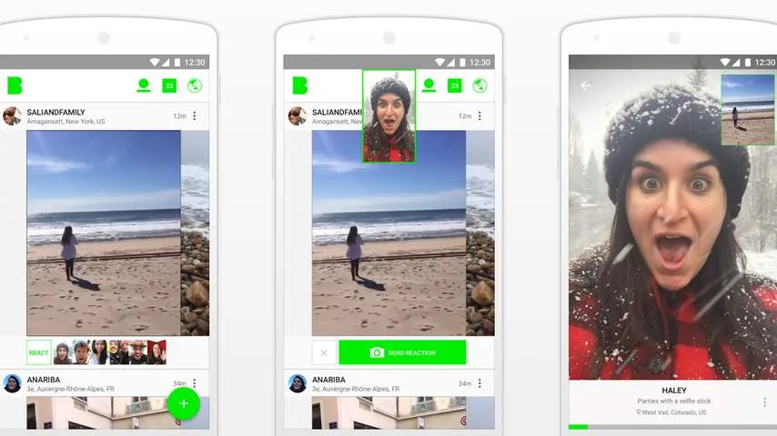
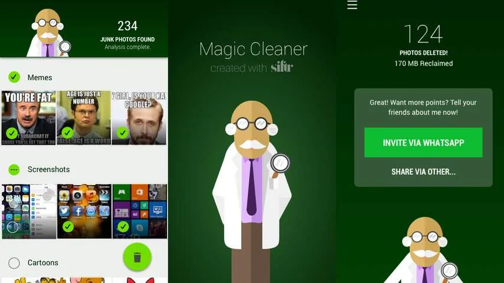
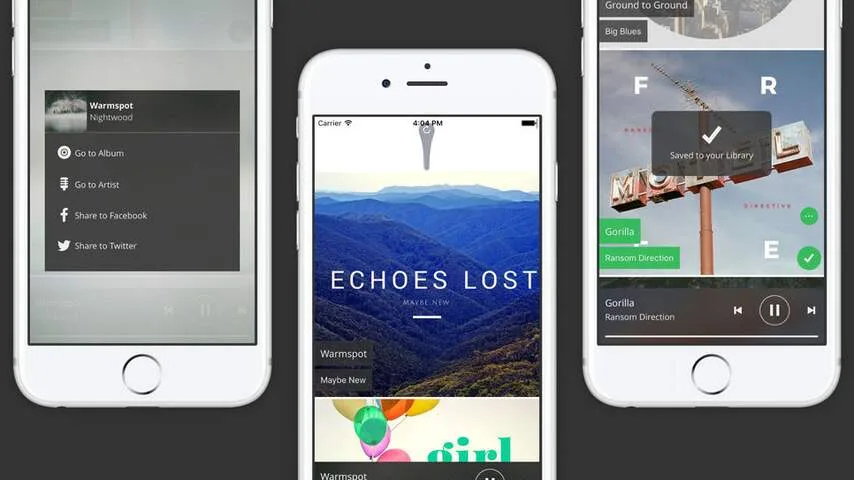
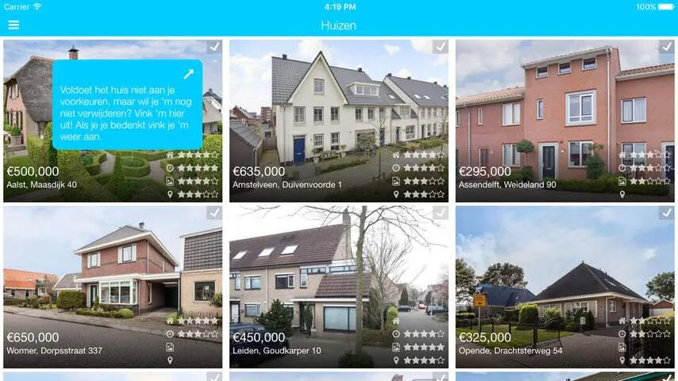

**Deze week een sociaal videonetwerk dat er eindelijk ook voor Android is, een snelle manier om WhatsApp-foto's op te ruimen, een app voor de huizenjacht en een manier om je muzieklijst persoonlijker te maken.**

> [!NOTE]
> Deze recensie verscheen eerder op [NU.nl](https://www.nu.nl/apps/4258464/dit-zijn-de-beste-android-en-ios-apps-van-de-week.html).

## Beme

In juli 2015 stond de sociale video-app Beme al eens in ons app-overzicht. Het sociale netwerk werd toen geïntroduceerd door geroemd vlogger Casey Neistat, die een bètaversie alleen voor de iPhone uitbracht. Beme laat gebruikers hun omgevingen filmen, maar dat kon alleen door de telefoon tegen de borst te drukken. Dit dwingt gebruikers om met hun eigen ogen rond te kijken terwijl ze een video maken.

Inmiddels zijn we bijna een jaar verder en verlaat Beme officieel de testfase. Daarbij wordt meteen ook een app voor Android geïntroduceerd, zodat meer mensen met Beme aan de slag kunnen gaan.

_Beme — Beeld: Beme_

Volgens de makers is Beme inmiddels een stuk stabieler en leuker om te gebruiken, maar we zouden niet meteen te enthousiast worden: vooral Android-gebruikers blijken nog tegen de nodige bugs aan te lopen. Hopelijk worden deze mankementen snel opgelost.

_Download Beme voor [Android](https://play.google.com/store/apps/details?id=com.beme.android) en [iOS](https://itunes.apple.com/us/app/beme-share-video.-honestly./id1005178547?mt=8) (gratis)_

## WhatsApp Magic Cleaner

Deze nieuwe Android-app belooft het makkelijker te maken om ongewilde plaatjes uit je WhatsApp-archieven te verwijderen. Door de app op te starten, wordt er gezocht naar alle 'troepplaatjes' die in WhatsApp-chats zijn ontvangen. Deze platen worden vervolgens verwijderd, zodat alleen gewone foto's nog overblijven.

_WhatsApp Magic Cleaner — Beeld: WhatsApp Magic Cleaner_

Volgens de ontwikkelaar worden bijvoorbeeld strips, geinige internetplaatjes en screenshots als troep gemarkeerd. In theorie moeten alleen de foto's die jij en je vrienden zelf hebben gemaakt nog overblijven. De app zou deep learning en een neuraal netwerk gebruiken om dit soort afbeeldingen te identificeren, zodat de juiste plaatjes zo foutloos mogelijk worden gemarkeerd.

_Download WhatsApp Magic Cleaner voor [Android](https://play.google.com/store/apps/details?id=com.siftr.whatsappcleaner&ref=producthunt) (gratis)_

## Discover on Demand (iOS)

Muziekdienst Spotify biedt zijn gebruikers iedere week een nieuwe afspeellijst, met muziek gebaseerd op zijn of haar interesses. De nieuwe iPhone-app Discover on Demand belooft hetzelfde, maar wil daar graag een stapje verder in gaan. Deze app analyseert constant beluisterde muziek op Spotify, om een potentieel eindeloze afspeellijst aan mogelijk interessante muziek aan te bieden.

_Discover on Demand — Beeld: Discover on Demand_

Discover on Demand is gratis te downloaden, maar let op: een Spotify Premium-account is wel vereist om deze app te gebruiken. Aan een Spotify Premium-account zijn maandelijkse kosten verbonden.

_Download Discover on Demand voor [iOS](https://itunes.apple.com/us/app/discover-on-demand/id1097518404?ls=1&mt=8) (gratis)_

## Huisvink

Op zoek naar een nieuw huis? De nieuwe, Nederlandse iOS-app Huisvink kan daar een handje bij helpen. In deze app kun je huizen op Funda of Jaap importeren, zodat je een bericht ontvangt zodra er wijzigingen worden gemaakt. Daarnaast is het maken van notities bij huizen vrij makkelijk gemaakt.

Huisvink is geen concurrent voor bestaande huizensites, maar eerder een hulpmiddel. Door huizen in de app op te slaan, ontstaat er een overzicht van huizen op zowel Jaap als Funda. Het notitiesysteem laat de gebruiker aangeven of een huis nou wel of niet de moeite waard is.

_Huisvink — Beeld: Huisvink_

In hoeverre dat de moeite waard is voor gebruikers, moet nog blijken. Het is immers in bijvoorbeeld de Funda-app ook mogelijk om een huis te bewaren - al is dat zonder notitiefunctie. Huisvink moet het vooral hebben van zijn wat gespecialiseerde functies - zoals bijvoorbeeld de mogelijkheid om reistijd naar een huis te berekenen.

_Download Huisvink voor [iOS](https://itunes.apple.com/nl/app/huisvink/id941594753?ls=1&mt=8) (gratis)_
