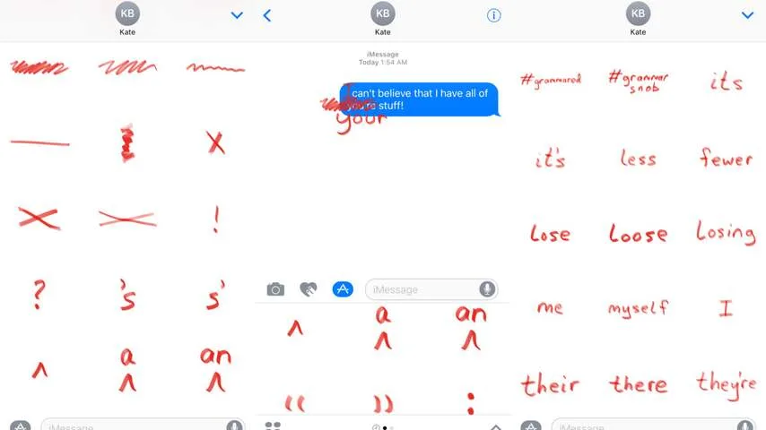
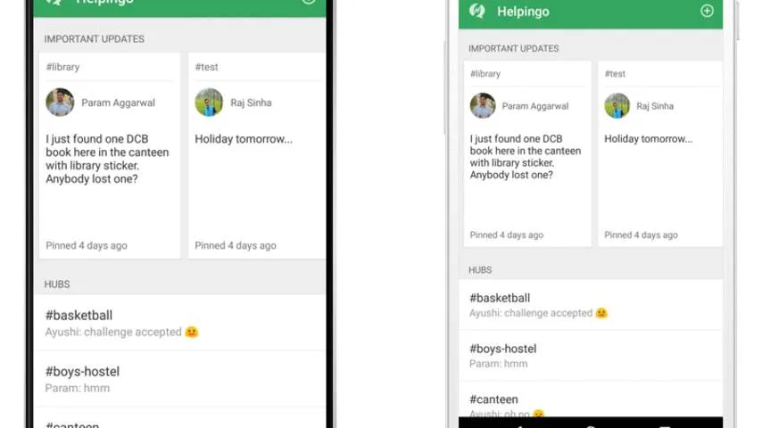
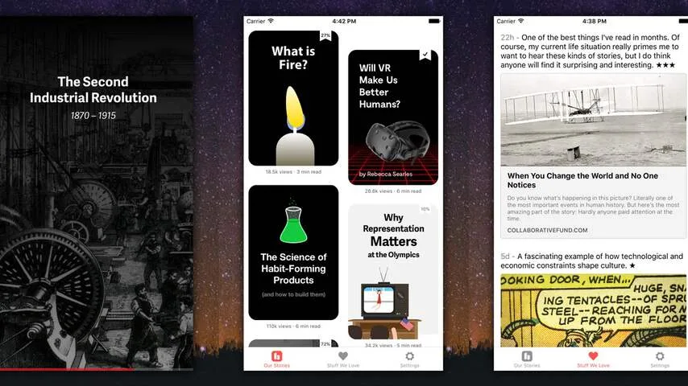

**Corrigeer verkeerd gespelde berichten van je vrienden, chat met schoolgenoten en lees mooie verhalen met de beste Android- en iOS-aps van deze week.**

> [!NOTE]
> Deze recensie verscheen eerder op [NU.nl](https://www.nu.nl/apps/4323327/dit-zijn-de-beste-android-en-ios-apps-van-de-week.html).

## Grammar Snob

iMessage heeft met iOS 10 een flinke update gekregen, waardoor het mogelijk is om ook stickers naar vrienden te sturen. De nieuwe iPhone-app Grammar Nazi weet hier slim gebruik van te maken.

Grammar Nazi voegt een verzameling aan rode potloodstrepen toe aan de stickerlist. Houd een sticker ingedrukt en je kunt hem bovenop het bericht van een ander slepen. Op deze manier kun je verkeerd gespelde zinnen doorstrepen.

_Grammar Snob — Beeld: Grammar Snob_

De stickers komen pas echt tot hun recht bij Engelstalige correcties. Zo kun je over het woordje ‘your’ een rode ‘you’re’ plakken, om verkeerd woordgebruik aan te pakken. Nederlandse woorden zijn helaas niet in de app te vinden.

Toch zijn er genoeg stickers om Nederlandse zinnen mee aan te passen. Je kunt doorstrepen, punctuatie toevoegen of zelfs woorden met extra kracht wegkrassen. Leuk voor de taalsnobs, al zal niet iedereen wellicht de correcties waarderen.

_[Download Grammar Snob voor iOS](https://itunes.apple.com/us/app/grammar-snob/id1153479737?mt=8) (€0,99)_

## Helpingo

De nieuwe chatdienst Helpingo wil één plek bieden om met mede-studenten te chatten. Daarvoor maakt de Android-app gebruik van kanalen. Je maakt een groep over een bepaald onderwerp, waar anderen vervolgens in kunnen meepraten.

Zo is het mogelijk om een chatkanaal over bepaalde vakken te maken, of voor een studentenhuis. Een gebruiker kan hierdoor alleen chatberichten ontvangen die op zijn of haar studentenleven slaan.

_Helpingo — Beeld: Helpingo_

Wie zakelijke chatapp Slack heeft gebruikt, zal Helpingo wellicht bekend voorkomen. Ook deze dienst biedt de mogelijkheid om kanalen gericht op onderwerpen te maken. Waar Slack de zakelijke markt bedient, beperkt Helpingo zich slechts tot studenten.

Heel veel studentspecifieke functies zijn er op dit moment nog niet in de app. Het is wel mogelijk om artikelen over bijvoorbeeld stages in de app te lezen.

[_Download Helpingo voor Android_](https://play.google.com/store/apps/details?id=com.helpingo.android&ref=producthunt) (gratis)

## Hardbound

Ontwerpers denken geregeld na over hoe verhalen op smartphones verteld kunnen worden - en Hardbound geeft hier een goed voorbeeld van.

De app gebruikt beelden en simpele animaties om informatieve prentenboeken in beeld te brengen. Zo wordt in beeld gebracht hoe vuur werkt of wat virtual reality kan betekenen, zonder dat er grote brokken tekst worden gebruikt.

_Hardbound — Beeld: Hardbound_

In feite is Hardbound een interactief prentenboek, maar dan met onderwerpen voor volwassen gebruikers. Daarmee demonstreert de maker nieuwe manieren om lastige onderwerpen op een smartphone uit te leggen.

Hardbound is gratis, maar laat gebruikers slechts vier recente verhalen lezen. Wie de overige onderwerpen wil bekijken moet een abonnement nemen. Wat je betaalt, bepaal je zelf: je kunt kiezen uit 2, 10 of 20 euro per maand.

[_Download Hardbound voor iOS_](https://itunes.apple.com/us/app/hardbound-stories-for-curious/id1037112353?mt=8&ref=producthunt) (gratis)
