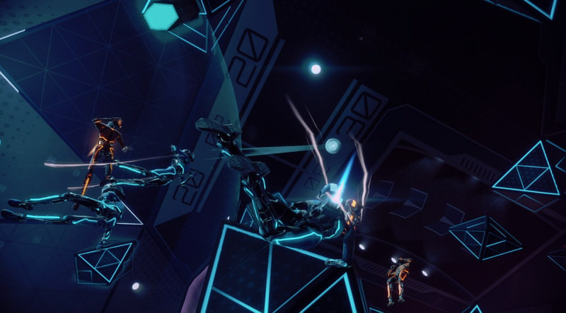
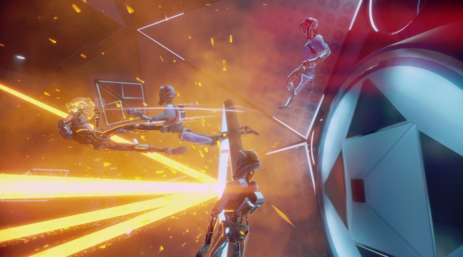

Het nieuwe Echo Arena en Rocket League hebben het nodige met elkaar gemeen. Beide proberen een nieuwe sport uit te vinden en de games waren allebei initieel gratis. Eén groot verschil: Echo Arena is alleen te spelen met de VR-bril Oculus Rift en bijbehorende Touch-controllers.

> [!NOTE]
>
> Deze review verscheen eerder op [Insidegamer](https://inside.gamer.nl/129042-review-echo-arena-wil-de-rocket-league-van-vr-zijn/?ref=gamepraat.nl).

Echo Arena is de multiplayeroptie van Lone Echo, een nieuwe game voor virtual reality. De modus wordt ook als zelfstandig spel tijdelijk gratis aangeboden.

Wie ooit Ender’s Game heeft gelezen of gezien, kent eigenlijk al het basisprincipe achter Echo Arena. In de game zweef je door een kamer zonder zwaartekrecht, waarin je een discus moet bemachtigen om in een doel te werpen.

Je gebruikt daarvoor op ingenieuze wijze je ‘echte’ handen, die door de VR-gamepads naar het spel worden overgezet. Aan het begin van een potje grijp je vast aan een katapult om jezelf te lanceren, waarna je kunt afzetten tegen muren en blokken om verder te bewegen. Met stuwraketten en een boostmotor op je handen kun je nog sneller heen en weer vliegen.

Je gebruikt je handen om voort te bewegen, maar ook om bijvoorbeeld tegenstanders vast te grijpen en in hun gezicht te slaan. Op die manier schakel je ze een paar seconden uit, wat je teamgenoten extra gelegenheid geeft om te scoren. En je werpt uiteraard met je eigen armen de discus, waardoor je net als bij een gewone sport de juiste coördinatie nodig hebt.

De manier waarop je handen gebruikt om te grijpen en bewegen is baanbrekend. Het is een manier om instinctief door een spelomgeving te bewegen, zonder dat je in de echte wereld een stap hoeft te zetten. Daarnaast zijn we tijdens de uren in Echo Arena gek genoeg nooit misselijk geworden. Wel zouden we net als bij Lone Echo de aanschaf van een derde sensor aanraden, zodat je 360 graden in je kamer kunt draaien. Heb je twee sensoren, dan ben je genoodzaakt de camera soms bij te stellen met de analoge stick.

## Kern

De kern van Echo Arena klinkt simpel, maar bevat onwijs veel nuances. Zo kun je aan het begin van een potje bijvoorbeeld een teamgenoot vastgrijpen die zichzelf katapulteert, zodat je van hem kunt afzetten. Zo beweeg je nog sneller vooruit, maar neem je ook een nog groter risico. Grijp of werp je mis na je race naar voren? Dan heb je ook flink wat tijd nodig om te remmen, bij te sturen en terug te zweven. Tijd waarin de tegenstander kan scoren.

Dat is de essentie van Echo Arena. Je moet inschatten wanneer je snel en doelgericht te werk gaat, en wanneer je methodisch door de lucht zweeft. Een fout kost je tijd, waardoor je doel open staat. Het voelt puur en makkelijk te begrijpen – net als bij gewone sporten die je zonder VR-bril speelt.

## Weinig variatie

Helaas ontbreekt er wel variatie in Echo Arena. De game heeft slechts één level, waarin je altijd op dezelfde manier tegen elkaar speelt. Er zijn geen extra modi en geen optionele arena’s. De enige vorm van progressie zit in het groeien naar een nieuw level, waarvoor beloningen nagenoeg niet-bestaand zijn. Het klimmen op de ranglijsten is je enige echte doel als speler.

Is dat erg? In Rocket League was in het begin ook vrij weinig te doen, maar de kern van de game was ijzersterk. Hierdoor wist dit spel ook tientallen uren te verbazen. We betwijfelen alleen of Echo Arena echt zo lang leuk zal blijven. In het begin ontwikkel je nieuwe strategieën en leer je nuances in het spel tegen, maar je hebt het waarschijnlijk ooit wel eens allemaal gezien.

[Bekijk ingesloten media](https://www.youtube.com/embed/_4CHXpnlyyw)

Daarmee is Echo Arena alsnog een toonbeeld van geniale besturing in een VR-game, maar diezelfde bediening zit ook in Lone Echo. Een game die hier effectiever gebruik van maakt, door je echt het idee te geven dat je onderdeel bent van een bestaande wereld. Dat gevoel ontbrak een beetje in Echo Arena, wat het spel ook iets minder memorabel maakt dan zijn éénspelerbroertje.
